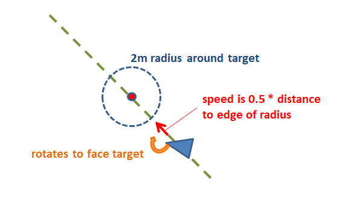

.. _loiter-mode:

===========
Loiter Mode
===========

..  youtube:: IBptvWRT_Tg
    :width: 100%

Loiter mode allows boats to hold position in a strong current.

.. note::

   This mode is available in Rover-3.4 (and higher).

   If the mode does not appear in the :ref:`Flight mode setup screen <common-rc-transmitter-flight-mode-configuration>` you can manually set a MODEx parameter to '5'.

The way this mode works is:

- the user switches into Loiter mode and the vehicle’s current position, velocity and maximum deceleration are used to project a reasonable stopping point
- while the boat is within the :ref:`WP_RADIUS <WP_RADIUS>` of the target it simply drifts
- if/when the boat strays more than :ref:`WP_RADIUS <WP_RADIUS>` from the target it:

    - rotates to point either directly towards the target or directly away from it (whichever results in less rotation)
    - drives/floats forwards or backwards at 0.5 m/s * the distance to the edge of the circle around the target

