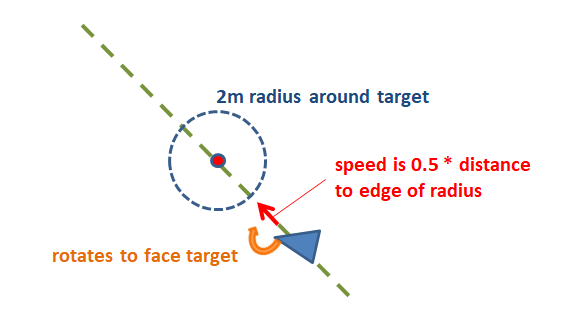

.. _loiter-mode:

===========
Loiter Mode
===========

..  youtube:: IBptvWRT_Tg
    :width: 100%

Loiter mode allows boats to hold position in a strong current.

The way this mode works is:

- the user switches into Loiter mode and the vehicle’s current position, velocity and maximum deceleration are used to project a reasonable stopping point
- while the boat is within the :ref:`LOIT_RADIUS<LOIT_RADIUS>` of the target it simply drifts
- if/when the boat strays more than :ref:`LOIT_RADIUS<LOIT_RADIUS>` from the target it:

    - rotates to point either directly towards the target or directly away from it (whichever results in less rotation)
    - drives/floats forwards or backwards at 0.5 m/s * the distance to the edge of the circle around the target, but at a speed no greater than :ref:`WP_SPEED<WP_SPEED>`.

The way the boat turns to return to the target is controlled by :ref:`LOIT_TYPE<LOIT_TYPE>`:

- "0" (the default) allows the boat to drive either forwards or backwards, whichever requires
  less rotation. This normally holds position with the least movement, but means the boat's
  heading is not predictable.
- "1" always turns the bow towards the target and drives forwards. Use this if the boat handles
  or is instrumented poorly in reverse, or if a bow mounted sensor or camera must face the
  direction of travel.
- "2" always turns the stern towards the target and drives in reverse. This keeps the bow
  pointing away from the target, which can be useful to hold the boat's stern heading into the current or wind.

.. note:: :ref:`LOIT_TYPE<LOIT_TYPE>` only affects how the boat behaves once it has strayed
   outside :ref:`LOIT_RADIUS<LOIT_RADIUS>`. Within the radius the boat simply drifts regardless
   of this setting.

.. tip:: In order to obtain the optimum performance, the ESC deadband should be small. The :ref:`MOT_THR_MIN<MOT_THR_MIN>` can be used to compensate for ESC deadband. See this :ref:`section<rover-motor-and-servo-min-throttle>` for details.
