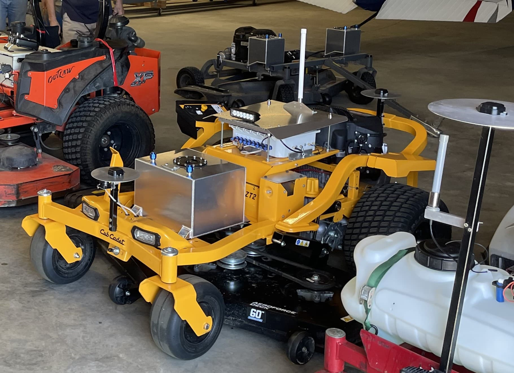

.. _mower-home:

======================
Mowers
======================

There is an active and growing community using ArduPilot Rovers for lawn mowing and agricultural applications. Many have converted gasoline-powered zero-turn (ZTR) riding mowers to autonomous operation, and a few have even designed custom vehicles from the ground up.  These self-guided mowers are capable of running mowing missions entirely autonomously, which can be defined via mission planning software.

..  youtube:: NjaIKyrInpg
    :width: 100%

.. toctree::
  :titlesonly:

    Hardware Recommendations <mower-hardware>
    RTK GPS Configuration <mower-gps>
    Tuning Tips <mower-tuning>
