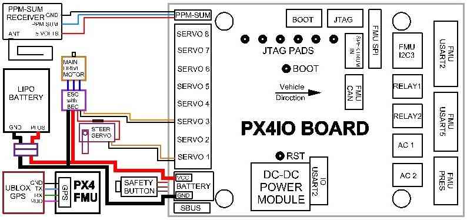
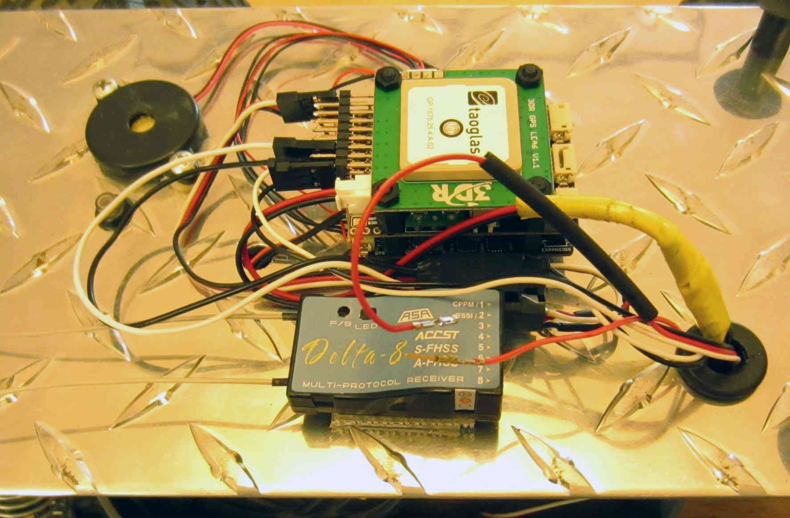
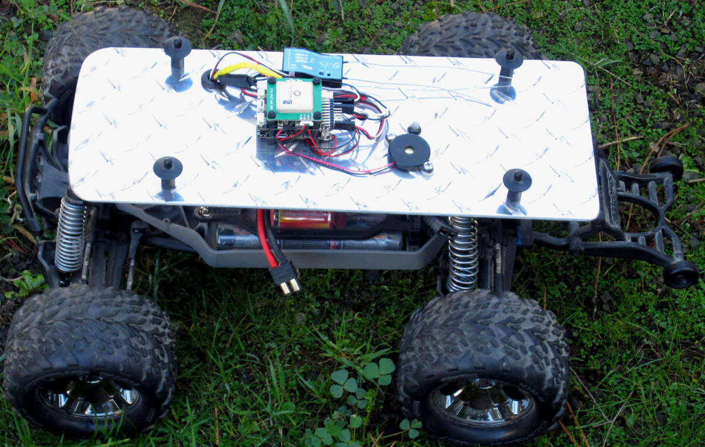
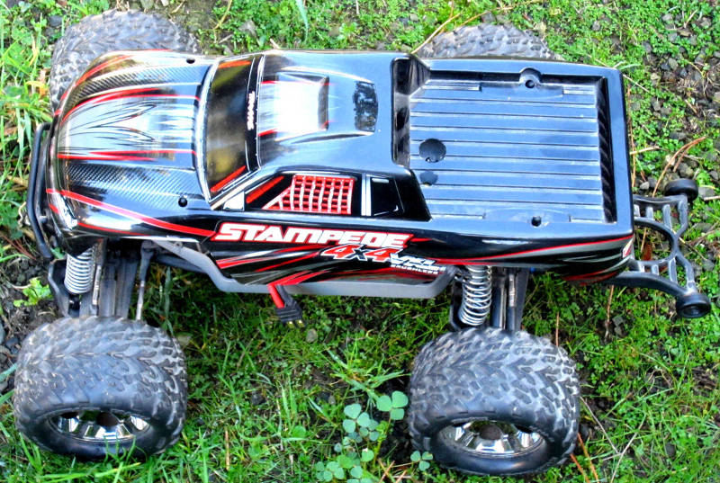

.. _reference-frame-traxxas-stampede:

==========================
Traxxas Stampede 4WD Truck
==========================

This article explains how to add Rover running on a Pixhawk to the `Traxxas Stampede 4x4 monster truck <https://traxxas.com/products/models/electric/67086stampede4x4vxl>`__.

Wiring diagram
==============

The wiring diagram below shows a method for directly powering the steering servo from the Stampede's ESC.

No solder connection of ESC and steering servo power
====================================================

The photograph below illustrates a no solder method for connecting the
ESC and steering servo power wire:

-  Remove the power pin sockets from the end of the connectors that plug into the flight controller on the servo and ESC cables.
-  Strip them loose of the 3 wire cables and connect them with a small piece of wire or (wire wrap pin).
-  Put heat shrink tubing over the joined sockets and shrink it on with a heat gun. (Shown before connection).

RC Setup
========

This truck uses the FRSky Delta 8 multi-protocol receiver which is
compatible with Hitec and Futaba RC transmitters. The Delta 8 provides
the required PPM-Sum communication with the flight controller using a Futaba or Hitec transmitter.

Mounting setup
==============

The 1/8" 6061 aluminum plate is excessive (and required heavier springs
on the suspension) but functions well.

-  In addition to the flight controller and receiver, the safety button and buzzer have also been mounted to the plate
-  Slightly longer screws were used to install the plate and body mounting studs (a very simple installation)
-  The receiver is mounted with heavy duty Velcro and the flight controller will be remounted with Kyosho Zeal gel squares

Cutouts for safety button access and the buzzer can be seen in the truck's body below.

-  this uses a Hitec Aurora 9 transmitter so throttle (channel 3) was mapped to the right (self centering) elevator stick.
-  steering (channel 1) was mapped to the left rudder stick.
