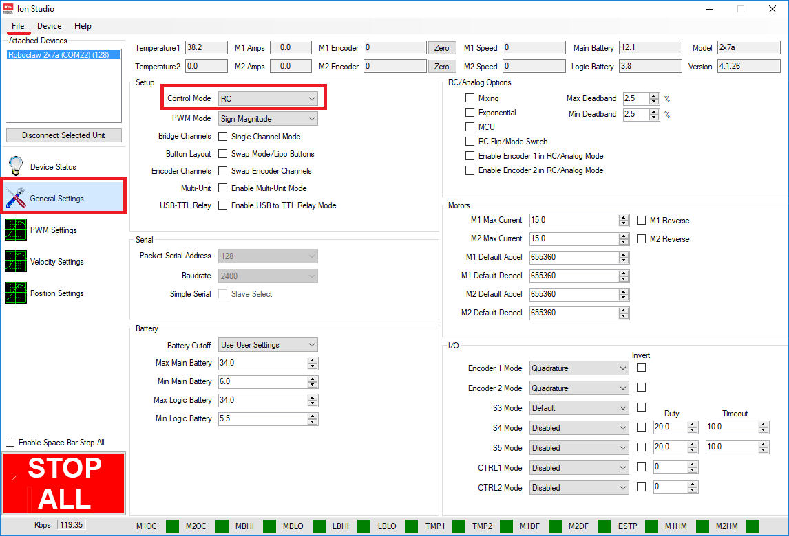
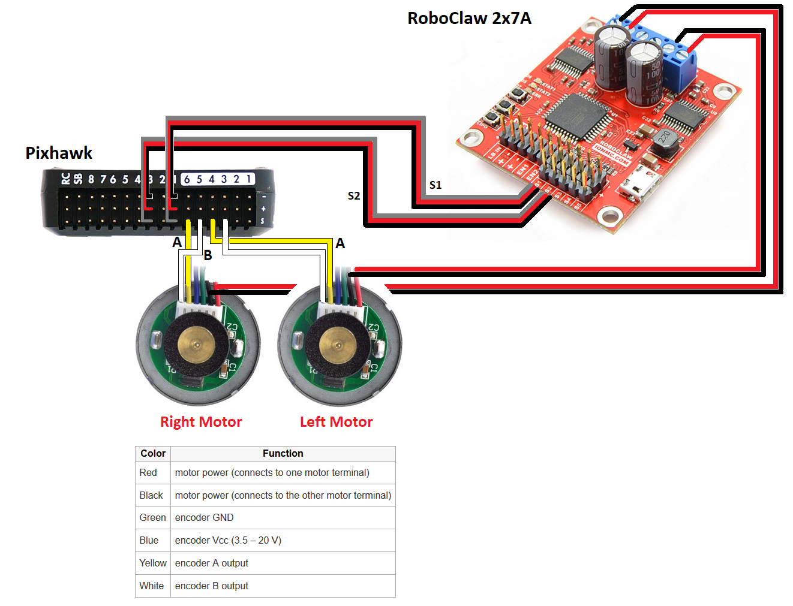

.. _reference-frames-arduroller:

======================
ArduRoller Balance Bot
======================

..  youtube:: hbPzTOfn3EA
    :width: 100%

ArduRoller is a BalanceBot frame originally designed by Jason Short (described in `this Makezine article <https://makezine.com/projects/arduroller-self-balancing-robot/>`__).  Rover-3.5 (and higher) supports this frame as described below.

One issue with this frame is that there is some play in the motors which leads to a slightly wobble when standing still.  This could be resolved by using `stepper motors <https://github.com/ArduPilot/ardupilot/issues/9172>`__

Parts List
----------

- `ArduRoller 3D printed frame from Thingiverse.com <https://www.thingiverse.com/thing:810998>`__
- `4" clear platic globe <https://www.amazon.com/gp/product/B0044SEKA0>`__ (optional)
- `mRobotics Pixhawk autopilot <https://store.mrobotics.io/Genuine-PixHawk-Flight-Controller-p/mro-pixhawk1-minkit-mr.htm>`__.  :ref:`Other autopilots <common-autopilots>` may also work but they must have GPIO input pins to support the :ref:`wheel encoders <wheel-encoder>`.
- `RoboClaw 2x7A motor controller <https://www.pololu.com/product/3284>`__
- `Pololu 12V 2.1A 34:1 motors with encoders <https://www.pololu.com/product/3240>`__
- `Wild Thumber Wheels with 4mm shaft adapters <https://www.pololu.com/product/1557>`__
- small 3S battery like the `Turnigy 1600mAh 3S 20C <https://hobbyking.com/en_us/turnigy-1600mah-3s-20c-lipo-pack.html>`__
- any 8 channel (or more) transmitter like the `Futaba T10J <https://www.futabarc.com/systems/futk9200-10j/index.html>`__

Connection and Setup
--------------------

- Setup the Roboclaw motor driver:

  - Download and install the ION Studio configuration software
  - Connect the Roboclaw motor driver to your PC with a USB cable
  - Connect with ION Studio then on the General Settings page, set Control Mode = RC
  - From the File menu, "Save Setting"

- Connect the yellow and white wires from the wheel encoders to the AUX OUT 3,4,5,6 pins as described on the :ref:`wheel encoder wiki page <wheel-encoder>`
- Connect the autopilot, motor driver and motors as shown below

Firmware used: Rover-3.5

Parameter file: `ArduRoller BalanceBot <https://github.com/ArduPilot/ardupilot/blob/master/Tools/Frame_params/ArduRoller-balancebot.param>`__

This parameter file can also be loaded using the Mission Planner's Config/Tuning >> Full Parameter Tree page by selecting "ArduRoller-balancebot" from the drop down on the middle right and then push the "Load Presaved" button.
