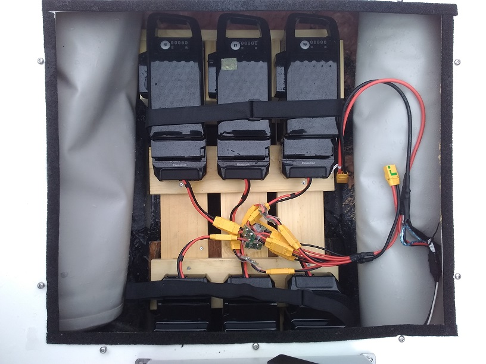
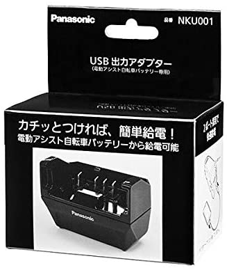

.. _reference-frames-deset-mapping-boat:

==================
DeSET mapping boat
==================

..  youtube:: V8N3lA-20fs
    :width: 100%

The DeSET mapping boat is a relatively small but agile electric mapping boat designed by `JapanDrones <http://japandrones.com/>`__ and `AttracLab <http://attraclab.com/>`__ with input from `Shimane University <https://www.shimane-u.ac.jp/en/>`__ and `Lighthouse <https://isana.lighthouse-frontier.tech/>`__.  The development of this boat was sponsored by `DeSET <https://deset-en.lne.st/>`__

Parts List
----------

- :ref:`Torqeedo 1003c electric motor <common-torqeedo>`
- `motor extension cable <https://www.torqeedo.com/en/products/accessories/cables-and-steering/motor-cable-extension-travel---ultralight/1920-00.html>`__ and RS485-to-serial interface board
- 6x `Panasonic  NKY580B02 16Ah ebike batteries <https://www.amazon.co.jp/-/en/Panasonic-NKY580B02-25-2V-Lithium-Battery/dp/B07B533K72>`__, `adapters <https://www.amazon.co.jp/-/en/dp/B086JQVFZ5/ref=sr_1_1?keywords=NKU001>`__ and `charger <https://www.amazon.co.jp/-/en/Panasonic-NKJ074Z-Stand-Charger-Small/dp/B07VLG6F8X>`__
- `Ideal diodes <https://discuss.ardupilot.org/t/ideal-diodes-when-using-multiple-batteries/75487>`__ to allow safely connecting multiple batteries

- `Hondex HE-8S sonar <https://www.honda-el.co.jp/product/marine/lineup/gps_plotter_fishfinder/he-8s>`__, TD25 transducer, mount and `RS232-to-serial converter <https://www.sparkfun.com/products/449>`__
- Waterproof box to hold autopilot, Herelink receiver, dAISy2+ and steering mechanism
- "Glands" for passing wires between waterproof box and main frame
- :ref:`dAISy2 AIS receiver <common-ais>` and VHF antenna
- :ref:`CubePilot CubeOrange <common-thecubeorange-overview>` or similar :ref:`ArduPilot compatible autopilot <common-autopilots>`
- `CubePilot HereLink <https://www.cubepilot.com/#/herelink/features>`__ or any 8 channel (or more) transmitter

The steering mechanism is a custom built servo and pulley system but we hope to eventually provide a 3D printable steering mechanism

More details can be found in `this blog post <https://discuss.ardupilot.org/t/deset-mapping-boat-in-okinoshima-japan/78035>`__

Parameters: `deset-mapping-boat.param <https://github.com/ArduPilot/ardupilot/blob/master/Tools/Frame_params/deset-mapping-boat.param>`__

Firmware used: Rover-4.2.0
