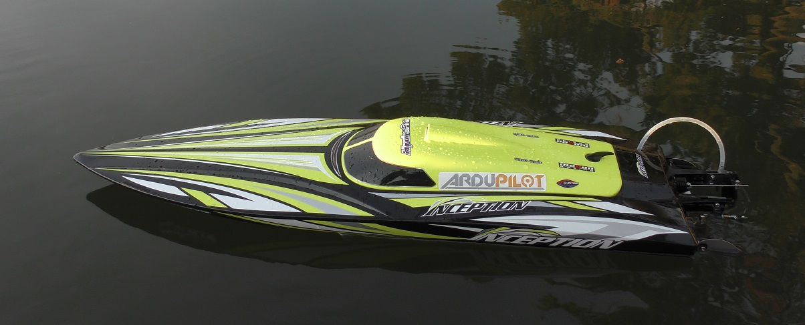

.. _reference-frames-hydropro-inception:

============================
HobbyKing Hydropro Inception
============================

..  youtube:: Of0a7OgHJ4g
    :width: 100%

The HobbyKing HydroPro Inception is a high speed (over 11 m/s) electric powerboat.

Parts List
----------

- `HobbyKing HydroPro Inception <https://hobbyking.com/en_us/alpha-1000mm-rtr.html>`__ (discontinued but the `Super Surge Crusher <https://hobbyking.com/en_us/super-surge-crusher-90a-twin-hull-brushless-r-c-boat-730mm-arr.html>`__ may be similar)
- two `Nano-Tech 4S 4000mAh batteries <https://hobbyking.com/en_us/turnigy-nano-tech-4000mah-4s-30c-lipo-pack-wxt60.html>`__
- `XT60 Y-cable <https://hobbyking.com/en_us/xt60-harness-for-2-packs-in-parallel-1pc-2.html>`__ to connect batteries in parallel
- `Holybro Pixfalcon <http://www.holybro.com/product/8>`__ with `GPS <https://hobbyking.com/en_us/ublox-micro-m8n-gps-compass-module-1pc.html>`__ and `telemetry <https://hobbyking.com/en_us/holybro-telemetry-radio-v3-100mw-915mhz.html>`__
- 6 channel (or more) transmitter like the `Futaba T10J <https://www.futabarc.com/systems/futk9200-10j/index.html>`__

The inside of the vehicle becomes a bit wet during operation so it is important to take steps to keep the electronics dry.

For this build a 3cm x 10cm rectangular hole was cut on the underside of the removable cover which stretches from the blacked out windscreen at the front to the black hook-like knob at the back.  The RC receiver, autopilot, GPS and telemetry radio were inserted through the hole and then attached using 3M double sided adhesive foam. The 3cm x 10cm hole was then closed using duct tape.

The battery power module was left in the main open area of the frame but partially protected from getting wet using a red balloon that came with the set (intended for use with the RC receiver).

Firmware used: Rover-3.5.0

Parameter file: `HK-HydroProInception-Rover350.param <https://github.com/ArduPilot/ardupilot/blob/master/Tools/Frame_params/HK-HydroProInception-Rover350.param>`__

This parameter file can also be loaded using the Mission Planner's Config/Tuning >> Full Parameter Tree page by selecting "HK-HydroProInception-Rover350" from the drop down on the middle right and then push the "Load Presaved" button.

