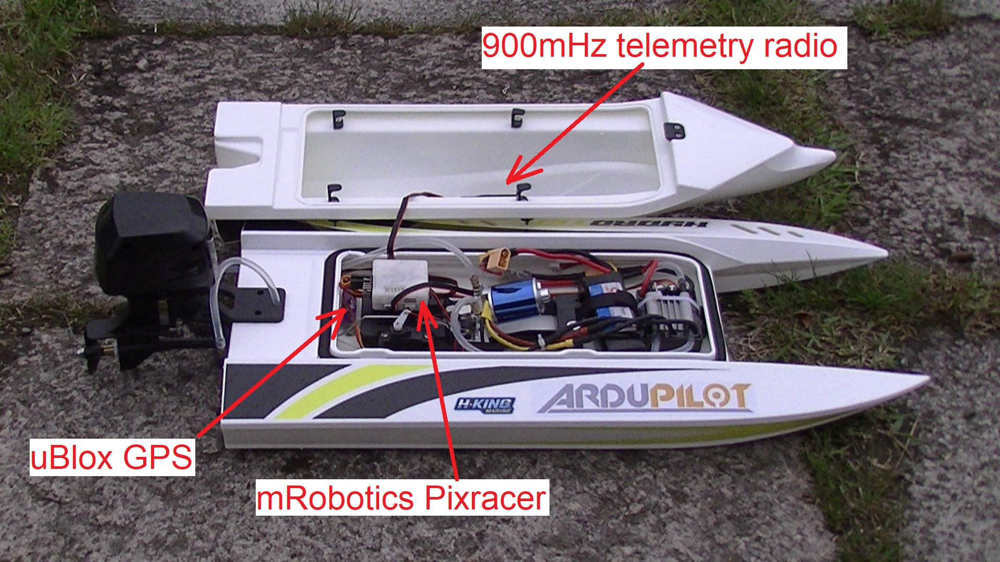

.. _reference-frames-hydrotek:

==================
HobbyKing Hydrotek
==================

..  youtube:: xY2VSbkfvvs
    :width: 100%

The HobbyKing Hydrotek is a relatively fast electric powerboat with self-righting feature (one pontoon fills with water while the other does not).  The rear motor rotates using a steering servo making it a good test of Rover's :ref:`vectored thrust <rover-vectored-thrust>` feature.

The motor only spins forward and the boat drives best at speeds over 2m/s.

Parts List
----------

- `HobbyKing Hydrotek <https://hobbyking.com/en_us/h-king-marine-hydrotek-f1-tunnel-hull-racing-boat-arr-1.html>`__
- 3S battery with high discharge and no more than 11cm in length like the `Turnigy 2200mAh 3S 40C <https://hobbyking.com/en_us/turnigy-2200mah-3s-40c-lipo-pack.html>`__
- Small autopilot like the `mRobotics Pixracer including GPS and telemetry radio <https://store.mrobotics.io/mRo-PixRacer-R14-Official-p/mro-pxrcr-r14-kit-mr.htm>`__
- any 8 channel (or more) transmitter like the `Futaba T10J <https://www.futabarc.com/systems/futk9200-10j/index.html>`__

Firmware used: Rover-3.3.1

Parameter file: `HK-hydrotek-Rover331 <https://github.com/ArduPilot/ardupilot/blob/master/Tools/Frame_params/HK-hydrotek-Rover331.param>`__

This parameter file can also be loaded using the Mission Planner's Config/Tuning >> Full Parameter Tree page by selecting "HK-hydroteck-Rover331" from the drop down on the middle right and then push the "Load Presaved" button.

.. warning::

   The parameter file above includes setting the :ref:`COMPASS_ORIENT <COMPASS_ORIENT>` parameter "4" (Yaw 180) because the wiring was more convenient if the GPS arrow was pointin backwards

