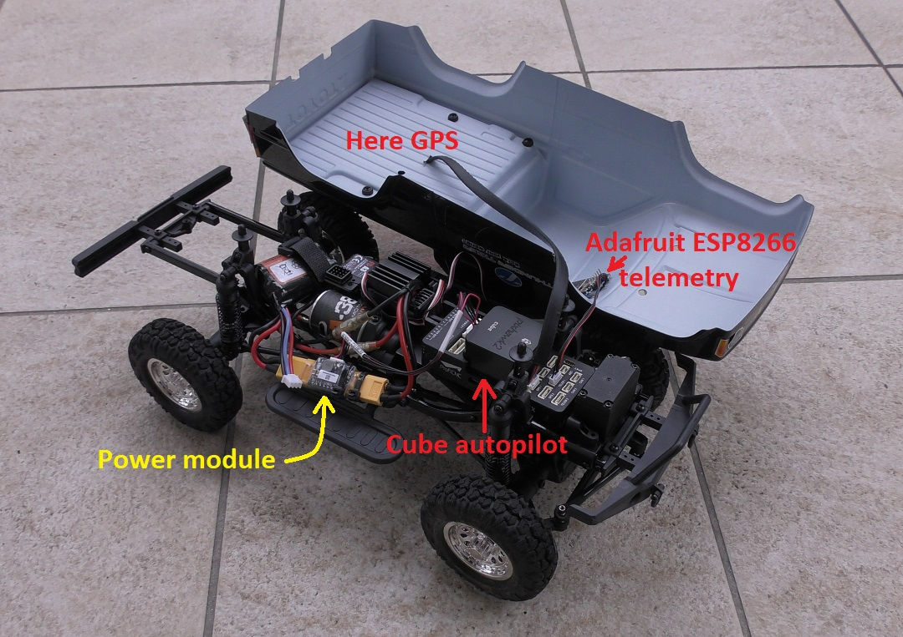

.. _reference-frames-tt-toyotahilux:

==========================
Thunder Tiger Toyota Hilux
==========================

..  youtube:: 9zOlvTsHY6k
    :width: 100%

The Thunder Tiger Toyota Hilux is a relatively inexpensive four wheel drive RC car with a top speed of about 1m/s.

One weakness of this frame is the suspension is a bit soft once the frame is loaded up with the required electronics (autopilot, GPS, receiver) which leads to some body role during stops.

Parts List
----------

- `Thunder Tiger Toyota Hilux frame <https://www.thundertiger.com/products-detail.php?id=74>`__ available from many retailers including `Amazon <https://www.amazon.com/Thunder-Tiger-TOYOTA-HILUX-PICK-UP/dp/B071WJCMKN>`__
- :ref:`Hex Cube autopilot <common-thecube-overview>` or similar
- :ref:`Adafruit ESP8266 <common-esp8266-telemetry>` wifi telemetry board
- any 8 channel (or more) transmitter like the `Futaba T10J <https://www.futabarc.com/systems/futk9200-10j/index.html>`__ (the 2 channel transmitter/receiver provided with the frame is not currently supported by ArduPilot)

Mounting the electronics
------------------------

- the Cube autopilot fits easily into front portion of the frame of the vehicle
- the GPS should be placed away from the motor and battery.  In this example it was placed in the rear cargo bed
- some soldering is required to allow the 2S battery to plug into the power module
- the :ref:`Adafruit ESP8266 <common-esp8266-telemetry>` wifi telemetry board should be connected to the Cube's Telem1 port
- the frame apparently includes this `WP-1040-Brushed ESC <http://www.redcatracing.com/manuals/HW-WP-1040-Brushed.pdf>`__ and the "Reverse" jumper should be set as shown below.

Firmware used: Rover-3.4.1

Parameter file: `ThunderTiger-ToyotaHilux-Rover <https://github.com/ArduPilot/ardupilot/blob/master/Tools/Frame_params/ThunderTiger-ToyotaHilux-Rover.param>`__

This parameter file can be loaded using the Mission Planner:

- start the Mission Planner and connect to the autopilot
- open the Config/Tuning >> Full Parameter Tree page
- select "ThunderTiger-ToyotaHilux-Rover" from the drop down on the middle right and then push the "Load Presaved" button

.. warning::

   The parameter file above includes setting the :ref:`COMPASS_ORIENT <COMPASS_ORIENT>` parameter "4" (Yaw 180) because the wiring was more convenient if the GPS arrow was pointing backwards
