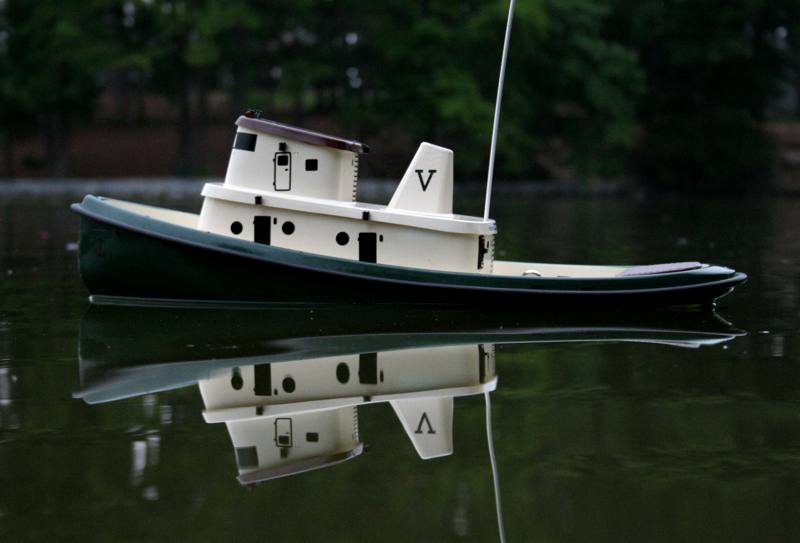
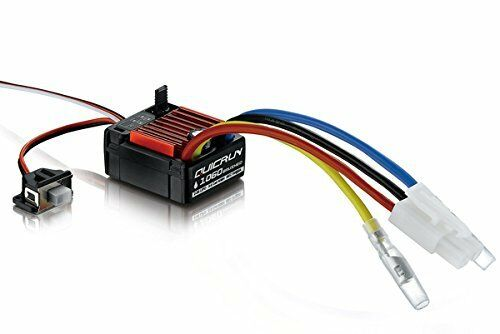
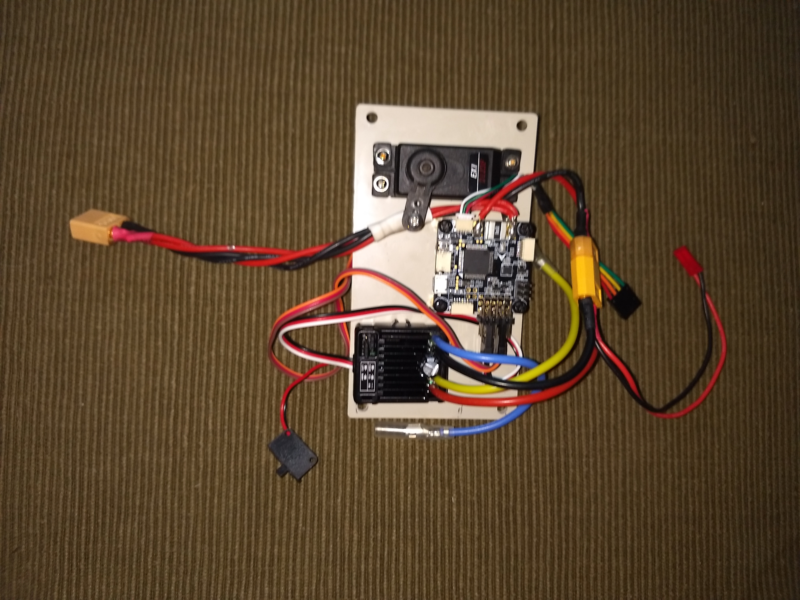
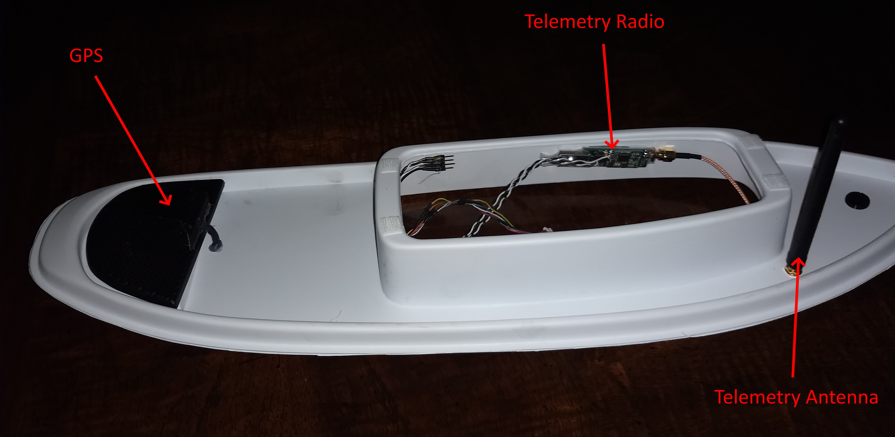
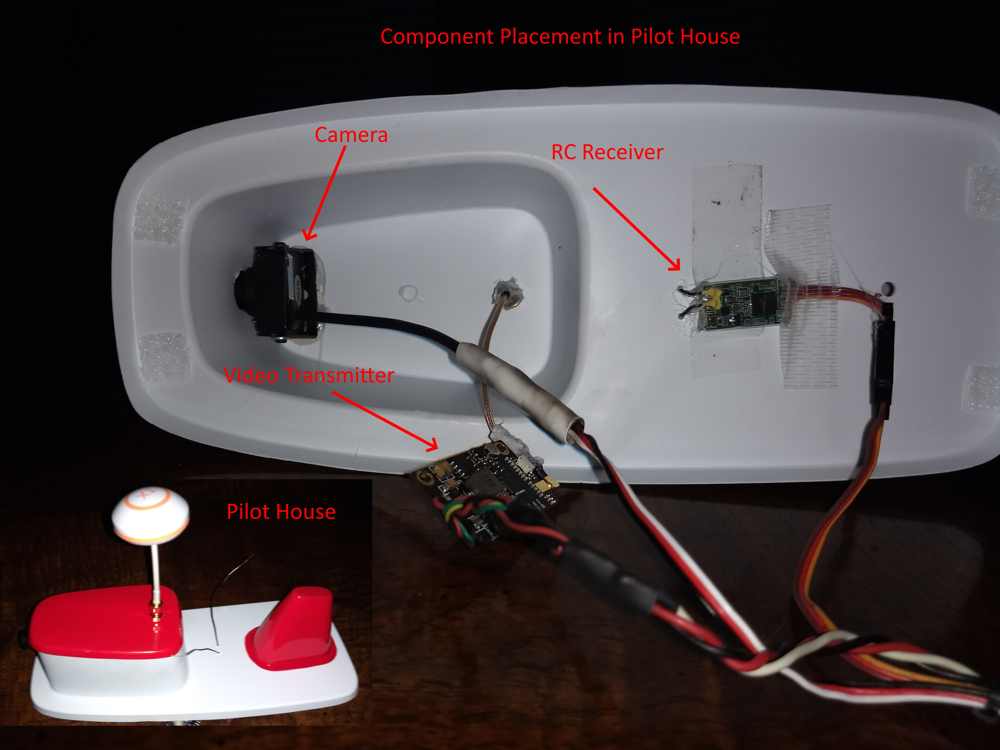

.. _reference-frames-vacutug:

========
Overview
========

    
  
The `Vac-U-Tug <http://www.vac-u-boat.com/Vacutug.htm>`__ is an ideal candidate for a first ArduRover Boat project. It's roomy, has comprehensive  build instructions targeted for inexperienced builders, and does not usually require extensive waterproofing of the ArduPilot electronic components. It's definitely not a speed boat, but is a great long duration lake/pond cruiser.

Parts List
----------

The kit includes the drive train and requires the addition of:

- A standard size servo
- A Brushed ESC with reverse ("1060" style), such as `this <https://www.ebay.com/sch/i.html?_from=R40&_trksid=m570.l1313&_nkw=1060+brushed+esc&_sacat=0>`__:

- :ref:`Autopilot Controller<common-autopilots>`. An Omnibus F4 Pro was used in this build.
- GPS: Any UBLOX MN-8 class GPS with compass. BN-880 is an example, and was used in this build.
- Receiver: Any 3 Channel, or more, TX/RX system. More channels allow more auxiliary functions to be implemented, like automatic waypoint learning, etc. Standard aircraft radios work well also.
- Telemetry (optional but recommended): 3DR or other telemetry radio system, or via the receiver if it has that capability, like Dragonlink (bi-directional) or FRSky (downlink only). Directing the boat from a cell phone running a ground control station is great fun.
- Battery: A 6 cell NiMH 2000mah battery will give 1-2 hours of operation with a 2-3 km/hr top speed. A 3S 3000mah LIPO battery will provide extra speed and power (perhaps for rescuing disabled boats and pushing them to shore).
- FPV Equipment (optional): A miniature video camera and video transmitter. A 5.8GHz 200mw transmitter will provide more than enough range in most situations. See :ref:`common-fpv-first-person-view` for more information.

Build
-----

The build followed the manufacturer's instructions exactly, with a few minor deviations:

#. Install the telemetry radio in the upper deck before gluing to lower deck

#. Waterproof the GPS, since it is located in the most likely place to get wet if a wave broadsided the vessel. I 3D printed a small plastic case and sealed the GPS inside, assuring a waterproof seal around it.

#. During ballasting step, in order to avoid rolling over while filling ballast cups on top deck, split the operation into two or more steps: putting the partial ballast in the plastic bags that will be used to mix them with epoxy in a later step, and placing them inside the hull below the cups before continuing to fill them with the final amounts of ballast. Keeping the center of gravity low.

Additional Build Steps
----------------------

#. Mount the autopilot controller as shown below on the electronics deck.

#. Install the camera and video transmitter as shown below. Paint and glue the pilot house roof before  installing the video transmitter's antenna. After confirming that the camera is oriented and functioning correctly. Waterproof around its exit hole from the pilot house. Hot glue works well and can be removed in the future, if needed.

#. Locate the components as shown below. Separating the GPS, video transmitter, and telemetry transmitter will prevent any interference between these systems.

   

   

   
Setup Steps
-----------

#. Install the firmware
#. Set :ref:`FRAME_TYPE<FRAME_TYPE>` = 2 for boat.
#. Connect steering servo to PWM output 1 and ESC to output 3.
#. Set :ref:`AHRS_ORIENTATIONM<AHRS_ORIENTATION>` orientation (in this build it's 6 for USB connector facing forward)
#. Do Accelerometer, Compass, and RC calibrations.
#. Set control modes. In this build, Manual, HOLD, Loiter, Steering, Acro,and Auto were used.
#. Set up throttle failsafe and low battery failsafe, if desired. Set desired failsafe action.
#. Set up an auxiliary switch for Throttle Learn.
#. Set :ref:`GCS_PID_MASK<GCS_PID_MASK>` = 1. For steering controller tuning in the future.
#. On the bench, be sure that all modes function correctly, the steering servo moves in the correct direction in ACRO mode as you change the boat's heading, as well as under RC control in MANUAL.

First Float
-----------
#. Verify properly operation sailing in MANUAL mode. Trim steering from TX to cruise straight. Then in the ground control station (GCS), set the steering servo's :ref:`SERVO1_TRIM<SERVO1_TRIM>` to the SERVO1's output value at neutral TX stick. Then set the :ref:`RC1_TRIM<RC1_TRIM>` (Assuming no RC remapping has been done) to the value of the channel at neutral stick, then return the trim to zero.
#. Next sail in ACRO. At low speed, determine the turn rate, ie how many secs for a complete turn divided by 360 and enter this in the :ref:`ACRO_TURN_RATE<ACRO_TURN_RATE>` parameter.
#. Next do the :ref:`rover-tuning-throttle-and-speed` and  :ref:`rover-tuning-steering-rate` .

At this point, it will be tuned well enough with the defaults in the navigation controller to navigate and return to home. Further :ref:`rover-tuning-navigation` can be done, if desired.
