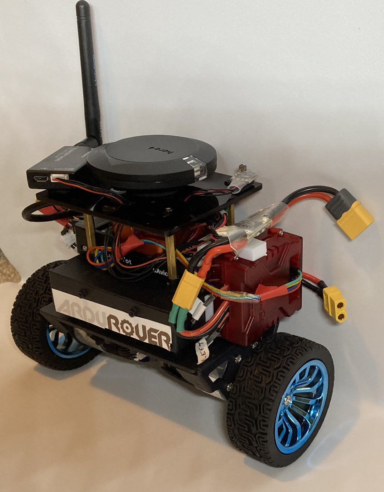
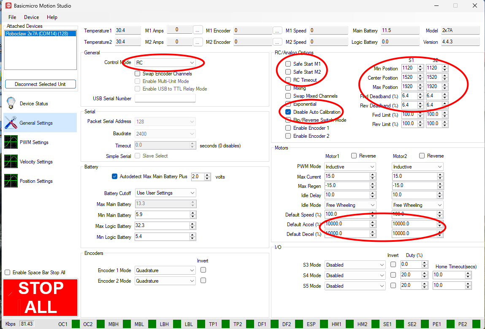
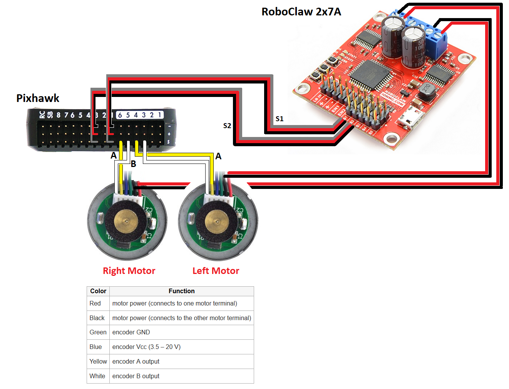

.. _reference-frames-yahboom-balancebot:

======================
Yahboom Balance Bot
======================

This build is based on the `Yahboom Balance Bot <http://category.yahboom.net/products/sbr-chassis-kit?variant=50227273072956>`__ chassis.

The chassis comes with motors, wheel encoders and just enough room to fit a flight controller and a motor driver.

A complete build log is available on the ArduPilot forum here: `Yahboom Balance Bot Build Log <https://discuss.ardupilot.org/t/yahboom-balancebot-build-log>`__

Parts List
----------

- `Yahboom Chassis Kit <http://category.yahboom.net/products/sbr-chassis-kit?variant=50227273072956>`__
- Flight Controller + GPS. The flight controller must have 6x outputs - 2 for motor control and 4 for wheel encoders.
- 3S (12V) Battery. An `18650 battery holder <https://core-electronics.com.au/3-x-18650-battery-holder-with-dc2-1-power-jack.html>`__ fits well in the chassis.
- RC receiver
- `Roboclaw 2x7A Motor controller <https://www.pololu.com/product/3284>`__

Connection and Setup
--------------------

- Setup the Roboclaw motor driver:

  - Download and install the BasicMicro Motion Studio software
  - Connect the Roboclaw motor driver to your (Windows) PC with a USB cable. Note a mandatory firmware update is required and requires a Windows (not a VM) PC.
  - Connect with BasicMicro Motion Studio then on the General Settings page. Set Control Mode = RC, disable Safe Start, Disable Auto Calibration.
  - From the File menu, "Save Setting"

- Connect the yellow and white wires from the wheel encoders to the AUX OUT 3,4,5,6 pins as described on the :ref:`wheel encoder wiki page <wheel-encoder>`
- Connect the autopilot, motor driver and motors as shown below

Driving
-------

The vehicle is stable up to 0.6m/s, but 0.5m/s is recommended for AUTO and GUIDED modes.

When driving up or down slopes, the vehicle is stable for slopes up to 12 degrees. Beyond that, the vehicle may tip over.

Parameters
----------

Firmware used: Rover-4.7.0

Parameter file: `Yahboom BalanceBot <https://github.com/ArduPilot/ardupilot/blob/Tools/Frame_params/Yahboom-balancebot.param>`__

