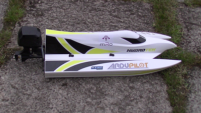

.. _reference-frames:

================
Reference Frames
================

This section includes details on tested frames to speed up DIY builds of rovers and boats.  If you are looking for a completely ready-to-use vehicle please see our `RTF wiki page <https://ardupilot.org/ardupilot/docs/common-rtf.html>`__.

.. toctree::
    :maxdepth: 1

    ArduRoller Balance Bot <reference-frames-arduroller>
    Boogie Board Boat <reference-frames-boogieboard-boat>
    Thunder Tiger Toyota Hilux <reference-frames-tt-toyotahilux>
    HobbyKing Hydrotek <reference-frames-hydrotek>
    HobbyKing Hydropro Inception <reference-frames-hydropro-inception>
    Traxxas Stampede 4WD Truck <reference-frame-traxxas-stampede>
    Vac-U-Tug Tugboat <reference-frames-vacutug>

.. note::

   If you have a tested vehicle of your own that you would like added to this list, please do a `blog post on ardupilot.org <https://discuss.ardupilot.org/c/blog>`__, `reply to this discussion <https://discuss.ardupilot.org/t/reference-frames>`__ and/or :ref:`create a wiki page directly <common_wiki_editing_guide>`.  Please include a video, a list of parts, firmware version used and a parameter file.