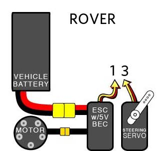
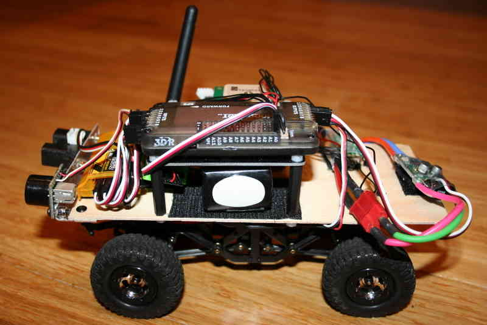
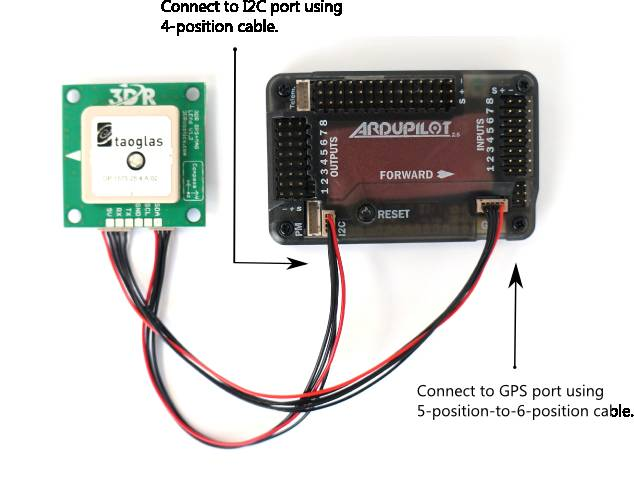
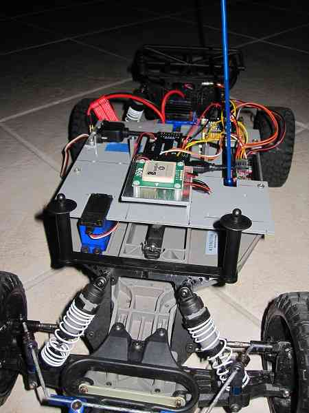

.. _rover-apm2-setup:

============================================
Archived:Rover APM2.x Wiring and Quick Start
============================================

.. warning::

    **ARCHIVED**
    
    The APM2.x is end of life for use with ArduPilot. 
    This article is made available for existing
    users.

This article explains how to set up Rover using the APM2.x autopilot.

Overview
========

The process of converting an RC car to a Rover consists of adding an
autopilot board in between the RC receiver and the car's motor and
steering servo. We recommend that the controller be powered by the
included Power Module.

.. note::

   This tutorial assumes you're using a Mode 2 radio setup. If you're
   using Mode 1, the throttle will move to the other stick

Rover is designed to use regular RC transmitters (not specialized RC car
transmitters) with both throttle and steering on the right stick in Mode
1 or left stick in Mode 2 - typically the elevator stick. This is
because RC cars can typically go both forwards and backwards and so the
throttle should be spring-loaded to return to the mid-point. If however,
you are not using a RC car motor controller (ESC) but rather a regular
aircraft motor controller (ESC), which typically does not have a reverse
function, you can put the throttle on the left stick as would normally
be the case for an aircraft.

Powering Rover
==============

The easiest way to power the APM2.x is using a :ref:`3DR Power Module <common-3dr-power-module>` with a LiPo battery.

The Power Module will not power servos and other peripherals. For more
information/alternatives see :ref:`Powering the APM2 <common-powering-the-apm2>`.

RC Setup
========

Connect your RC system to APM as shown below:

**Input Channels:**

+-------------+-----------------+-------------------+
| **RC Rx**   | **APM Input**   | **Function**      |
+-------------+-----------------+-------------------+
| 1           | 1               | Steering          |
+-------------+-----------------+-------------------+
| 2           | 3               | Throttle          |
+-------------+-----------------+-------------------+
| 5           | 8               | Mode              |
+-------------+-----------------+-------------------+
| 6           | 7               | Record waypoint   |
+-------------+-----------------+-------------------+

**Output Channels:**

For standard RC cars that use a servo to steer, use the Car settings.
If, however, you have a treaded tank or some other vehicle that uses
different speed motors on each side to steer, use the Skid Steer
settings.

+------------------+-------------+------------------+
| **APM Output**   | **Car**     | **Skid Steer**   |
+------------------+-------------+------------------+
| 1                | Servo       | Left Motor       |
+------------------+-------------+------------------+
| 3                | Motor/ESC   | Right Motor      |
+------------------+-------------+------------------+

Reassigning your RC transmitter stick channels
----------------------------------------------

The default transmitter stick configuration should be suitable in almost
all cases. If you do need to change them, then see :ref:`RCMAP Input Channel Mapping <common-rcmap>`.

Installing it in your car
=========================

The below shows a typical setup in a small rover, using APM2.x, 3DR
radio telemetry and both sonar and IR sensors (instructions on setting
them up are :ref:`here) <sonar-sensors>`. Note a few elements:

-  The RC car's plastic body shell has been removed and a plywood sheet
   cut and drilled to fit on the mounting posts.
-  APM2.x has been raised up on a platform made of four *30mm nylon
   spacers*, four *5mm nylon screws*,  and a *Copter stack-up plate*.
   This is to ensure that the sensitive compass sensor on APM is as far
   as possible from the magnetic noise/interference of the car's
   electric motor.
-  APM, the GPS, 3DR radio and RC receiver are all powered by the APM
   Power Module (included with the APM set). The car's steering servo is
   powered by the car's speed controller. This is the standard setup and
   doesn't require any special settings or configuration, but for those
   wondering about power, that's the answer. Among other advantages, the
   use of the APM Power Module means that APM can do voltage and current
   sensing and report battery status to the Ground Station during the
   run, as well as data log it for after-run analysis.
-  A larger battery than the car was originally designed for is being
   used (because the rover is designed to travel long distances
   off-road), and it is mounted on velcro under the APM platform so it
   doesn't shift.

Depending on the car frame you're using, you may wish to set up your
gear differently. Almost any configuration can work, but just remember
to keep APM's far from sources of magnetic interference as possible! The
image below shows a top view of Tom Coyle's Slash Rover (winner of the
Peloton Class at AVC 2013) with a Spektrum receiver, GPS, and external
compass.

3DR GPS uBlox with Onboard Compass
==================================

3DR GPS uBlox with Onboard Compass is intended for use with APM2.x  (for
external compass). It provides enhanced compass performance because of
the freedom to situate the GPS unit in an optimal position independent
of the location of the APM.

.. image:: ../../../images/gps.jpg
    :target: ../_images/gps.jpg

Place your GPS in an elevated position on your rover with the arrow
facing forward (toward the front facing direction of your rover).
Connect the GPS module to the APM using the two cables included with the
GPS as shown below.

3DR GPS uBlox with Onboard Compass includes two connector cables: one
4-position cable and one 5-position-to-6-position cable. To connect the
GPS module to APM, connect the GPS to the APM GPS port using the
5-position-to-6-position cable; connect the GPS to the APM I2C port
using the 4-position cable.

Slash Rover's GPS with external compass mount:
==============================================

3DR GPS uBlox without Onboard Compass
=====================================

.. image:: ../../../images/old-gps.jpg
    :target: ../_images/old-gps.jpg

3DR GPS uBlox without Onboard Compass is intended for use with APM2.x.
To install your GPS module without compass, mount to the top of your
rover and connect to the APM GPS port using the 5-position-to-6-position
connector cable.

**Next step:** :ref:`Load the Rover code and configure it <rover-code-configuration>`
