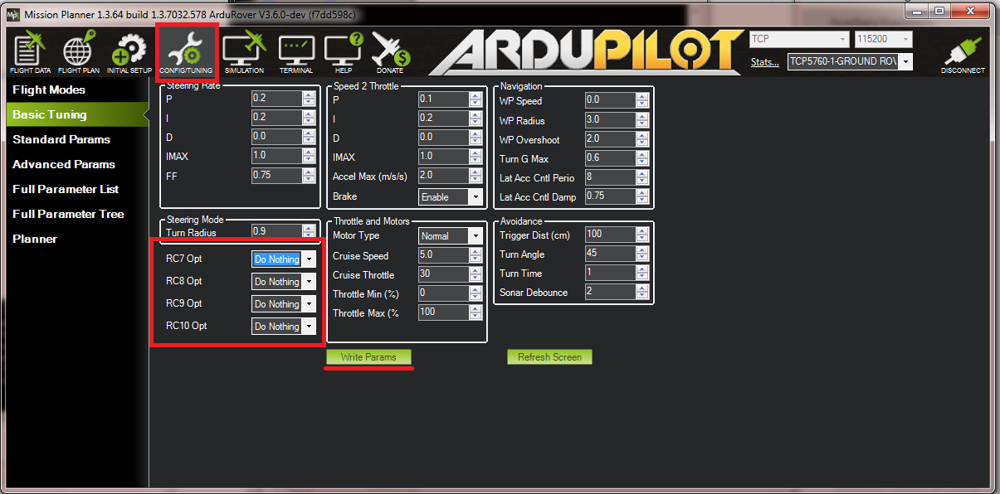
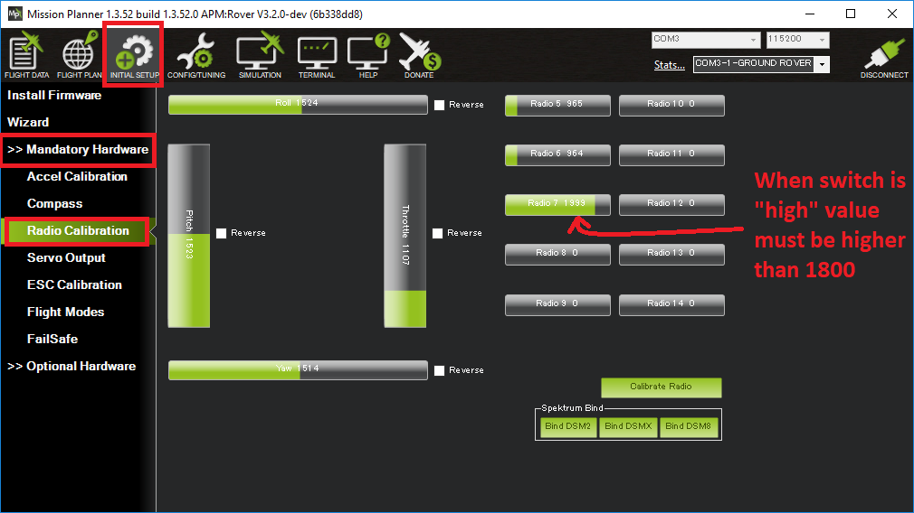

.. _rover-auxiliary-functions:

===================
Auxiliary Functions
===================

This page describes how to set up additional features which can be invoked from the transmitter's auxiliary function switch (normally channel 7).

Configuring which transmitter channel is used
=============================================

By default the channel 7 is used but this can be changed to another channel by setting the :ref:`AUX_CH <AUX_CH>` parameter.
For example, if you would prefer to use channel 9, set :ref:`AUX_CH <AUX_CH>` to "9".

Assigning the Feature
=====================

The :ref:`CH7_OPTION <CH7_OPTION>` parameter controls which feature is assigned to the auxiliary switch.  By default this is the "Save Waypoint" feature.

If using the Mission Planner, the Config/Tuning >> Basic Tuning's "Ch7 Opt" drop-down can be used to easily set the desired feature.

Supported Features
==================

.. raw:: html

   <table border="1" class="docutils">
   <tbody>
   <tr>
   <th>CH7_OPTION</th>
   <th>Feature</th>
   <th>Description</th>
   </tr>
   <tr>
   <td>0</td>
   <td><strong>Disabled</strong></td>
   <td>No feature assigned
   </td>
   </tr>
   <tr>
   <td>1</td>
   <td><strong>Save Waypoint</strong></td>
   <td>The vehicle's position will be stored as a new waypoint in the mission command list.  Use Auto mode later to return to this location
   </td>
   </tr>
   <tr>
   <td>2</td>
   <td><strong>Learn Cruise Speed</strong></td>
   <td>Record the vehicle's speed and throttle to the CRUISE_SPEED and CRUISE_THROTTLE parameters
   </td>
   </tr>
   <tr>
   <td>3</td>
   <td><strong>Arm / Disarm</strong></td>
   <td>Arm or Disarm the vehicle
   </td>
   </tr>
   <tr>
   <td>4</td>
   <td><strong>Manual</strong></td>
   <td>Change to Manual mode
   </td>
   </tr>
   <tr>
   <td>5</td>
   <td><strong>Acro</strong></td>
   <td>Change to Acro mode
   </td>
   </tr>
   <tr>
   <td>6</td>
   <td><strong>Steering</strong></td>
   <td>Change to Steering mode
   </td>
   </tr>
   <tr>
   <td>7</td>
   <td><strong>Hold</strong></td>
   <td>Change to Hold mode
   </td>
   </tr>
   <tr>
   <td>8</td>
   <td><strong>Auto</strong></td>
   <td>Change to Auto mode
   </td>
   </tr><tr>
   <td>9</td>
   <td><strong>RTL</strong></td>
   <td>Change to RTL mode
   </td>
   </tr>
   <tr>
   <td>10</td>
   <td><strong>SmartRTL</strong></td>
   <td>Change to SmartRTL mode
   </td>
   </tr>
   <tr>
   <td>11</td>
   <td><strong>Guided</strong></td>
   <td>Change to Guided mode
   </td>
   </tr>
   </tbody>
   </table>

Check the channel range
=======================

The configured feature will be triggered when the auxiliary switch's pwm value becomes higher than 1800.  It will be deactivated when the value falls below 1200.

You can check the pwm value sent from the transmitter when the switch is high and low using the Mission Planner's Initial Setup >> Mandatory Hardware >> Radio Calibration screen.  If it does not climb higher than 1800 or lower than 1200, it is best to adjust the servo end points in the transmitter.