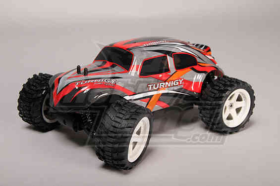

.. _rover-components:

================
Rover Components
================

While it is is possible to build a vehicle with Rover from scratch we
highly recommend starting from an existing RC vehicle (this comes with a
frame, escs and power supply). You will need to add the autopilot, GPS,
and possibly some other hardware. Most importantly you will need to
obtain an RC Transmitter that has spare channels needed for autopilot
mode control and learning.

If you want a slow skid steering rover the `WildThumper <https://www.robotgear.com.au/Product.aspx/Details/1978-Wild-Thumper-6WD-Chassis-Black-34-1-gear-ratio?gclid=CjwKEAiAirXFBRCQyvL279Tnx1ESJAB-G-QvE-d_2uQTEsca9RdetzCZYwnFaIpzZ9MFClF0L_BxBhoCEmfw_wcB>`__ varieties are
very popular.  If you want a standard car then any 1/10 scale RC car is
fine.  We prefer 1/10 scale as its large enough to easily work on and
fit any gear like companion computers etc.  The 1/16 or `1/18 
<https://hobbyking.com/en_us/1-18-brushless-4wd-stadium-truck-w-18amp-system.html>`__
scale vehicles you have to squeeze everything on but as you
can see from the photos in this wiki its certainly do-able.  We tend
towards `2WD <https://hobbyking.com/en_us/basher-bsr-bz-222-1-10-2wd-racing-buggy-arr.html>`__ instead of `4WD
<https://hobbyking.com/en_us/turnigy-trooper-sct-4x4-1-10-brushless-short-course-truck-arr.html>`__
as well just because we get slightly longer
battery life (fewer mechanical losses) and the car is less
complicated.  But if you're looking to go on the dirt fast and corner hard then 4WD is the way to go.
We also prefer vehicles with brushless motors and no RC - the RC units
that come with most ready-to-run RC cars don't have the spare channel
needed for autopilot mode control and learning.

Autopilot Hardware
------------------

The list of supported autopilots is on the :ref:`Choosing a Flight Controller <common-choosing-a-flight-controller>` wiki page.  The :ref:`Pixhawk <common-pixhawk-overview>` family is the most common choice.

Developers creating robot vision applications should consider a Linux based autopilot board (e.g. :ref:`Emlid Edge <common-emlid-edge>`) or adding a separate `Companion Computer <https://ardupilot.org/dev/docs/companion-computers.html>`__.

.. note::

   You will need servo extension cable to connect the autopilot to your RC receiver (choose length to
   suit)

4+ channel RC transmitter and receiver
--------------------------------------

You'll need a radio control transmitter to manually control your Rover
and to activate its control modes. You can use any RC
transmitter/receiver system with at least 4 channels.

.. image:: ../../../images/spektrum-dx8.jpg
    :target: ../_images/spektrum-dx8.jpg

Don't get one designed for cars (with a steering wheel and throttle
trigger); we won't be driving the Rover manually much at all.  Ideally,
it will have at least two toggles switches, and one of those switches
will have three positions. If you're on a budget, the `Turnigy 9x <http://hobbyking.com/hobbyking/store/__8992__Turnigy_9X_9Ch_Transmitter_w_Module_8ch_Receiver_Mode_2_v2_Firmware_.html>`__ ($54)
is a popular choice. If you'd like better quality, we like the OpenTX/FrSky systems

Some other options are discussed in the topic :ref:`Compatible RC Transmitter and Receiver Systems <common-rc-systems>`.

GPS module
----------

Your Rover will *require* a GPS module. The recommended module is :ref:`UBlox GPS + Compass Module <common-installing-3dr-ublox-gps-compass-module>` which also
includes a compass. You can check out :ref:`other GPS solutions here <common-positioning-landing-page>`.

.. image:: ../../../images/GPS_TopAndSide.jpg
    :target: ../_images/GPS_TopAndSide.jpg

LiPo batteries and charger
--------------------------

You'll also need batteries and a charger. For a 1/16 or 1/18 scale almost any 2S (7.2v) LiPo
under 2600 mAh will do - for example `this one
<http://hobbyking.com/hobbyking/store/__16589__Turnigy_1700mAh_2S_20C_Lipo_Pack_Suits_1_16th_Monster_Beatle_SCT_Buggy_USA_Warehouse_.html>`__.
For larger 1/10th scale `this is a good size choice <https://hobbyking.com/en_us/zippy-5000mah-2s1p-30c-hardcase-pack.html>`__
A simple LiPo charger like `this one <https://hobbyking.com/en_us/imax-b6-ac-v2-charger-discharger-1-6-cells-genuine-au-plug.html>`__
will work fine.