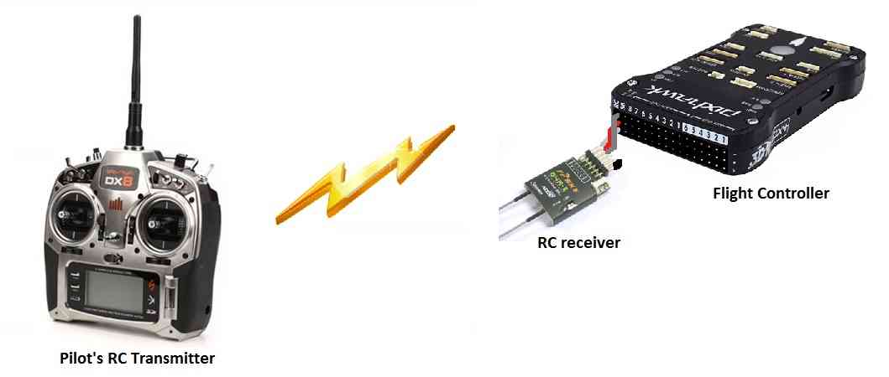

.. _rover-failsafes:

=========
Failsafes
=========

Rover supports three failsafe mechanisms as described below.

Radio Failsafe (aka Throttle Failsafe)
--------------------------------------

This failsafe is triggered if the connection between the user's transmitter and the receiver on the vehicle is lost for at least :ref:`FS_TIMEOUT <FS_TIMEOUT>` seconds.

- the loss of transmitter/receiver connection is detected by:

  - no signals being sent from the receiver to the autopilot board OR
  - the throttle channel (normally input channel 3) value falling below the :ref:`FS_THR_VALUE <FS_THR_VALUE>` parmeter value

- set :ref:`FS_THR_ENABLE <FS_THR_ENABLE>` to "1" to enable this failsafe
- if :ref:`FS_ACTION <FS_ACTION>` is "1", the vehicle will :ref:`RTL <rtl-mode>` to home, if "2" the vehicle will :ref:`Hold <hold-mode>`, if "3" or "4" the vehicle will attempt to use :ref:`SmartRTL <smartrtl-mode>` but if this mode cannot be engaged the vehicle will :ref:`RTL <rtl-mode>` or :ref:`Hold <hold-mode>` respectively.
- once the transmitter/receiver connection is restored, the user may use the transmitter's mode switch to re-take control of the vehicle in :ref:`Manual <manual-mode>` (or any other mode)

Battery Failsafe
----------------

The battery failsafe is triggered if a :ref:`battery monitor <common-powermodule-landingpage>` has been enabled and the battery voltage and/or the estimated remaining power has crossed a configurable threshold for at least 10 seconds.

- set :ref:`BATT_LOW_VOLT <BATT_LOW_VOLT>` to the minimum voltage (i.e. 10.5V)
- optionally set :ref:`BATT_LOW_MAH <BATT_LOW_MAH>` to the minimum battery capacity (i.e. 300mAh)
- :ref:`BATT_FS_LOW_ACT <BATT_FS_LOW_ACT>` configures the failsafe action to take.  "0" to take no action, "1" to change into :ref:`RTL <rtl-mode>`, "2" to change to :ref:`Hold <hold-mode>`, if "3" or "4" the vehicle will attempt to use :ref:`SmartRTL <smartrtl-mode>` but if this mode cannot be engaged the vehicle will :ref:`RTL <rtl-mode>` or :ref:`Hold <hold-mode>` respectively.  "5" will disarm the vehicle.
- :ref:`BATT_LOW_TIMER <BATT_LOW_TIMER>` allows configuring how many seconds the low voltage or low capacity must continue for the failsafe action to be executed (default is 10seconds)

A two stage failsafe is possible by setting the :ref:`BATT_CRT_VOLT <BATT_CRT_VOLT>`, :ref:`BATT_CRT_MAH <BATT_CRT_MAH>` and :ref:`BATT_FS_CRT_ACT <BATT_FS_CRT_ACT>`.
The second stage failsafe action will be taken once the battery falls below these limits for :ref:`BATT_LOW_TIMER <BATT_LOW_TIMER>` seconds.

GCS Failsafe (aka Telemetry Failsafe)
-------------------------------------

This failsafe is triggered if the vehicle stops receiving `heartbeat messages <http://mavlink.org/messages/common#HEARTBEAT>`__ from the ground station for at least :ref:`FS_TIMEOUT <FS_TIMEOUT>` seconds.

- set :ref:`FS_GCS_ENABLE <FS_GCS_ENABLE>` to "1" to enable this failsafe
- if :ref:`FS_ACTION <FS_ACTION>` is "1", the vehicle will :ref:`RTL <rtl-mode>` to home, if "2" the vehicle will :ref:`Hold <hold-mode>`
- use the transmitter's mode switch to re-take control of the vehicle in :ref:`Manual <manual-mode>` (or any other mode)

Crash Check
-----------

If enabled by setting the :ref:`FS_CRASH_CHECK <FS_CRASH_CHECK>` parameter to "1" (for :ref:`Hold <hold-mode>`) or "2" (for :ref:`Hold <hold-mode>` and Disarm) this failsafe will switch the vehicle to Hold and then (optionally) disarm the vehicle if all the following are true for at least 2 seconds:

- the vehicle is in :ref:`Auto <auto-mode>`, :ref:`Guided <guided-mode>`, :ref:`RTL <rtl-mode>` or :ref:`SmartRTL <smartrtl-mode>` mode
- velocity falls below 0.08m/s (i.e. 8cm/s)
- the vehicle is turning at less than 4.5 deg/s
- demanded throttle to the motors (from the pilot or autopilot) is at least 5%
