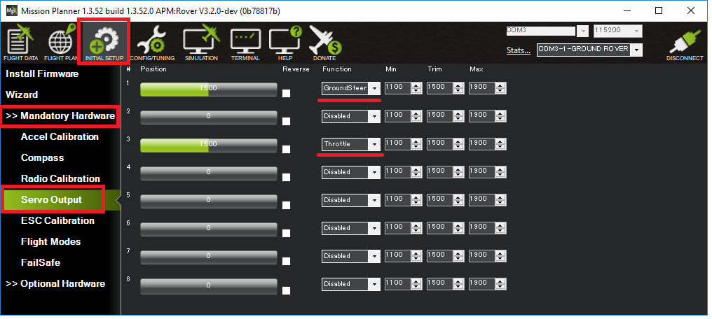
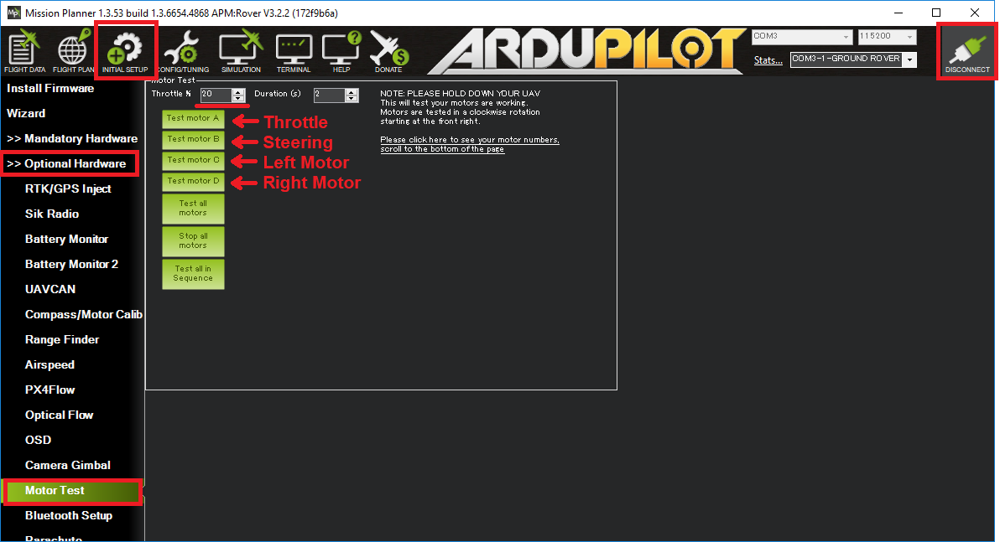

.. _rover-motor-and-servo-configuration:

=============================
Motor and Servo Configuration
=============================

This page describes the few parameters that should be set in order to support the steering and throttle method being used.
This page is closely related to the :ref:`Motor and Servo Connections <rover-motor-and-servo-connections>` page which describes the physical connections between the autopilot, motors and servos.

Separate Steering and Throttle
------------------------------

For separate steering and throttle vehicles these parameters values should be set (they should actually be set by default):

- :ref:`SERVO1_FUNCTION <SERVO1_FUNCTION>` = 26 (GroundSteering)
- :ref:`SERVO3_FUNCTION <SERVO3_FUNCTION>` = 70 (Throttle)

If using the mission planner, the Initial Setup >> Mandatory Hardware >> Servo Output page is a convenient way to do this

.. _rover-motor-and-servo-configuration-skid:

Skid Steering
-------------

For "Skid steering" vehicles (like R2D2) these parameters values will need to be set:

- :ref:`SERVO1_FUNCTION <SERVO1_FUNCTION>` = 73 (Throttle Left)
- :ref:`SERVO3_FUNCTION <SERVO3_FUNCTION>` = 74 (Throttle Right)

.. image:: ../images/rover-motor-and-servo-config2.png
    :target: ../_images/rover-motor-and-servo-config2.png

Omni Vehicles
-------------

For Omni vehicles (that can move left-to-right without changing heading) these parameter values will need to be set:

- :ref:`FRAME_TYPE <FRAME_TYPE>` = 1 (Omni3), 2 (OmniX) or 3 (OmniPlus)
- :ref:`SERVO1_FUNCTION <SERVO1_FUNCTION>` = 33 (motor1)
- :ref:`SERVO2_FUNCTION <SERVO2_FUNCTION>` = 34 (motor2)
- :ref:`SERVO3_FUNCTION <SERVO3_FUNCTION>` = 35 (motor3)
- :ref:`SERVO4_FUNCTION <SERVO4_FUNCTION>` = 36 (motor4)

Motor Driver Types
------------------

At least three different Motor Driver (aka ESC) types are supported which allows using ArduPilot with most motor drivers.  The :ref:`MOT_PWM_TYPE <MOT_PWM_TYPE>` parameter should be used to ensure the output from the autopilot board matches the input required by the motor driver.

- "Normal" is the most common and involves sending PWM values normally between 1000 and 2000 (1ms ~ 2ms)
- "Brushed With Relay" is for brushed motor drivers that use a :ref:`relay pin <common-relay>` to indicate whether it should rotate forwards or backwards.
- "Brushed BiPolar" is for brushed motor drivers that, a bit like "Normal" pwm interpret a low PWM values for reverse, a high PWM value for forward

ESC Configuration
-----------------

Some ESCs support three "Running Models":

#. Forward with brake
#. Forward and reverse with brake
#. Forward and Reverse

For Rover to have full and straight forward control of the throttle it is best to set the "Running Model" to the 3rd option, "Forward and Reverse".  An ESC programming card compatible with the ESC can normally be used to change the ESC's configuration.

.. _rover-motor-and-servo-configuration-testing:

Testing Motor direction
-----------------------

The Mission Planner (and perhaps other GCSs) can be used to test the direction of the motors:

- plug in the vehicle's battery and place the vehicle on a stand so that its wheels can move freely
- connect with the Mission Planner using USB or telemetry radio
- go to the Initial Setup >> Optional Hardware >> Motor Test page
- increase the "Throttle %" to 20
- push the "Test motor" buttons to test the steering and motors.

  - for rovers with separate steering and throttle, pushing the the "Test motor A" button should cause the wheels to turn forward, "Test motor B" should cause steering to turn right.
  - for rovers with skid steering, "Test motor C" should cause the left wheel to turn forward.  "Test motor D" should cause the right wheel to turn forward.
- If the motors or steering do not move in the correct direction change the appropriate ``SERVOx_REVERSED`` value and try again.
- if a "command rejected" message appears or the motors or steering do not respond to the test, the cause may be written in the Mission Planner's Flight Data >> Messages tab (see bottom left of window).  Common causes included the radio calibration has not been performed or the ``SERVOx_FUNCTION`` parameters have not been set correctly.

.. _rover-motor-and-servo-min-throttle:

Minimum Throttle
================
Many motors and ESCs have a dead zone. This is the zone between the zero throttle value and the throttle value at which the motor starts to move. This can be compensated by setting minimum throttle in the firmware.

.. tip:: Remove wheels before proceeding with surface vehicles. Be aware of propellers on boats if they cannot be easily removed!

To fix the dead zone, open the motor test window in Mission Planner, as mentioned :ref:`below<rover-motor-and-servo-configuration-testing>`.  Find the minimum throttle value at which the motor turns on and set the parameter :ref:`MOT_THR_MIN<MOT_THR_MIN>` to that value. Now the motor should start at 1% throttle.

..  youtube:: 5ySmzuqE_bg
    :width: 100%
