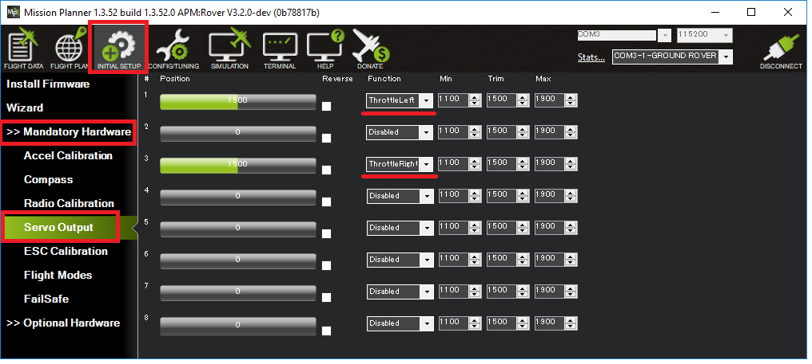

.. _rover-motor-and-servo-configuration:

=============================
Motor and Servo Configuration
=============================

This page describes the few parameters that should be set in order to support the steering and throttle method being used.
This page is closely related to the :ref:`Motor and Servo Connections <rover-motor-and-servo-connections>` page which describes the physical connections between the flight controller, motors and servos.

Separate Steering and Throttle
------------------------------

For separate steering and throttle vehicles these parameters values should be set (they should actually be set by default):

- :ref:`SERVO1_FUNCTION <SERVO1_FUNCTION>` = 26 (GroundSteering)
- :ref:`SERVO3_FUNCTION <SERVO3_FUNCTION>` = 70 (Throttle)

If using the mission planner, the Initial Setup >> Mandatory Hardware >> Servo Output page is a convenient way to do this

.. image:: ../images/rover-motor-and-servo-config1.png
    :target: ../_images/rover-motor-and-servo-config1.png

Skid Steering
-------------

For "Skid steering" vehicles (like R2D2) these parameters values will need to be set:

- :ref:`SERVO1_FUNCTION <SERVO1_FUNCTION>` = 73 (Throttle Left)
- :ref:`SERVO3_FUNCTION <SERVO3_FUNCTION>` = 74 (Throttle Right)

