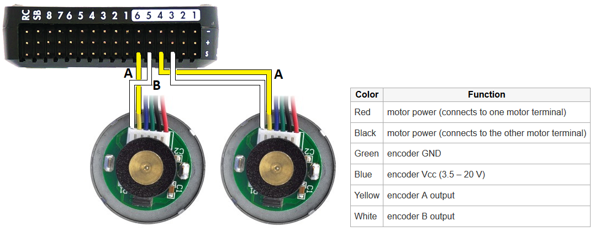

.. _rover-motor-and-servo-connections:

===========================
Motor and Servo Connections
===========================

Two steering/throttle methods are supported and each requires slightly different wiring and configuration as described below.

Separate Steering and Throttle
------------------------------

Most RC cars are like full sized cars in that they have separate steering and throttle controls.
For these rovers, the steering servo (which normally turns the front wheels) should be connected to the flight controller's RC Output 1.  The motor's ESC (which normally controls the speed of the back wheels) should be connected to RC Output 3.

.. image:: ../images/rover-motor-connections.jpg
    :target: ../_images/rover-motor-connections.jpg

For this setup these parameters values should be set (they should actually be set by default).  More details can be found on the :ref:`Motor and Servo Configuration <rover-motor-and-servo-configuration>` page.

- :ref:`SERVO1_FUNCTION <SERVO1_FUNCTION>` = 26 (Ground Steering)
- :ref:`SERVO3_FUNCTION <SERVO3_FUNCTION>` = 70 (Throttle)

Skid Steering
-------------

"Skid steering" vehicles (like R2D2) control their direction and forward/reverse motions by varying the speed of two (or more) independent wheels.  For these style rovers the left wheel should be connected to RC Output 1 and the right wheel should be connected to RC Output 3.

.. image:: ../images/rover-skid-steer-motor-connections.jpg
    :target: ../_images/rover-skid-steer-motor-connections.jpg

For this setup these parameters values will need to be set.  More details can be found on the :ref:`Motor and Servo Configuration <rover-motor-and-servo-configuration>` page.

- :ref:`SERVO1_FUNCTION <SERVO1_FUNCTION>` = 73 (Throttle Left)
- :ref:`SERVO3_FUNCTION <SERVO3_FUNCTION>` = 74 (Throttle Right)

Wheel Encoders
--------------

Up to two wheel encoders can be connected to the flight controller as described on the :ref:`Optional Hardware / Wheel Encoders <wheel-encoder>` page.

