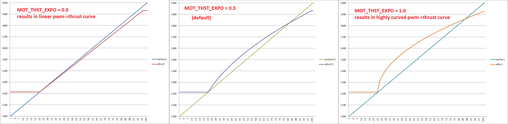

.. _rover-motor-thrust-scaling:

====================
Motor Thrust Scaling
====================

Rover-3.2 (and higher) includes motor thrust scaling which may improve steering and speed control slightly by compensating for the non-linear output of the ESCs and motors.

By default this scaling is disabled (i.e. no compensation) which works well enough for most vehicles but to improve performance you may wish to measure the wheels RPM given various throttle levels and then adjust the :ref:`MOT_THST_EXPO <MOT_THST_EXPO>` parameter to linearise the response.

Above shows the curve for a few different values of :ref:`MOT_THST_EXPO <MOT_THST_EXPO>`.  Many Rovers use DC motors which generally work best with :ref:`MOT_THST_EXPO <MOT_THST_EXPO>` values between 0 and -0.5.
