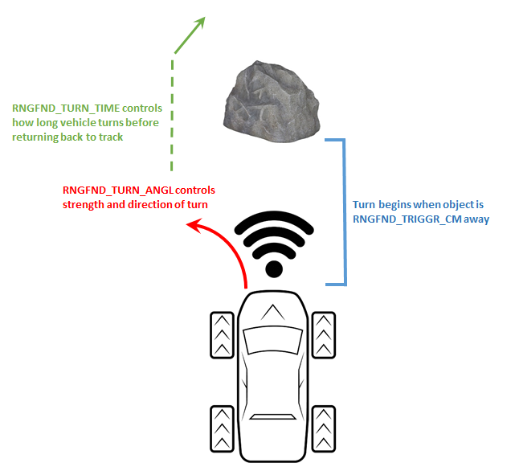

.. _rover-object-avoidance:

================
Object Avoidance
================

Rover supports two forms of object avoidance which can be enabled separately or simultaneously

- "dodge" avoidance attempts to steer around obstacles in :ref:`Steering <steering-mode>`, :ref:`RTL <rtl-mode>`, :ref:`SmartRTL <smartrtl-mode>`, :ref:`Guided <guided-mode>` and :ref:`Auto <auto-mode>` modes
- "simple" object avoidance attempts to stop the vehicle before it hits objects in :ref:`Acro <acro-mode>`, :ref:`Steering <steering-mode>`, :ref:`Loiter <loiter-mode>` and :ref:`Guided <guided-mode>` modes

"Dodge" Avoidance
-----------------

-  one or two range finders should be mounted facing forward as described on the :ref:`range finder wiki pages <common-rangefinder-landingpage>`
-  :ref:`RNGFND_TRIGGR_CM <RNGFND_TRIGGR_CM>` specifies the distance in cm at which the vehicle will begin turning.  I.e. 100 will mean the vehicle will begin turning 1m from the object
-  :ref:`RNGFND_TURN_ANGL <RNGFND_TURN_ANGL>` controls the direction and aggressiveness of the turn.  Large positive or negative values (i.e. -450 or 450) cause turns up to the vehicle's maximum lateral acceleration (i.e. :ref:`TURN_MAX_G <TURN_MAX_G>`) while values near zero cause gentle turns.  Negative values cause the vehicle to turn left, positive causes a turn right.
-  :ref:`RNGFND_TURN_TIME <RNGFND_TURN_TIME>` controls how many seconds the vehicle will continue turning after the object has gone out of view.
-  :ref:`RNGFND_DEBOUNCE <RNGFND_DEBOUNCE>` specifies how many consecutive readings are required to trigger the turn response.  A higher number reduces false positives but also adds a small lag in the response.

This "dodge" method of avoidance can only be activated in :ref:`Steering <steering-mode>`, :ref:`RTL <rtl-mode>`, :ref:`SmartRTL <smartrtl-mode>`, :ref:`Guided <guided-mode>` and :ref:`Auto <auto-mode>` modes.

Simple Avoidance (Stopping)
---------------------------

..  youtube:: ho9mlVwhgHA
    :width: 100%

This form of avoidance attempts to stop the vehicle before hitting objects.

- follow the normal :ref:`instructions for setting up rangefinders <common-rangefinder-landingpage>`
- if using regular lidar or sonar (i.e. not 360 degree lidar):

   - set :ref:`RNGFND_ORIENT <RNGFND_ORIENT>` and/or :ref:`RNGFND2_ORIENT <RNGFND2_ORIENT>` to "0" for forward facing lidar and "4" for backwards facing lidar
   - set :ref:`PRX_TYPE <PRX_TYPE>` = "4" to enable using range finders as "proximity sensors"

- set :ref:`AVOID_ENABLE <AVOID_ENABLE>` to "7" to enable avoidance using proximity sensors (and fences)

This "simple" method of avoidance can only be activated in :ref:`Acro <acro-mode>`, :ref:`Steering <steering-mode>`, :ref:`Loiter <loiter-mode>` and :ref:`Guided <guided-mode>` modes.
