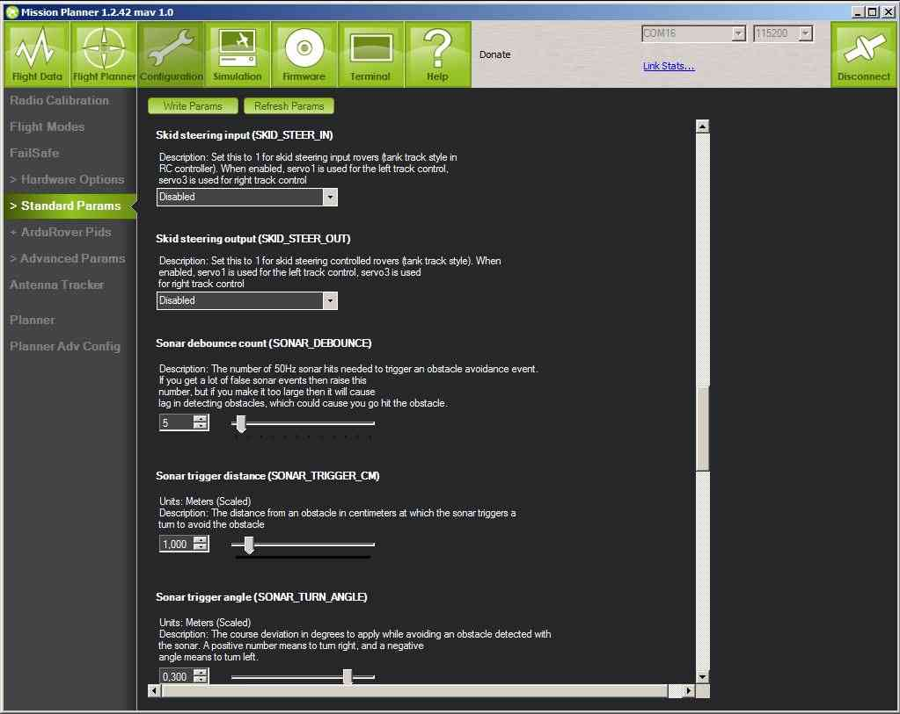

.. _rover-object-avoidance:

======================
Rover Object Avoidance
======================

This topic explains how to tune Rover's simple objet avoidance feature 

Overview
========

-  Up to 4 RNGFNDs may be used.
-  Debounce lets you specify the number of returns before triggering an
   obstacle avoidance event, good for filtering false returns.
-  Maximum and Minimum range of the RNGFND can be set.
-  The SONAR readings can be scaled and adjusted for your use.
-  When an obstacle is detected you can set the correcting steering
   angle and the time to hold it.

RNGFND parameters
=================

The parameters that are relevant to the rangefinder(s) are :ref:`listed here <RNGFND_TYPE>`.

The parameters are set in the *Mission Planner* **CONFIG/TUNING\| Basic
Tuning** or **CONFIG/TUNING \| Standard Params** pages):

   Mission Planner: Rover SonarParameters

.. figure:: ../images/MissionPlanner_Rover_Basic_Tuning.png
   :target: ../_images/MissionPlanner_Rover_Basic_Tuning.png

   Mission Planner: Rover BasicTuning

.. note::

   All parameters may be adjusted in the "Advanced Parameter List" in
   Mission Planner. All the Rover user settable parameters are listed in
   :doc:`APMrover2 Parameters <parameters>`.
