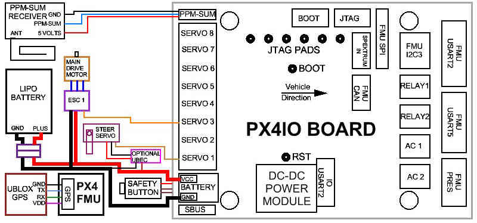
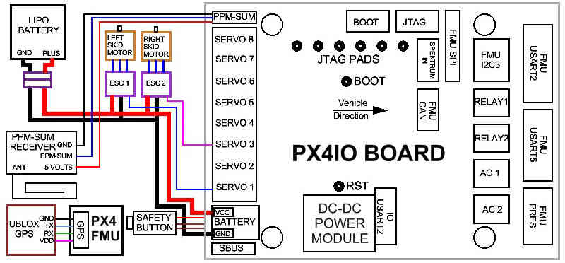
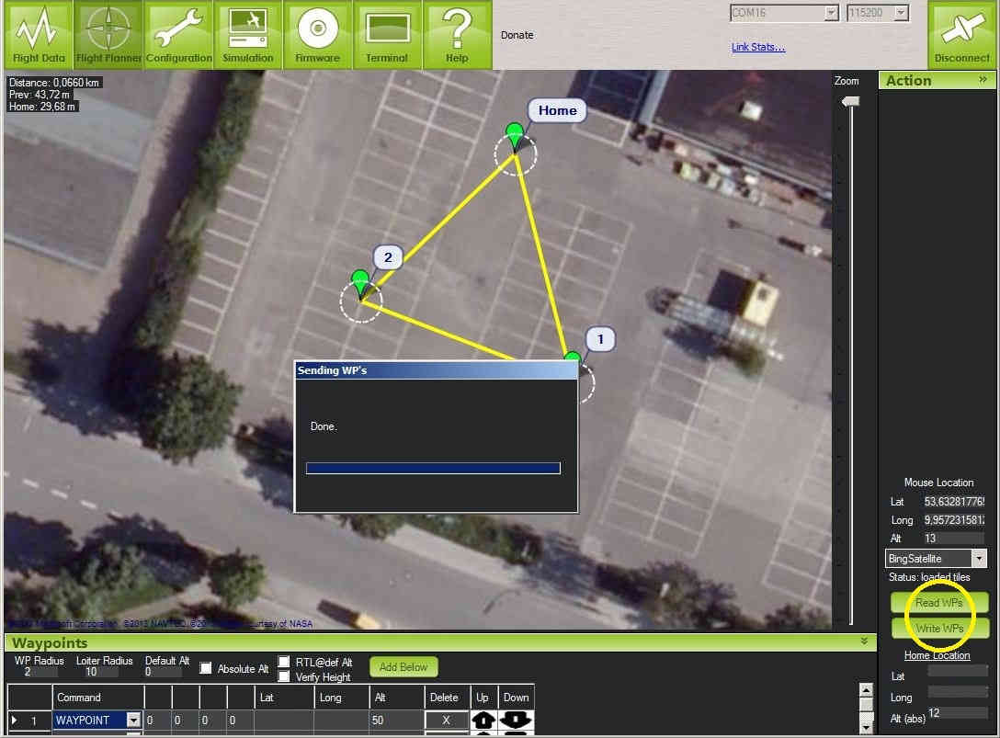

.. _rover-px4-quickstart:

==================================================
Archived:Rover PX4FMU/PX4IO Wiring and Quick Start
==================================================

.. warning::

    **ARCHIVED**
    
    The PX4 is end of life and is not generally available for purchase. 
    This article is made available for existing users.

This article provides high level information about how to wire up the
:ref:`PX4FMU/PX4IO autopilot board <common-px4fmu-overview>` for Rover and connect
its most important peripherals.

Mounting the PX4FMU / PX4IO board stack
=======================================

It is recommended that you mount the PX4FMU / PX4IO board stack upside
down with the PX4IO board on top to provide unrestricted access to the
connectors on the PX4IO board. If you do mount the PX4IO board on top
you will need to specify the :ref:`AHRS_ORIENTATION<AHRS_ORIENTATION>` as number 8 or roll
180 in the Mission Planner Advanced Parameter list.

See also :ref:`Mounting the Flight Controller <common-mounting-the-flight-controller>`.

RC Setup
========

Pixhawk uses a single PPM sum RC input. Output depends on whether a steering
servo or "skid steer" (left or right motors turn faster to turn in the
opposite direction) is used on your rover

+------------+------------------+------------------+
| ** PX4**   | **Car**          | **Skid Steer**   |
+------------+------------------+------------------+
| 1          | Steering Servo   | Left Motor       |
+------------+------------------+------------------+
| 2/3        | Motor ESC        | Right Motor      |
+------------+------------------+------------------+

**Output Channels:**

Reassigning your RC transmitter stick channels
----------------------------------------------

The default transmitter stick configuration should be suitable in almost
all cases. If you do need to change them, then see :ref:`RCMAP Input Channel Mapping <common-rcmap>`.

Normal One Motor Servo Steering Wiring Diagram
----------------------------------------------

Two Motor Skid Steering Wiring Diagram
--------------------------------------

Check out the Basic Operating Modes of the Rover2 Firmware
==========================================================

**The board must have its automatic Safety disengaged before the Rover can be driven.**

-  **Safety Button LED Indications:**

   -  Fast Blinking indicates: Error Condition, Safety cannot be
      disengaged. Possibly not calibrated or sensor error.
   -  Slow Blinking indicates: Safe condition. Safety can be disengaged
      by depressing Safety Button for 5 seconds.
   -  LED Continuously on indicates: Safety has been disengaged. PX4
      controller may be armed with Throttle down and to the right.
   -  When the LED is continuously on indicating Safety Disengaged it
      may be toggled back to a Safety engaged condition by depressing
      the Safety button for 5 seconds.

**Both the Safety engaged and Safety disengaged conditions require the
button to be held down for 5 seconds to toggle them.** This is a safety
mechanism to prevent accidental disarming during use and to prevent
accidental arming during transportation.

Test MANUAL mode
----------------

To test the Manual mode, put the Rover up on blocks, to prevent a
runaway, turn on the R/C transmitter, power up the autopilot
(depressing the safety button on the PX4FMU for 5 seconds to disengage the
safety lock (LED solid on)), and when a 3D lock has been obtained

#. verify that when the elevator joystick is moved forward that the
   rover goes forward and vice versa, and that when the aileron joystick
   is moved to the left,
#. the steering wheels go to the left and vice versa.
#. A R/C receiver radio tester that can display channel PWM values can
   also be used to determine the throttle and steering outputs of the
   Pixhawk.
#. If either the throttle or steering channel is reversed, then the R/C
   transmitter channel reversing function must be used to reverse the
   appropriate channel.

Test AUTO mode
--------------

To test the Auto mode at least one waypoint that is either to the right
or the left of the home waypoint must be loaded into the APM using the
MP Flight Planner:

#. Using the same test setup as in the Manual mode, verify using the
   Manual mode that the Rover throttle and steering are still
   functional.
#. Then moving the mode switch to the put the Rover in the Auto mode,
   verify that the Rover motor comes up to a speed commensurate with the
   Cruise Throttle value that was previously selected and that the
   steering moves to either the right or the left depending on where the
   first waypoint was selected relative to the home waypoint. If either
   the throttle or the steering is reversed, the Radio Calibration in
   the MP Configuration Tab (not the R/C transmitter) must be used to
   reverse the appropriate channel by checking the appropriate "reverse"
   box on either the aileron (steering) or the throttle.

Once the functionality of the Manual and Auto modes has been verified,
use the Flight Planner Tab in the MP to setup a waypoint course. Make
sure to set the Waypoint Radius to around 2 meters for good performance.

A more complete guide to using the Mission Planner with Rover is
described in \ :ref:`Learning a Mission <learning-a-mission>`.

