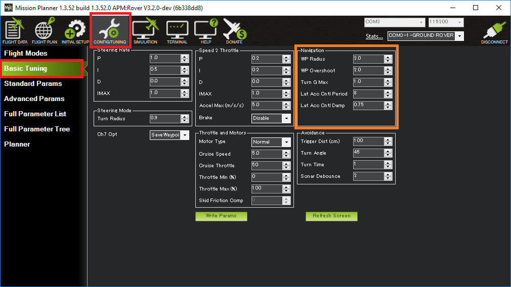
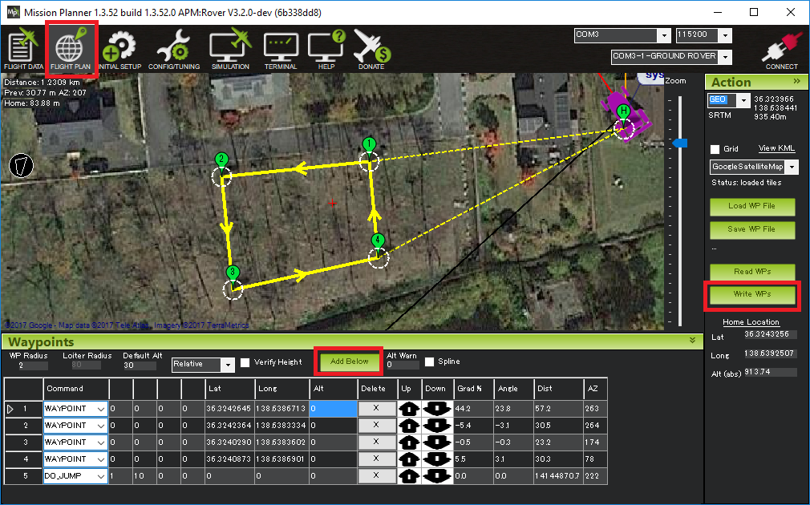

.. _rover-tuning-navigation:

=================
Tuning Navigation
=================

This page describes how to tune the Navigation control including the "L1 controller".  The lower level :ref:`speed <rover-tuning-throttle-and-speed>` and :ref:`turn rate <rover-tuning-steering-rate>` controllers should be tuned before attempting to tune this controller.

L1 controller
-------------

The L1 one controller is the highest level steering controller.  It accepts position targets (i.e. latitude, longitude points) and the vehicle's current speed and outputs a desired lateral acceleration which is then fed into lower level controllers (including the Steering Rate controller).  Together this leads to the vehicle tracking a line towards the target.  This controller is used in all the autonomous modes including :ref:`Auto <auto-mode>`, :ref:`Guided <guided-mode>`, :ref:`RTL <rtl-mode>` and :ref:`SmartRTL <smartrtl-mode>`.

Recommended steps for tuning the L1 controller:

- Connect the ground station to the vehicle using a telemetry radio
- Create an rectangular or back-and-forth mission (perhaps using the Mission Planner's Flight Plan screen) and upload to the vehicle
- Arm the vehicle (in :ref:`Manual <manual-mode>` or :ref:`Hold <hold-mode>`) and switch to :ref:`Auto <auto-mode>` mode.
- If the rover weaves along the straights, then raise :ref:`NAVL1_PERIOD <NAVL1_PERIOD>` (aka "Lat Acc Cntrl Period") in increments of 0.5
- If the rover does not turn sharply enough then lower :ref:`NAVL1_PERIOD <NAVL1_PERIOD>` (aka "Lat Acc Cntrl Period") in increments of 0.5
- Raise :ref:`NAVL1_DAMPING <NAVL1_DAMPING>` (aka "Lat Acc Cntrl Damp") by increments of 0.05 to improve navigation in tight courses

Other Parameters
----------------

- :ref:`TURN_MAX_G <TURN_MAX_G>` defines the maximum lateral acceleration (in Gs = 9.81m/s/s) the controllers will attempt during cornering.  Most vehicles cannot achieve more than 0.3G.  To more precisely measure the vehicle's maximum possible lateral acceleration:

    - On Mission Planner's Flight Data screen, check the "Tuning" checkbox (bottom middle), double click on the graph and select "ay" (Acceleration Y-axis)
    - Drive the vehicle in Manual mode at a high speed making very sharp turns
    - Set :ref:`TURN_MAX_G <TURN_MAX_G>` to slightly lower than the highest values seen.  Note the value shown may be in cm/s/s so the value should be divided by 981 to match the parameter

- :ref:`WP_SPEED <WP_SPEED>` defines the target speed (in m/s) that the vehicle will drive at in :ref:`Auto <auto-mode>` and :ref:`Guided <guided-mode>`.  It will also be used in :ref:`RTL <rtl-mode>` and :ref:`SmartRTL <smartrtl-mode>` if :ref:`RTL_SPEED <RTL_SPEED>` is set to zero
- :ref:`WP_RADIUS <WP_RADIUS>` specifies the distance before the waypoint that the vehicle may begin turning towards the next waypoint.  This parameter should not be set too low or the vehicle may attempt unhelpful turns as it gets very close to the waypoint.
- :ref:`WP_OVERSHOOT <WP_OVERSHOOT>` is used to slow the vehicle if it strays too far from the line between the origin and destination.  If set too low the vehicle may slow down very often as its position drfits off the line between waypoints.  If set too high the vehicle may not slow down for corners.
- :ref:`PIVOT_TURN_ANGLE <PIVOT_TURN_ANGLE>` is only used by skid steering vehicles.  If the vehicle's heading error becomes larger than this value (in degrees) the vehicle will momentarily stop and pivot towards the target before continuing.  See :ref:`Tuning Pivot Turns <rover-tuning-pivot-turns>` for more details.
