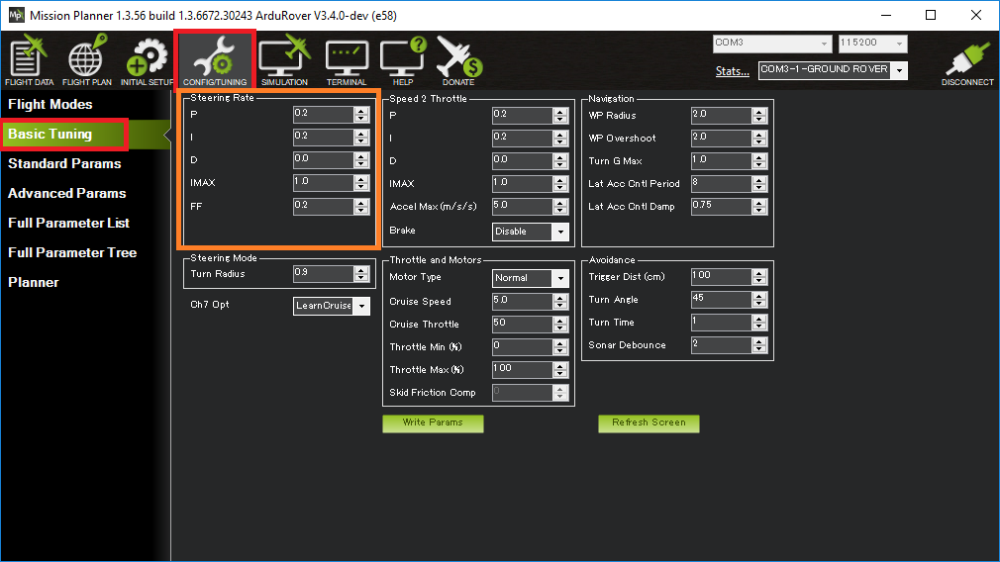

.. _rover-tuning-steering-rate:

================
Tuning Turn Rate
================

This page describes how a Rover's Turn Rate controller (aka steering rate controller) can be tuned.  This is the most important controller to tune in order to achieve good steering control.

Turn Rate PID Tuning
--------------------

The Turn Rate controller attempts to achieve the desired turn rate (set by the pilot or autopilot) using a PID controller.  All modes except :ref:`Hold <hold-mode>` and :ref:`Manual <manual-mode>` use this controller.

The FF, P, I and D gains for this controller are held in the :ref:`ATC_STR_RAT_FF <ATC_STR_RAT_FF>`, :ref:`ATC_STR_RAT_P <ATC_STR_RAT_P>`, :ref:`ATC_STR_RAT_I <ATC_STR_RAT_I>` and :ref:`ATC_STR_RAT_D <ATC_STR_RAT_D>` parameters respectively.

Recommended steps for tuning this controller are:

- Connect the ground station to the vehicle using a telemetry radio
- Set the :ref:`ACRO_TURN_RATE <ACRO_TURN_RATE>` parameter to be roughly what the vehicle's maximum turn rate is in deg/sec.  For a more precise measurement:

    - On Mission Planner's Flight Data screen, check the "Tuning" checkbox (bottom middle), double click on the graph and select "gz" (Gyro Z-axis)
    - Drive the vehicle in Manual mode at a medium speed making very sharp turns
    - Set :ref:`ACRO_TURN_RATE <ACRO_TURN_RATE>` to a bit lower than the highest values seen.  Note the value shown may be in centi-degrees/sec so its value should be divided by 100 to match the parameter's deg/sec

- Set the :ref:`GCS_PID_MASK <GCS_PID_MASK>` to 1 (Steering)
- On Mission Planner's Flight Data screen, check the "Tuning" checkbox (bottom middle), double click on the graph and select "pidachieved", "piddesired"

  .. image:: ../images/rover-throttle-and-speed2.png
      :target: ../_images/rover-throttle-and-speed2.png

- Drive the vehicle in :ref:`Acro <acro-mode>` at a medium speed making various wide and tight turns and compare how well pidachieved follows piddesired
- Tune the :ref:`FF gain <ATC_STR_RAT_FF>` first.  This gain converts the desired turn rate directly into a steering servo or motor output.  If the vehicle's turn rate response is sluggish then this parameter should be increased.  If the vehicle is constantly overshooting its desired turn rate then this parameter should be reduced.
- The :ref:`P gain <ATC_STR_RAT_P>` corrects for short-term error.  It can often be left at zero or another very low value if the FF value is set well.  If set too high the rotation rate may oscillate.  This :ref:`P gain <ATC_STR_RAT_P>` should always be lower than the :ref:`FF gain <ATC_STR_RAT_FF>`.
- The :ref:`I gain <ATC_STR_RAT_I>` corrects for long-term error.  If the vehicle never achieves the desired turn rate, then this parameter should be increased.  If the vehicle's turn rate slowly oscillates then this parameter should be reduced.  This :ref:`I gain <ATC_STR_RAT_I>` should always be lower than then :ref:`FF gain <ATC_STR_RAT_FF>`.
- The :ref:`D gain <ATC_STR_RAT_D>` is meant to stabilize the output by fighting against short-term changes in turn rate.  This gain can normally be left at zero.

Finally set :ref:`ATC_STR_RAT_MAX <ATC_STR_RAT_MAX>` to the :ref:`ACRO_TURN_RATE <ACRO_TURN_RATE>` value and optionally reduce :ref:`ACRO_TURN_RATE <ACRO_TURN_RATE>`.  The difference between these two parameters is:

- :ref:`ACRO_TURN_RATE <ACRO_TURN_RATE>` controls how the pilot's input is converted to a desired turn rate in Acro mode.  This parameter can be reduced to make turns in Acro mode more docile for the driver
- :ref:`ATC_STR_RAT_MAX <ATC_STR_RAT_MAX>` is the maximum turn rate that the vehicle will ever attempt in any mode.  This should normally be kept close to the vehicle's performance limits so the vehicle remains agile

Video
-----

..  youtube:: 9zOlvTsHY6k
    :width: 100%
