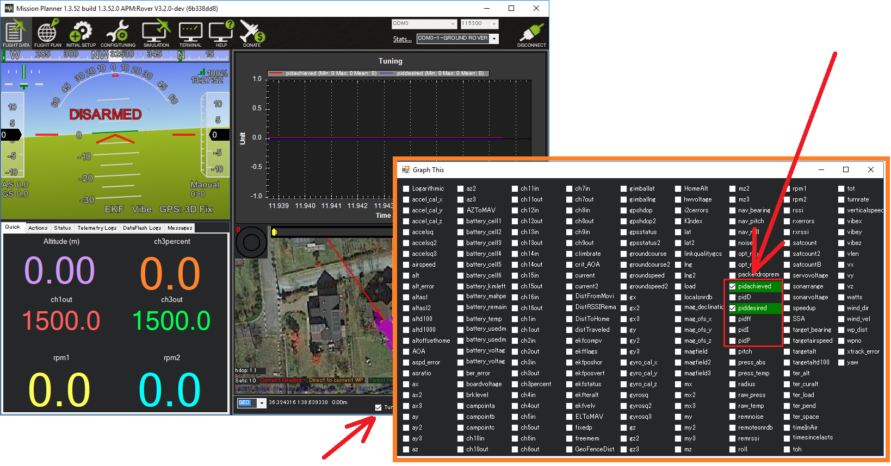

.. _rover-tuning-throttle-and-speed:

=========================
Tuning Speed and Throttle
=========================

This page describes how a Rover's speed and throttle controls can be tuned.
In general it is best to tune this controller before moving on to the steering controllers.

.. image:: ../images/rover-throttle-and-speed1.png
    :target: ../_images/rover-throttle-and-speed1.png

Cruise Throttle and Cruise Speed
--------------------------------

The :ref:`CRUISE_THROTTLE <CRUISE_THROTTLE>` and :ref:`CRUISE_SPEED <CRUISE_SPEED>` parameters set the baseline throttle output used by the Desired-Speed-to-Throttle controller.  It is important that these two values are reasonable and consistent with each other meaning that the :ref:`CRUISE_THROTTLE <CRUISE_THROTTLE>` value (expressed as a percentage) should be close to the throttle required to achieve the :ref:`CRUISE_SPEED <CRUISE_SPEED>` (expressed in m/s).

The easiest way to set these parameters is to:

- Set the :ref:`Auxiliary Function Switch <common-auxiliary-functions>` to "Learn Cruise Speed"
- Arm the vehicle and switch to :ref:`Manual <manual-mode>`
- Drive the vehicle at between 50% and 80% throttle
- Move the aux function switch to the high position for a few seconds and then back down to the low position
- Check the ground station for a message like, "Cruise Learned: Thr:XX Speed:YY" which confirms :ref:`CRUISE_SPEED <CRUISE_SPEED>` and :ref:`CRUISE_THROTTLE <CRUISE_THROTTLE>` have been updated

Desired Speed to Throttle PID Tuning
------------------------------------

The Desired-Speed-to-Throttle controller attempts to achieve the desired speed (set by the pilot or autopilot) using a PID controller.  All modes except :ref:`Hold <hold-mode>` and :ref:`Manual <manual-mode>` use this controller.

The P, I and D gains for this controller are held in :ref:`ATC_SPEED_P <ATC_SPEED_P>`, :ref:`ATC_SPEED_I <ATC_SPEED_I>` and :ref:`ATC_SPEED_D <ATC_SPEED_D>` parameters respectively.  :ref:`ATC_SPEED_FF <ATC_SPEED_FF>` is not used.

Recommended steps for tuning this controller are:

- Connect the ground station to the vehicle using a telemetry radio
- Set :ref:`GCS_PID_MASK <GCS_PID_MASK>` to 2 (Throttle) to send PID information to the ground station
- On the ground station graph the "piddesired" and "pidachieved" values.  If using Mission Planner, Open the Flight Data screen, check the "Tuning" checkbox (bottom middle), double click on the graph and select "pidachieved", "piddesired"

- Drive the vehicle at various speeds in Acro mode and compare how well pidachieved follows piddesired
- Adjust :ref:`ATC_SPEED_P <ATC_SPEED_P>`, :ref:`ATC_SPEED_I <ATC_SPEED_I>` up or down so that piddesired follows pidachieved
- The :ref:`P gain <ATC_SPEED_P>` is the most important and should be tuned first.  If the vehicle's speed is jerky and unstable then this parameter should be reduced.  If the vehicle is slow to get up to speed, this parameter should be increased.
- The :ref:`I gain <ATC_SPEED_I>` corrects for long-term error.  If the vehicle never achieves the desired speed, then this parameter should be increased.  If the vehicle's speed is slowly oscillating between too fast and too slow, this parameter should be reduced.  I should normally be lower than P.
- The :ref:`D gain <ATC_SPEED_D>` is meant to stablize the output by fighting against short-term changes in speed.  This can be left at zero.
- The :ref:`FF gain <ATC_SPEED_FF>` should be left at zero because the :ref:`CRUISE_THROTTLE <CRUISE_THROTTLE>` and :ref:`CRUISE_SPEED <CRUISE_SPEED>` are used to calculate a base throttle output which removes the need for feed-forward.

Acceleration Maximum
--------------------

Although less important than other tuning values, the :ref:`ATC_ACCEL_MAX <ATC_ACCEL_MAX>` and :ref:`ATC_DECEL_MAX <ATC_DECEL_MAX>` parameters should be set to match the vehicle's physical limits.  This helps the speed controller avoid attempting impossible accelerations and reduces overshoot.

- Use the ground station to view the forward-back (aka x-axis) accelerations in real-time.  If using Mission Planner open the Flight Data screen, check the "Tuning" checkbox (bottom middle), double click on the graph and select "ax". Note that the values are in cm/s so they should be divided by 100 to get m/s.

  .. image:: ../images/rover-throttle-and-speed-accel.png
      :target: ../_images/rover-throttle-and-speed-accel.png

- Drive the vehicle in Manual mode, apply full throttle to accelerate from stopped to full speed
- Use the displayed accelerations as a guide to set the :ref:`ATC_ACCEL_MAX <ATC_ACCEL_MAX>` and :ref:`ATC_DECEL_MAX <ATC_DECEL_MAX>` parameters.  Note that the values displayed may be in cm/s while the parameter is in m/s.  If the vehicles acceleration and deceleration are similar :ref:`ATC_DECEL_MAX <ATC_DECEL_MAX>` can be left as zero
- Drive the vehicle in Acro mode to test the vehicle's accelerations are smooth and that decelerations are not too laggy

Throttle Slew
-------------

The :ref:`MOT_SLEWRATE <MOT_SLEWRATE>` parameter can be used to limit how quickly the throttle output can change.

- a value of 100 allows the throttle output to change over its full range in one second
- a value of zero disables the limit

Video
-----

..  youtube:: mV9Dxp1PX-8
    :width: 100%
