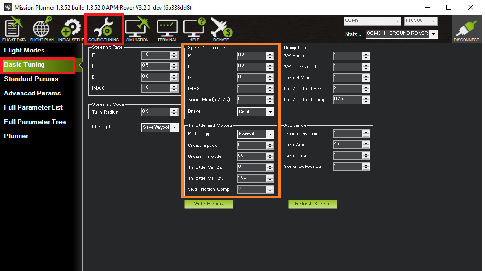

.. _rover-tuning-throttle-and-speed:

=========================
Tuning Speed and Throttle
=========================

This page decribes how a Rover's speed and throttle controls can be tuned.
In general it is best to tune this controller before moving on to the steering controllers.

Cruise Throttle and Cruise Speed
--------------------------------

The :ref:`CRUISE_THROTTLE <CRUISE_THROTTLE>` and :ref:`CRUISE_SPEED <CRUISE_SPEED>` parameters set the baseline throttle output used by the Desired-Speed-to-Throttle controller.  It is important that these two values are reasonable and consistent with each other meaning that the :ref:`CRUISE_THROTTLE <CRUISE_THROTTLE>` value (expressed as a percentage) should be close to the throttle required to achieve the :ref:`CRUISE_SPEED <CRUISE_SPEED>` (expressed in m/s).

One way to set the value is to:

- set the :ref:`Auxiliary Function Switch <rover-auxiliary-functions>` to "Learn Cruise Speed"
- arm the vehicle and switch to :ref:`Manual <manual-mode>`
- drive the vehicle at a speed close to the speed you would normally drive it at (in Auto or other modes)
- move the aux function switch to the high position for a few seconds and then back down to the low position
- connect with a ground station and check that the :ref:`CRUISE_SPEED <CRUISE_SPEED>` and :ref:`CRUISE_THROTTLE <CRUISE_THROTTLE>` values have been updated

The :ref:`CRUISE_SPEED <CRUISE_SPEED>` is also used as the default speed in :ref:`Auto <auto-mode>`, :ref:`Guided <guided-mode>`, :ref:`RTL <rtl-mode>` and :ref:`SmartRTL <smartrtl-mode>` modes although these can be overridden using the :ref:`WP_SPEED <WP_SPEED>` and/or :ref:`RTL_SPEED <RTL_SPEED>` parameters.

Desired Speed to Throttle PID Tuning
------------------------------------

The Desired-Speed-to-Throttle controller attempts to achieve the desired speed (set by the pilot or autopilot) using a relatively standard PID controller.  All modes except :ref:`Hold <hold-mode>` and :ref:`Manual <manual-mode>` use this controller.

The Feed Forward, P, I and D gains for this controller are held in the :ref:`ATC_SPEED_FF <ATC_SPEED_FF>`, :ref:`ATC_SPEED_P <ATC_SPEED_P>`, :ref:`ATC_SPEED_I <ATC_SPEED_I>` and :ref:`ATC_SPEED_D <ATC_SPEED_D>` parameters respectively.

Recommended steps for tuning this controller are:

- connect the ground station to the vehicle using a telemetry radio
- drive the vehicle in :ref:`Acro <acro-mode>` or :ref:`Steering <steering-mode>` mode
- the :ref:`FF gain <ATC_SPEED_FF>` should be left at zero because the :ref:`CRUISE_THROTTLE <CRUISE_THROTTLE>` and :ref:`CRUISE_SPEED <CRUISE_SPEED>` are used to calculate a base throttle output which removes the need for feed-forward.
- the :ref:`P gain <ATC_SPEED_P>` is the most important and should be tuned first.  If the vehicle's speed is jerky and unstable then this parameter should be reduced.  If the vehicle is slow to get up to speed, this parameter should be increased.
- the :ref:`I gain <ATC_SPEED_I>` corrects for long-term error.  If the vehicle never achieves the desired speed, then this parameter should be increased.  If the vehicle's speed is slowly oscillating between too fast and too slow, this parameter should be reduced.
- the :ref:`D gain <ATC_SPEED_D>` is meant to stablize the output by fighting against short-term changes in speed.  This gain can normally be left at zero.

The desired speed vs achieved speed, along with the individual contributions to the throttle output from P, I and D gains can be seen in real-time by doing the following:

- connect the Mission Planner to the vehicle's flight controller using a telemetry radio
- set the :ref:`GCS_PID_MASK <GCS_PID_MASK>` to 2 (Throttle)
- on the Flight Data screen, check the "Tuning" checkbox (bottom middle) and select "pidachieved", "piddesired"
- increase and decrease the desired speed of the vehicle and see how well the "achieved" follows the "desired"

.. image:: ../images/rover-throttle-and-speed2.png
    :target: ../_images/rover-throttle-and-speed2.png

Acceleration Maximum
--------------------

Although less important than other tuning values, the :ref:`ATC_ACCEL_MAX <ATC_ACCEL_MAX>` should be set the vehicle's maximum acceleration or deceleration value (whichever is lower) in m/s/s.  This will stop the Desired-Speed-to-Throttle controller from attempting impossible accelerations and reduce overshoot.

Throttle Slew
-------------

The :ref:`MOT_SLEWRATE <MOT_SLEWRATE>` parameter can be used to limit how quickly the throttle output can change.

- a value of 100 allows the throttle output to change over its full range in one second
- a value of zero disables the limit

Video
-----

..  youtube:: mV9Dxp1PX-8
    :width: 100%
