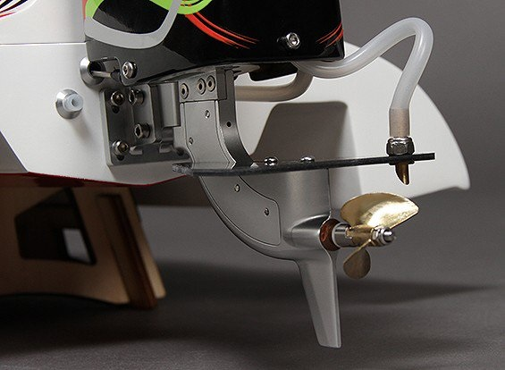
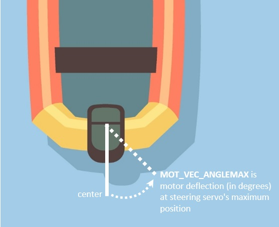
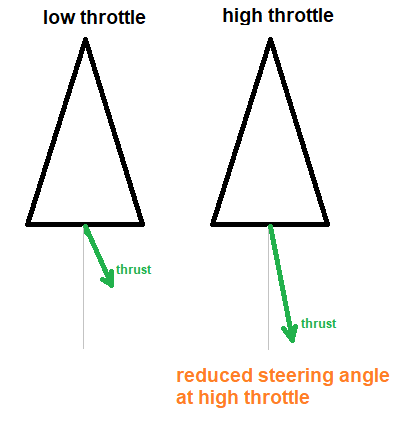
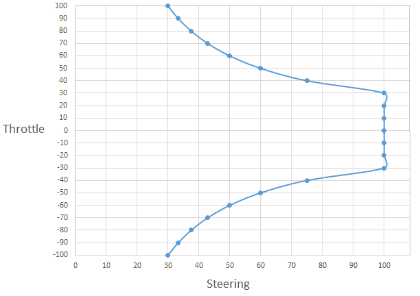

.. _rover-vectored-thrust:

===============
Vectored Thrust
===============

*above image is of a Sprint F3 boat from HobbyKing* (`link <https://hobbyking.com/en_us/sprint-f3-fiberglass-tunnel-hull-brushless-racing-boat-w-motor-630mm.html>`__)

The "Vectored thrust" feature improves steering control for :ref:`boats <boat-configuration>` and hovercraft that use a steering servo to aim the motor.
This feature should not be used on cars or boats with a rudder that is controlled separately from the motors.

In Rover-4.1.0 (and higher) the feature is enabled by setting :ref:`MOT_VEC_ANGLEMAX <MOT_VEC_ANGLEMAX>` to the angle of deflection of the motor when the steering servo is at its maximum position.

In 4.0 (and earlier) this features was enabled by setting the ``MOT_VEC_THR_BASE`` parameter to a value between 10 and 30 (normally 20 works well).
This parameter specifies:

- the throttle level above which the steering servo will be scaled towards the center.  I.e. if set to 20%, the steering response will be unrestricted between 0% and 20% throttle but above 20% throttle it will be scaled towards the center more and more as throttle increases.
- the maximum steering response at full throttle expressed as a percentage.  I.e. if set to 20%, at full throttle, full steering input will only result in the steering servo moving 20% of its full range.

The rough image below shows how the steering servo angle must be reduced as the throttle increases in order to achieve a desired steering response.

The graph below shows how the steering response is reduced as the throttle is increased when ``MOT_VEC_THR_BASE`` = 30.

