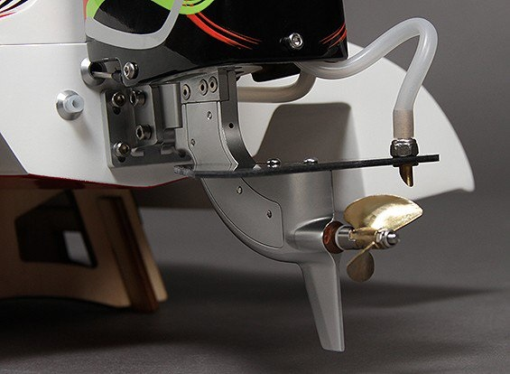
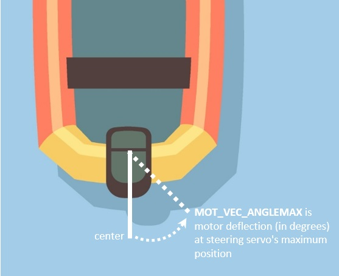

.. _rover-vectored-thrust:

===============
Vectored Thrust
===============

*above image is of a Sprint F3 boat from HobbyKing* (`link <https://hobbyking.com/en_us/sprint-f3-fiberglass-tunnel-hull-brushless-racing-boat-w-motor-630mm.html>`__)

The "Vectored thrust" feature improves steering control for :ref:`boats <boat-configuration>` and hovercraft that use a steering servo to aim the motor.
This feature should not be used on cars or boats with a rudder that is controlled separately from the motors.

The feature is enabled by setting :ref:`MOT_VEC_ANGLEMAX <MOT_VEC_ANGLEMAX>` to the angle of deflection of the motor when the steering servo is at its maximum position.

