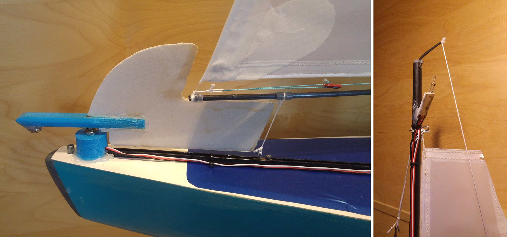

.. _sailboat-hardware: 

==============
Hardware Setup
==============

Sailing vehicles require a rudder for boats or movable wheel(s) for land vehicles. This is setup in the normal way by assigning a servo output channel, ``SERVOx_FUNCTION``, to function 26 (Ground Steering).

Sailing vehicles also require a method of controlling the sails. The servo must pull in and let out the sails in a symmetrical
way. I.e. no change of servo position should be required to set the sails at the same angle on a new tack. This is typically 
achieved through the use of a sail winch servo with a main sheet system. The sail winch is servo output function, ``SERVOx_FUNCTION``, 89 - Main Sail.

Although not absolutely required for best results a wind vane should be fitted to allow the vehicle to sense the wind 
direction. See :ref:<wind-vane>. If a wind vane sensor is not used, then assumed wind direction must be input using these methods: :ref:`wind-vane-home-heading`.

A further improvement can be gained by fitting a wind speed sensor, the faster your vehicle goes relative 
to the wind speed the more important this is. See :ref:`wind vane <wind-vane>`. 

Autopilots
----------
Sailing vehicles are supported by any autopilot, however if a wind vane is to be fitted one analogue ADC input
must be available. On newer beta-flight style controllers this is typically labelled as RSSI. In order to fit a hot wire
type wind speed sensor two more analogue inputs are required, although just a single additional input can be used with a
small loss in accuracy. Alternatively a pressure based airspeed sensor can be used (link to optional hardware airspeed).
Ideally a sail vehicle autopilot would have three analogue inputs. Pixhawk1 and the CUBE both fit this criteria.
