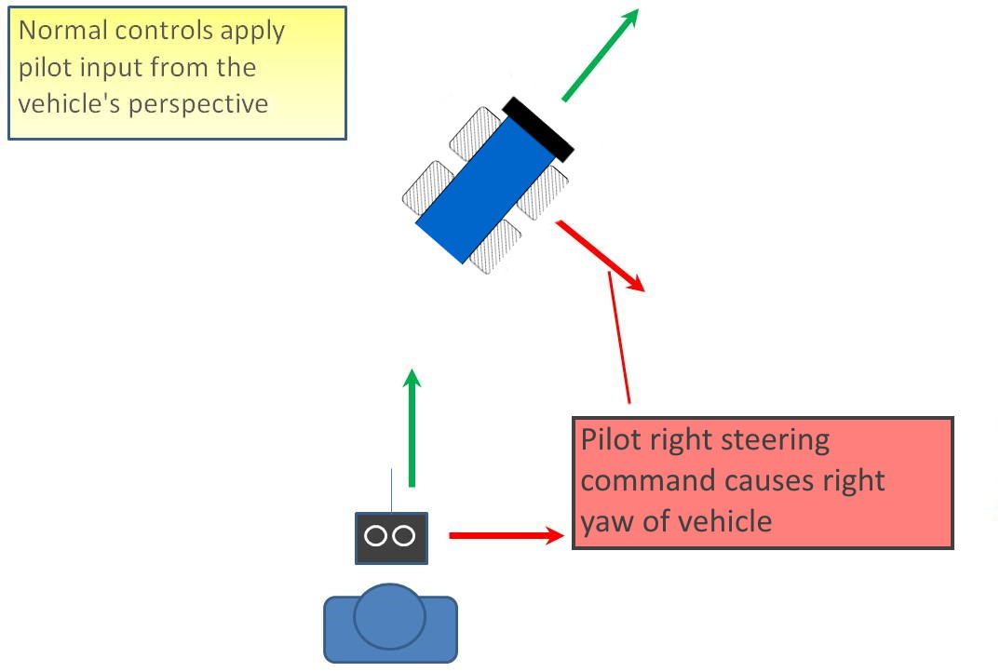
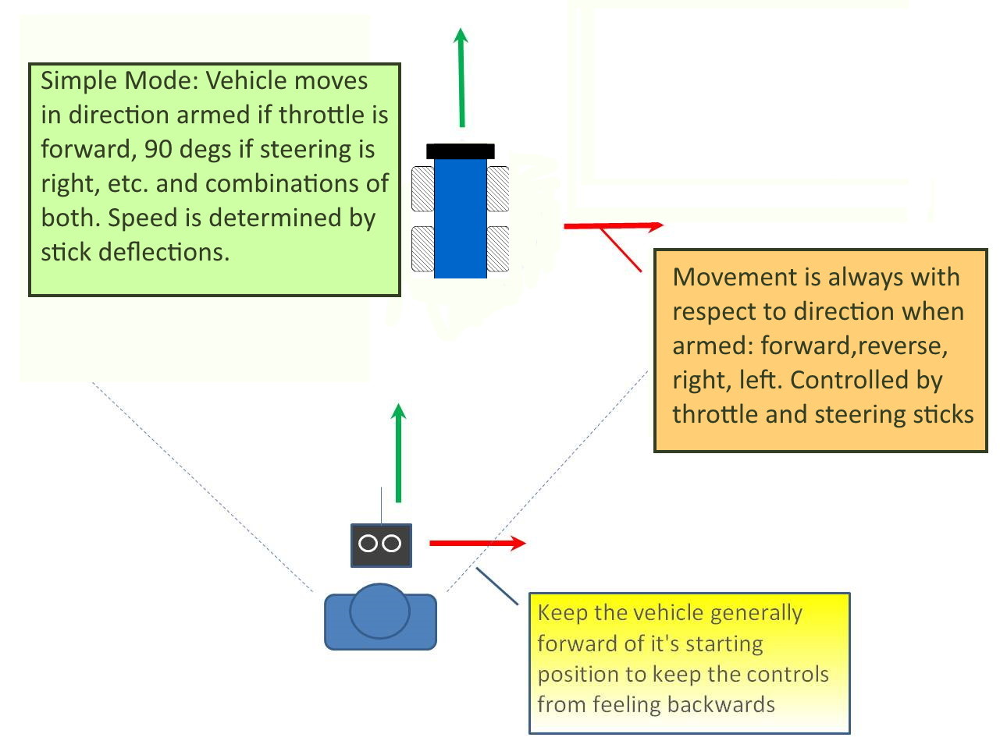

.. _simple-mode:

===========
Simple Mode
===========

Simple mode allows the pilot to control the movement of the vehicle from the pilot's point of view regardless of which way the vehicle is currently facing. This is useful for new pilots who have
not mastered adjusting their steering inputs depending upon which
way the vehicle is facing and for cases when the vehicle is far enough
away that its heading is not apparent.

-  Simple Mode allows you to control the vehicle relative to the vehicle's
   heading at arming and relies only on a good compass heading.

Manual/Acro Mode
================

In Manual or Acro modes, the pilot's transmitter stick
inputs are applied in the orientation of the vehicle.  For example, in the
diagram above when the pilot applies yaw right (red) the vehicle
yaws to its right as long as the stick input is not released.

With the vehicle is facing in the same direction as the pilot, it is
relatively easy to control the vehicle but when the vehicle is facing
towards the pilot an inexperienced pilot will feel that the controls are
all reversed.  I.e. if the pilot inputs right yaw, the vehicle will
steer to the left from the pilot's point of view.

.. _simple-mode_simple_mode:

Simple Mode
===========

This mode allows you to pilot your vehicle as though it were pointed in the direction it was
pointed when it was armed regardless of its current heading
orientation.  So if you hold the throttle stick forward the vehicle will move
away from you (in the direction it was armed), pull the throttle stick back and it will turn around and come back towards you, in the opposite direction from when it was armed. Likewise, if you hold the  steering stick to the right with the throttle at neutral, the vehicle will turn to face a direction 90 degrees to that when armed and move in that direction.

The speed at which the vehicle moves is directly proportional the the throttle and/or steering stick's position away from neutral and is similar to Acro mode, where neutral is stopped, and full stick is maximum speed (:ref:`SPEED_MAX<SPEED_MAX>`). With full foward stick on throttle, the vehicle will attempt to go maximum speed in the arming direction, at 75%, the speed target will be 1/2 of maximum, at 25% 1/2 maximum in the opposite direction as it was armed. Likewise for the steering stick, full right is maximum speed at 90 degrees, full left is maximum at -90 degrees from arming direction. The speed target is limited to the maximum speed, so full forward throttle and full right steering does not result in faster than maximum speed at 45 degrees, but instead is limited to maximum.

Generally when arming you should stand behind the vehicle with its nose
pointing directly away from you when arming.  While moving you should try to keep
the vehicle  in front of its starting position because if it
moves behind you all the controls will feel reversed.

As mentioned above simple mode is also very useful in emergency
situations where the vehicle is far enough away that it is very difficult
to determine its heading.

The :ref:`SIMPLE_TYPE<SIMPLE_TYPE>` parameter allows the  movement direction to be based on absolute North/South/East/West compass directions instead of relative to arming direction.
