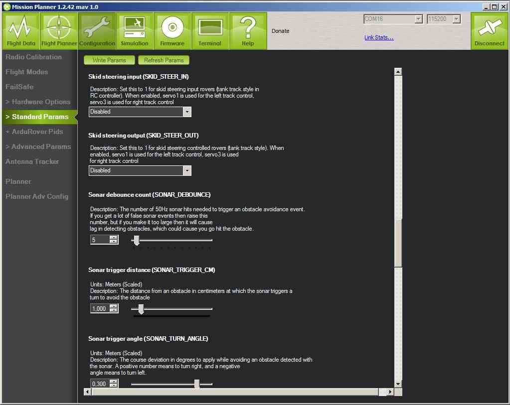

.. _skid-steer-parameter-tuning:

===========================
Skid Steer Parameter Tuning
===========================

The skid-steer parameters are used to configure whether a Skid Steer
vehicle uses a dual throttle skid steer transmitter or a conventional
single throttle RC transmitter.

There are two parameters, only one of which should be enabled (depending
on the type of transmitter used).

+----------------------+----------------------------+-----------------------------------------------------------------------------------------------------------------------------------------------------------------------------------+
| ``SKID_STEER_OUT``   | 0=Disabled 1=SkidSteer     | Set this to 1 for skid steering controlled rovers (tank track style). When enabled, servo1 is used for the left track control, servo3 is used for right track control             |
+----------------------+----------------------------+-----------------------------------------------------------------------------------------------------------------------------------------------------------------------------------+
| ``SKID_STEER_IN``    | 0=Disabled 1=SkidSteerRC   | Set this to 1 for skid steering input for rovers (tank track style RC Transmitter). When enabled, RC channel 1 is used for the left track control, RC channel 3 is used for right track control   |
+----------------------+----------------------------+-----------------------------------------------------------------------------------------------------------------------------------------------------------------------------------+

The options are set in the *Mission Planner* **CONFIG/TUNING \| Standard
Params** page:

   Mission Planner: Rover Skid-SteerParameters

.. note::

   All parameters may be adjusted in the "Advanced Parameter List" in
   Mission Planner). All the Rover user settable parameters are listed in
   :doc:`APMrover2 Parameters <parameters>`.
