.. _sonar-sensors:

=============
Sonar Sensors
=============

Sonar sensors can provide obstacle avoidance functionality for Rover.
This page provides instructions for installing, configuring, and testing
single and double sonar setups.

.. note::

   This article is out of date. Sonars are now more generically
   represented by "Rangefinders" - Rover can support 4. The relevant
   parameters have morphed from "SONAR" to "RNGFND" and are :ref:`the RNGFND parameters here <RNGFND_TYPE>`.

What you'll need
================

Sonar (ultrasonic) sensors allow Rover to detect obstacles and avoid
them. Sonar sensors can be more sensitive than IR sensors, making them
the preferred option for obstacle avoidance. Normally, a single sonar
sensor is used, at the front of the rover. But Rover also supports the
use of two sonar sensors, one pointing a bit to the right and the other
a bit to the left, to not only detect obstacles but steer away from
them.

To implement sonar sensors, you will need:

-  One or two `Maxbotics MB1240 XL Maxsonar EZ4 sensors <http://www.maxbotix.com/Ultrasonic_Sensors/MB1240.htm>`__.
-  A servo extension cable with female connector on one end to connect
   each sensor (or cut one end off a `female-female servo cable <http://www.hobbytronics.co.uk/radio-control/servo-cables-connectors/servo-ext-cable-6in>`__).

Connect the sensor
==================

Solder the servo cable wires to the sensor's GND (black wire), V+ (red
wire) and "3" (white wire) holes as shown below. *Click on images to
enlarge.*

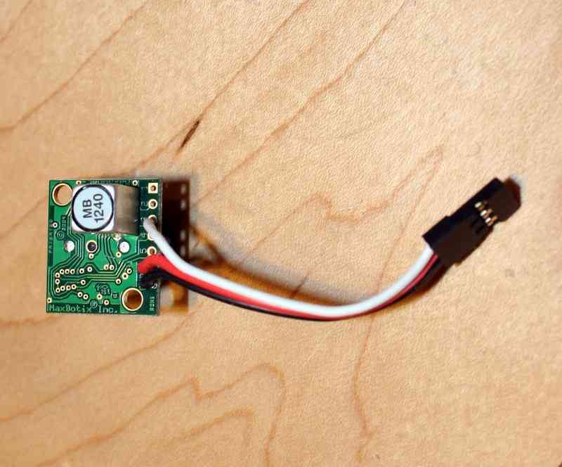

Then plug the servo connector into APM 2's A0 pins as shown in the
picture below. If you're using a second sonar sensor, plug it into A1.

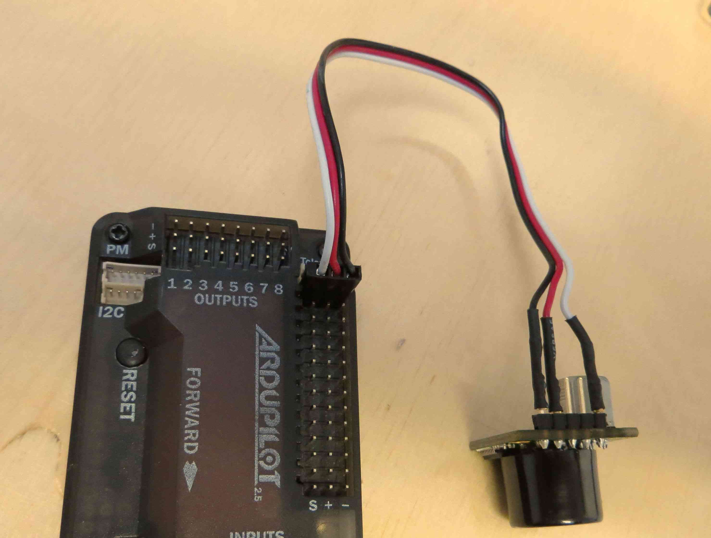

Next, mount your sonar sensor on the front of your rover. To avoid
interference from the ground, it should be either raised high off the
ground and/or tilted slightly upwards. Below is an example, on a very
small rover. The sonar sensor is on the front, nearest to us. The sensor
on the other side is an IR sensor, used to compare results.

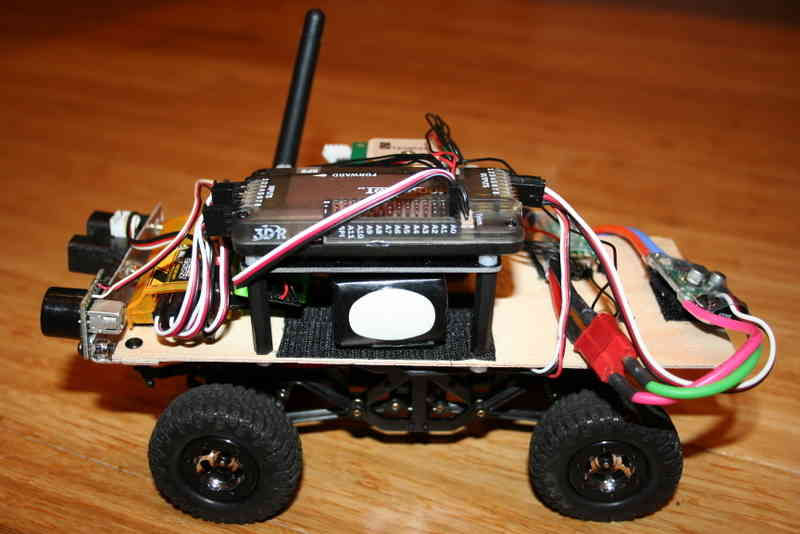

**PX4 Sonar Pins:** Sonar is now supported for Rover on PX4FMU/PX4IO. You
will need to assign one or both possible Sonars to the appropriate
"SONAR_PIN and SONAR2_PIN parameters in: Mission Planner -
Configuration - Advanced Params - Adv Parameter List.

The following PX4FMU/PX4IO "Pins" are available for Sonar use.

-  PIN = 11 : The "airspeed" pin. Located on a 3 pin DF13 connector on
   the PX4IO board, but directly visible to the ADC on the PX4FMU. This
   pin can take voltages up to 6.6V (it has an internal voltage
   divider).
-  PIN = 12: A general analog input pin. Located on pin 3 of the
   "FMUSPI" port on the PX4IO board, this pin is directly visible to the
   PX4FMU analog input code. This can take voltages up to 3.3V.
-  PIN = 13: A general analog input pin. Located on pin 4 of the
   "FMUSPI" port on the PX4IO board, this pin is directly visible to the
   PX4FMU analog input code. This can take voltages up to 3.3V.  It is
   being worked on and will be included in this section when it is
   available.

It is recommended to use the PX4IO board's FMU-SPI port connector pin 3
(SONAR_PIN = 12) and connector pin 4 (SONAR2_PIN = 13)

Enable sonar in Mission Planner
===============================

All configuration can be done via MAVLink parameters in the Mission
Planner. There is no need to edit the Rover code itself.

There are two ways to configure the sensors. You can either use the
simplified interface in the "Advanced Params" option of the Mission
Planner Configuration tab, or, if you want to get into more detailed
control of the sensors, you can use the full set of options in the
longer "Adv Parameters List". (Note: Although there is a sonar sensor
enable option in the Hardware Options tab, this is just for Copter and
Plane and is disabled for Rover. Because the Rover sonar settings are
more detailed and have more options, they must be set in the Advanced
lists)

First, connect to Rover via USB or 3DR radio with the Mission Planner.
Remember, select 115200 as the baud rate for USB or 57600 for the 3DR
wireless radios.

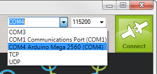

Once you've done that, go to the Configuration tab and select the
Advanced Params option. Set "Sonar enabled" to enabled. (If you're using
a second sonar sensor, we'll set that up in the next step.)

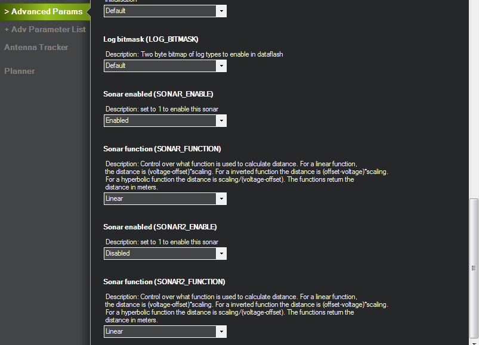

At this point, you should be able to see the sonar data in the Flight
Data screen. Look for the little "Tuning" checkbox on the right side,
under the map view, and check it. This will bring up the data window.
Click on legend and this will bring up the "Graph This" window of data
fields to display. Unselect everything but "sonarrange" and
"sonarvoltage". At this point it should start displaying the real-time
data from your primary sonar sensor, as shown below:

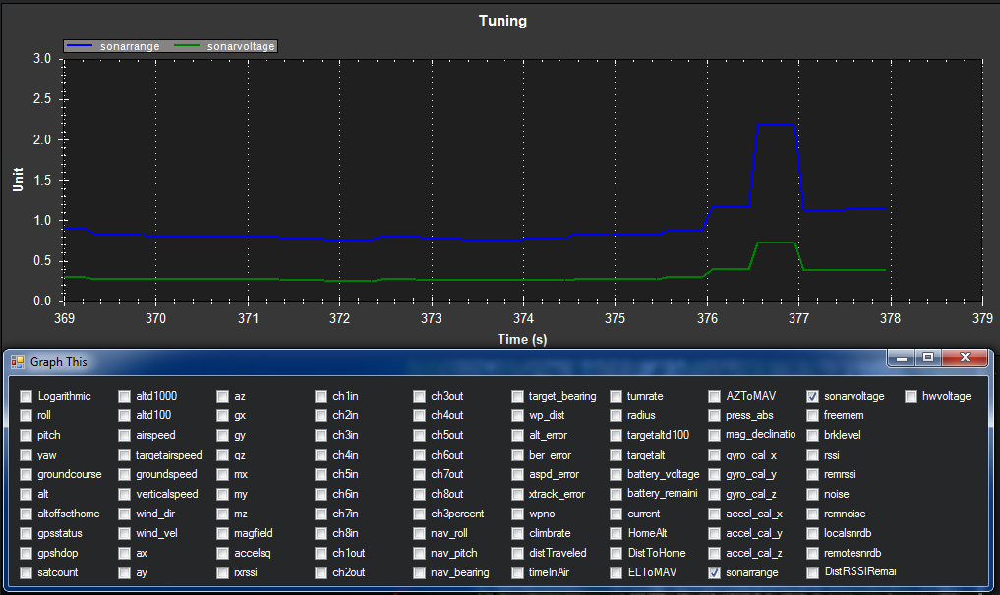

Enabling a second sonar sensor
==============================

Having two sonar sensors tells APM:Rrover which way to turn to avoid an
obstacle. If the obstacle is on the right, it turns left and vice versa.
This is a little tricky to set up, but well worth it for reliable
autonomy.

**Physical mounting:**

Mount the two sensors facing about 10-15 degrees out from the front of
the rover, and 10-15 degrees up from the horizontal, so they don't see
the road/ground.  You should also mount them raised as high as you can,
to avoid noise from ground reflections. In the picture below, they are
raised as high as they can be and still comply with the 4" height limit
of the Sparkfun AVC competition Micro category rover.

If you're going to use aluminium mounts as shown below, make sure you
have double-sided foam tape on the back of the sensors so they don't
ground out on the metal mounts.

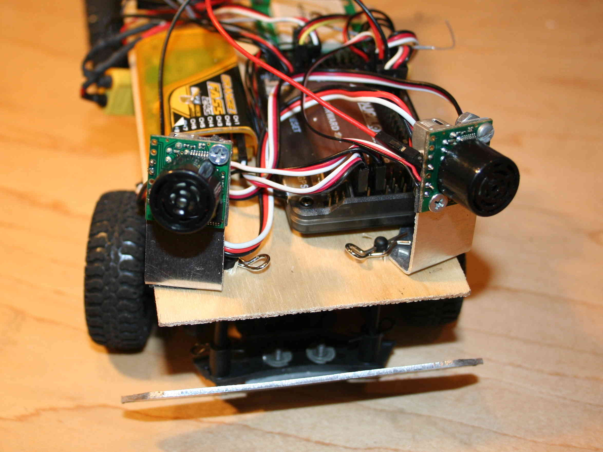

   Mount Sonar to Rover

The picture below shows twin sonar sensors mounted to Tom Coyle's Slash
Rover (winner of the AVC 2013 Peloton Class). The shielded signal cable
and capacitor (see section on power filtering) can be seen on the rover.

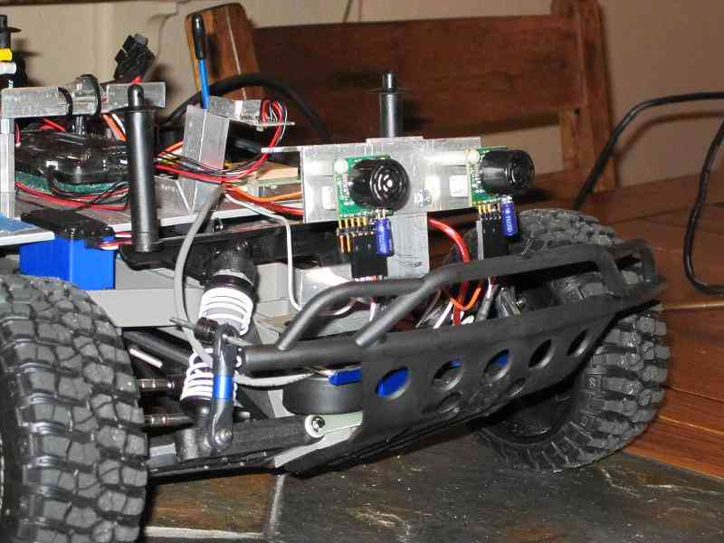

**Electrical connections:**

You can use any ports you want (A0-A8), but here's the way we do it:
Connect the left sensor's connector to A0, and the right to A1.

You're also going to need to connect a wire from each sensor's control
pin to APM so it can tell the sensors when to read, so they don't both
read at the same time and get echoes from each other's signals (this is
explained in the Maxbotix datasheet
`here <http://www.maxbotix.com/documents/XL-MaxSonar-EZ_Datasheet.pdf>`__).
To do this, solder a wire from each sensor's pin #4 to a cable with a
connector on the end that you can plug into APM, as shown below. We use
standard `jumper cables <http://adafruit.com/products/266>`__ for this.

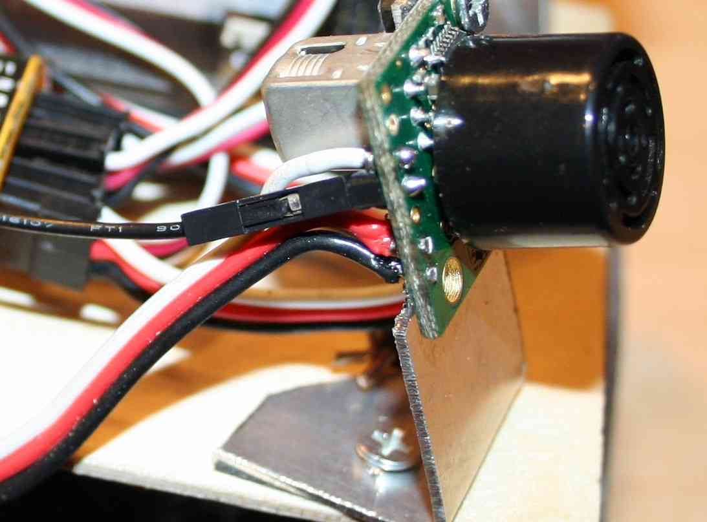

**Software setup:**

First, if you're using a second sonar sensor, you need to tell the
software what APM pins it is connected to. You can do that in the Adv
Parameters List in the "SONAR2_PIN" parameter (scroll down to the
parameters that begin with SONAR). Typically you will set that to 1 and
connect your second sonar sensor to APM 2.5's A1 port.

Likewise for the "stop pins" that APM uses to control when the sonar
sensors fire, to ensure that they don't interfere with each other. We
use A2 for Sonar 1 (left) and A3 for Sonar 2 (right).

The rest of the parameters shown below are appropriate for the
recommended MB1240 sensors.  Here are a few other parameters you'll want
to review and set as appropriate for your setup:

-  SONAR_TRIGGER is the distance at which you want the sonar to start
   to cause a steering deviation when an object is detected. We
   typically use 300cm (3 meters)
-  SONAR_SCALING is the value used to convert the input voltage into
   distance. Since we use the MB1240 sonar, our scaling parameter is
   2.04 which is based on 4.9mv/cm @5vdc.
-  SONAR_TURN_ANGLE is the angle, in degrees, the steering will make
   when the trigger distance is detected. A positive value will cause a
   right turn and a negative value will cause a left turn when only one
   sonar is in use.  We typically use 25 degrees for that.
-  SONAR_TURN_TIME is the amount of time that the steering will
   deviate when the trigger distance is detected. Defaults to 1 sec.
   We've actually used a smaller value (0.2 seconds) in the below so it
   doesn't turn away as long (we just want it to veer, not turn around)

All of these parameters, along with the others not documented here, are
fully described in :doc:`the Parameters List here <parameters>`.

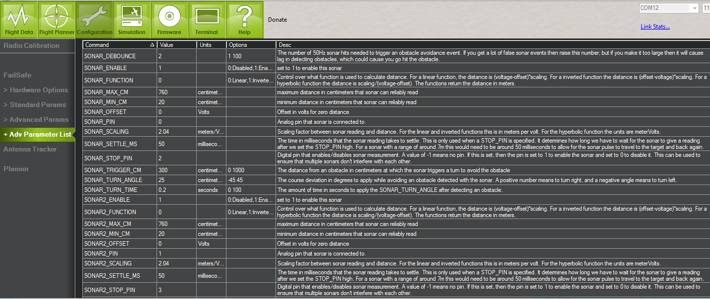

Testing your sonar setup
========================

The best way to test your sonar is by driving your rover around in
Steering mode.

**Steering Mode:**

The best way to test both your settings and the physical placement of
your sensors is in "Steering Mode", which will let you drive around in
manual RC mode but will override you when the sensors detect an
obstacle. Either assign that mode to a position on your RC Mode Switch
or select it via the Mission Planner over the wireless telemetry link by
using the Actions box on the Mission Planner Flight Data screen as shown
below.

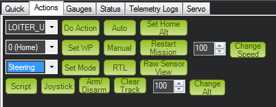

When you're in this mode, approach obstacles and ensure that the rover
steers away as you expect. A few troubleshooting tips:

If the rover detects phantom obstacles while just moving on open ground,
try one or more of the following:

#. Tilt the sensors up a bit more so they don't see the ground
#. Raise the SONAR_DEBOUNCE parameter from the default of 2 (50hz
   detections)
#. Turn the detection range a bit down from 300 cm

Power filtering (optional)
==========================

If you're getting a lot of electrical noise on your sensor (from you
rover's motors or the other electronics) you can improve performance
markedly by adding a simple filter.

To avoid spikes in the sonar data you should connect with a shielded
cable and include a cap and resistor to filter the power to the sonar as
described in \ `this tutorial <http://www.diydrones.com/profiles/blogs/fantastic-maxbotics-tutorial-on-using-sonor-sensors-with-multicop>`__ on
techniques to reduce noise and improve sensor performance. Maxbotics
sells the necessary components
`here <http://www.maxbotix.com/Ultrasonic_Sensors/MB7961.htm>`__.

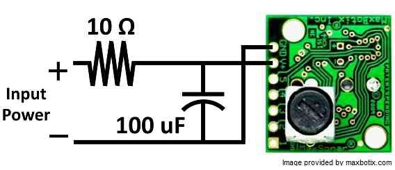

This image shows Slash Rover's twin sonars and shielded cables as part
of a power filtering setup.

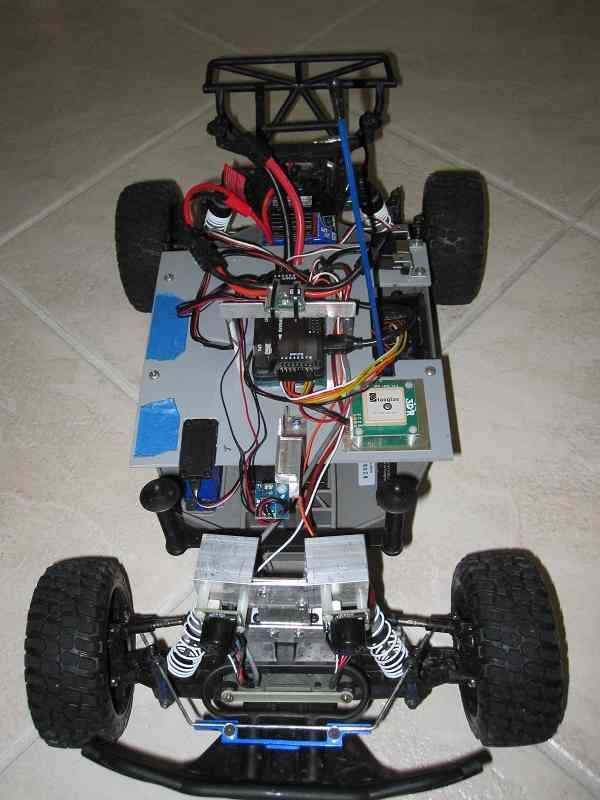
