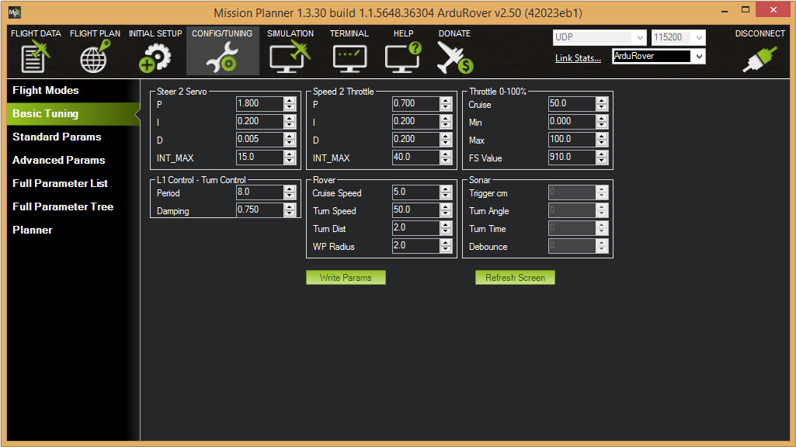

.. _speed-turn-parameter-tuning:

==============================================
Tuning Waypoint Turn Speed (ver 3.1 and older)
==============================================

**ARCHIVED**
.. note::

   These instructions are relevant for Rover-3.1 and older.
   For newer versions of the Rover firmware please refer to the :ref:`navigation tuning guide <rover-tuning-navigation>`.

The SPEED_TURN parameters are used to set the percentage reduction in
throttle when turning around a waypoint and the distance before a target
when the Rover will start to slow down.

The two parameters are listed below:

* ``SPEED_TURN_GAIN``

  * Range 0-100 Units: percent Increment 1 (50)
  * The percentage to reduce the throttle while turning. 
    If this is 100% then the target speed is not reduced while turning. 
    If this is 50% then the target speed is reduced in proportion to the turn rate, 
    with a reduction of 50% when the steering is maximally deflected.  

* ``SPEED_TURN_DIST``

  * Range 0-100 Units: meters Increment .1 (50)
  * The distance to the next turn at which the rover reduces its target 
    speed by the SPEED_TURN_GAIN.                                                                                                                                                                          |

The parameters are set in the *Mission Planner* **CONFIG/TUNING \| Basic
Tuning** page:

   Mission Planner: Rover BasicTuning

.. note::

   All parameters may be adjusted in the "Advanced Parameter List" in
   Mission Planner). All the Rover user settable parameters are listed in
   :doc:`Rover Parameters <parameters>`.
