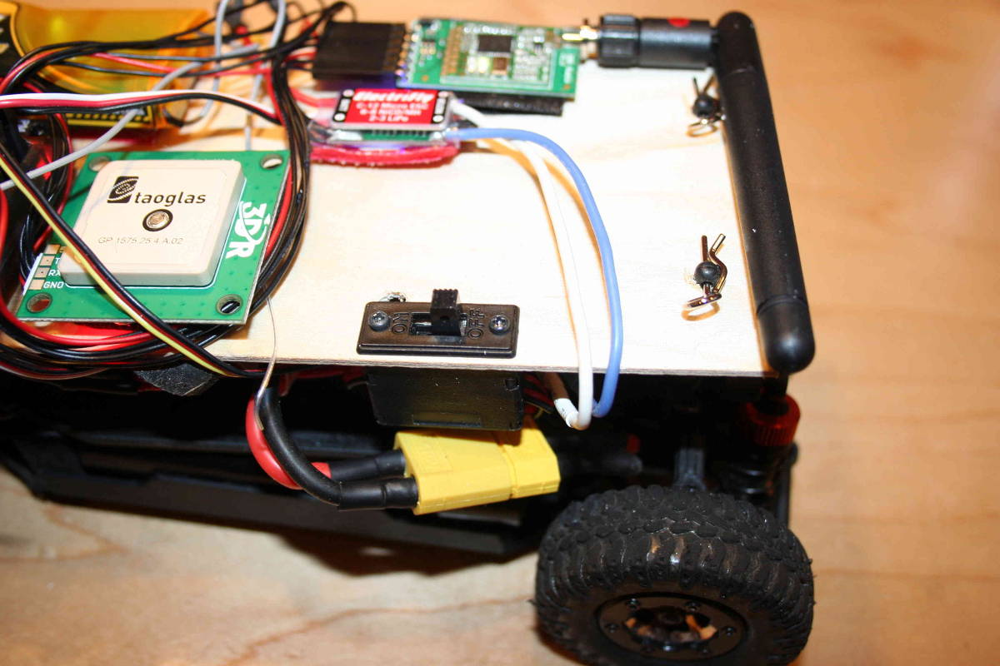
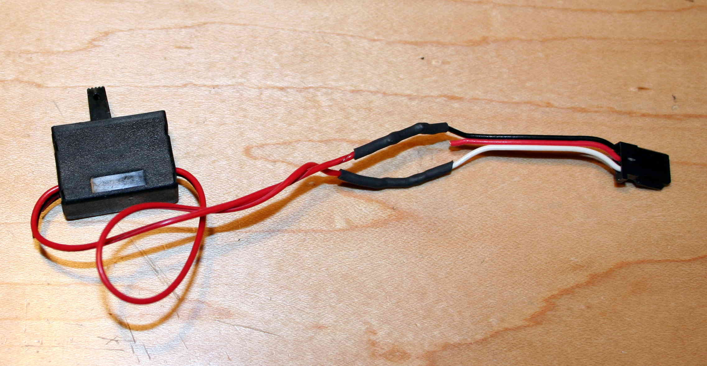
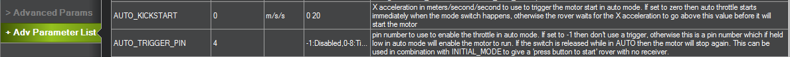

.. _startstop-switch:

=================
Start/Stop Switch
=================

For some robotics competitions, RC control is not allowed and the rover
must be started in :ref:`Auto <auto-mode>` mode with an onboard switch. This article
explains how to set up such a switch.

.. note::

   You don't necessarily need to use a switch for this. If you enable
   the :ref:`AUTO_KICKSTART <AUTO_KICKSTART>`
   function you can just kick your rover [not too hard!] and the sensed acceleration will start the vehicle automatically. But if
   you don't want to kick your car, a switch is the way to go)

Physical wiring
===============

The way this function works is that an APM port is assigned to the
Start/Stop switch and APM will wait for that pin to be brought low
(connected to ground). When this function is enabled, the Rover code
will not send power to the rover's motor in Auto mode until that pin
state is detected. So the rover will just stay stationary, waiting for
you to flick the switch. Once you do so, it will perform its Auto
mission as usual. You can stop the motion at any time by turning the
switch back to the off position

Any two-position switch will work, from a toggle (like `this one <https://www.sparkfun.com/products/9276>`__) to a slider as shown.
There should only be two terminals. Wire one to the white wire of a RC
servo cable and the other to the black wire as shown below. This way,
when the switch is in the "on" position it connects the ground and
signal pins.

Plug that connector into any spare APM port, from A0-A8 (the ports above
8 are not digital pins and cannot be used). We typically use A4, since
A0-A3 are used by the sonar sensors.

Software setup
==============

You can enable this switch in the Advanced Parameters List by entering
the number of the APM port you've connected the switch to in the
:ref:`AUTO_TRIGGER_PIN <AUTO_TRIGGER_PIN>`
parameter. In the example below, we've entered 4 because the switch is
plugged into port A4.

If you're not using RC at all and can't switch modes manually, you may
want to set your APM so that it boots into Auto mode at power-up (the
auto-start function only works in Auto mode). You can do that by setting
:ref:`INITIAL_MODE <INITIAL_MODE>`
to 10 (see parameter for other options).

Once this is set up, all you need to do at robotics competitions is
power on your rover, wait for GPS lock and when you get the green light,
flick the switch. The rover should take it from there!

.. note::

   Depending on your failsafe settings, the rover may not move if you
   don't have GPS lock. Check for that before flicking the Auto Start
   switch)
