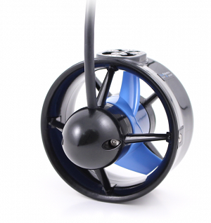
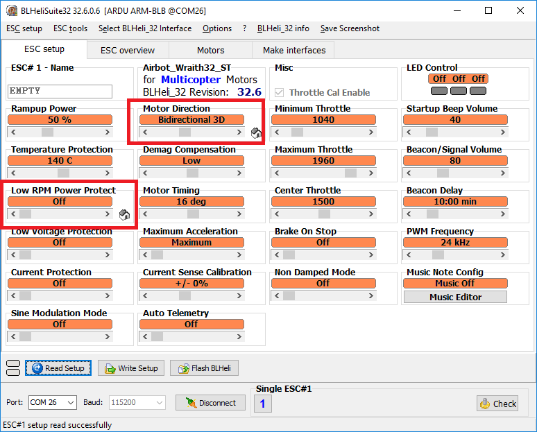

.. _thrusters:

====================================
Thrusters (for boats and submarines)
====================================

The `BlueRobotics T100 and T200 thrusters <https://www.bluerobotics.com/product-category/thrusters/>`__ are commonly used thrusters that can be controlled using a regular brushless motor ESCs or :ref:`BLHeli DShot ESCs <common-dshot>`

Clockwise and Counter-Clockwise propellers are included and should be used for skid-steering and omni vehicles to better balance the torque which could affect the vehicle's heading control

If using :ref:`BLHeli DShot ESCs <common-dshot>` set:

- "Motor Direction" to "Bidirectional 3D" 
- "Low RPM Power Protect" to "Off" 

