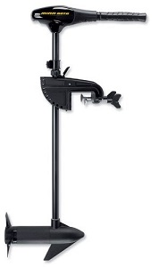
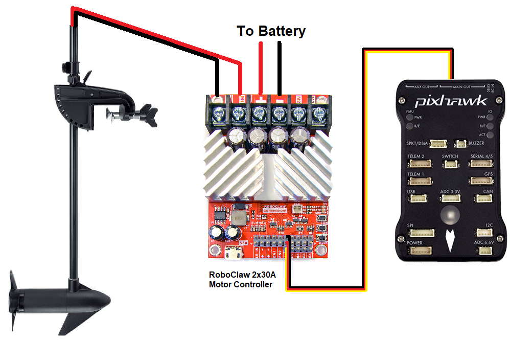

.. _trolling-motor:

==============
Trolling Motor
==============

This articles describes how to set-up a trolling motor for use with Rover

What To Buy
-----------

- Brushed trolling motor like the `Minn Kota Endura C2-30 <https://minnkotamotors.johnsonoutdoors.com/freshwater-trolling-motors/endura-c2>`__.  This can be powered from a 12V lipo battery and draws about 15amps at top speed
- Brushed motor controller with PWM input like the `Cytron SmartDrive 40 <https://www.cytron.io/p-mds40b>`__ or one of the `RoboClaw brushless motor controllers <http://www.basicmicro.com/34VDC_c_19.html>`__
- 3S Lipo battery with at least 20C rating and 5000mAh capacity (this should allow running at full speed for about 15min)

Connecting and Configuring
--------------------------

- Remove the upper handle and control section of the motor to expose the positive and negative leads
- Connect the motor leads to the M1 terminals of the brushed motor controller
- Connect the motor controller's RC input to the appropriate RC output from the autopilot (i.e. RC Output 3 for a :ref:`Separate Steering and Throttle vehicle <rover-motor-and-servo-connections>`)

- Test the motor moves in the correct direction using the Mission Planner's Motor Test page (see :ref:`Motor and Servo configuration <rover-motor-and-servo-configuration>` wiki page).  If the motor spins in the incorrect direction then reverse the black and red wires connecting the motor driver to the motor or change the :ref:`SERVO3_REVERSED <SERVO3_REVERSED>` parameter (assuming motor controller is connected to autopilot's RC Output 3)
- If the motor does not spin at full speed try lowering :ref:`SERVO3_MIN <SERVO3_MIN>` and/or increasing :ref:`SERVO3_MAX <SERVO3_MAX>` (assuming motor controller is connected to autopilot's RC Output 3)
- If the motor moves slowly forwards or backwards when it should be stopped then adjust :ref:`SERVO3_TRIM <SERVO3_TRIM>` (assuming motor controller is connected to autopilot's RC Output 3)
