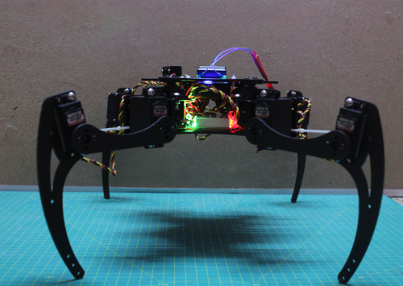
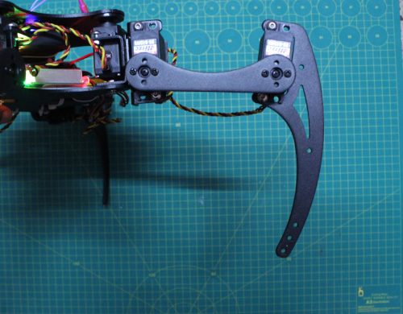
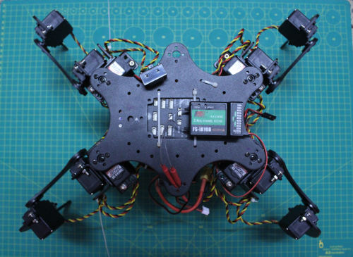
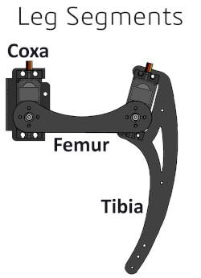

.. _walking-robots:

==============
Walking Robots
==============

ArduPilot Rover 4.1 (and higher) includes basic support for four legged walking robots.  More details can be found in `this GSoC 2020 blog post <https://discuss.ardupilot.org/t/gsoc-2020-walking-robot-support-for-ardupilot/57080>`__

..  youtube:: 07C-O9GdTkY
    :width: 100%

.. warning::

    This page is still a work-in-progress

Hardware Required
-----------------

- 1x `Lynxmotion Phoenix 3DOF Hexapod frame <https://www.robotshop.com/jp/en/lynxmotion-phoenix-3dof-hexapod---black-no-servos---electronics.html>`__ (only 4 legs will be attached)
- 12x `Hitec HS-645MG Servo <https://www.robotshop.com/en/hitec-hs-645mg-servo-motor.html>`__
- 1x 2200mAh 2S lipo battery
- 1x `15Amp UBEC <https://hobbyking.com/en_us/turnigy-8-15a-ubec-for-lipoly.html>`__
- :ref:`ArduPilot compatible autopilot <common-autopilots>` with at least 12 PWM outputs and ideally with the powerful STM32H7 CPU to give enough memory to run :ref:`Lua scripts <common-lua-scripts>` easily

Hardware Setup
--------------

Frontal view

- It is critically important that the Ardupilot knows the orientation of each leg when the servos are centered. The code assumes that, when all the servos are centered, the coxa faces directly away from the body, the femur is level with the ground, and the tibia is at an angle of 90 degrees relative to the femur.

Images can be used for reference.

Leg orientation 

Top view

  

Connect the AutoPilot's pwm outputs to each servo as listed below:

+----------------------+--------------------------------+
| **Output**           |        **Servo**               |
+----------------------+--------------------------------+
|        1             | front right coxa (hip) servo   |  
+----------------------+--------------------------------+
|        2             | front right femur(thigh) servo |
+----------------------+--------------------------------+
|        3             | front right tibia(shin) servo  | 
+----------------------+--------------------------------+
|        4             | front left coxa(hip) servo     |    
+----------------------+--------------------------------+
|        5             | front left femur(thigh) servo  |  
+----------------------+--------------------------------+
|        6             | front left tibia(shin) servo   |  
+----------------------+--------------------------------+
|        7             | back left coxa(hip) servo      |
+----------------------+--------------------------------+
|        8             | back left femur(thigh) servo   |   
+----------------------+--------------------------------+
|        9             | back left tibia(shin) servo    |
+----------------------+--------------------------------+
|        10            | back right coxa(hip) servo     |       
+----------------------+--------------------------------+
|        11            | back right femur(thigh) servo  |  
+----------------------+--------------------------------+
|        12            | back right tibia(shin) servo   |       
+----------------------+--------------------------------+

Configuration and Setup
-----------------------

1) Connections, Firmware and Calibration
========================================

#. Refer to :ref:`autopilot system assembly instructions <rover-autopilot-assembly-instructions>` for making connections between the autopilot board and each of these components:

    - Power Module
    - Servos
    - RC Receiver
    - GPS(optional)
    - Telemetry(optional)
    
Use a ground station to load Rover-4.1 (or higher) to the autopilot
#. :ref:`Install GCS<common-install-gcs>` (Mission Planner recommended) and :ref:`upload rover firmware<common-loading-firmware-onto-pixhawk>`, if ArduPilot firmware already is installed, or :ref:`Loading Firmware onto boards without existing ArduPilot firmware (first time only) <common-loading-firmware-onto-chibios-only-boards>`
#. Perform all the :ref:`hardware calibration<rover-code-configuration>` steps for:

    - :ref:`Accelerometer<common-accelerometer-calibration>`
    - :ref:`Compass<common-compass-calibration-in-mission-planner>`
    - :ref:`Radio<common-radio-control-calibration>` 
    - :ref:`RC Mode Setup<common-rc-transmitter-flight-mode-configuration>` (Add Manual and Acro Modes)
 
2) Loading lua script to ardupilot
==================================

    - Connect with a ground station and set :ref:`SCR_ENABLE <SCR_ENABLE>` = 1 to enable Lua scripting and reboot the autopilot
    - Download `quadruped.lua <https://github.com/ArduPilot/ardupilot/tree/master/libraries/AP_Scripting/examples>`__ from the ArduPilot Github repo to your PC
    - Load the quadruped.lua script to the autopilot using MAVFTP or by directly copying to the SD Card's APM/scripts directory (`see video     <https://youtu.be/3n80dYoJQ60?t=71>`__)
 
3) Additional Parameter Configuration
=====================================

 - set  RCx_OPTION parameters 
 - set any unused channels to access these features 
 
Supported Features
==================
+----------------------+----------------------------+
| **RCx_OPTION value** | **Feature Description**    |
+----------------------+----------------------------+
|      201             |         Roll               |
+----------------------+----------------------------+
|      202             |         Pitch              |
+----------------------+----------------------------+
|      203             |      Walking Height        | 
+----------------------+----------------------------+
    
4) Arming
=========

- Set a :ref:`transmitter switch<common-auxiliary-functions>` for arming. Ensure the channel used for the switch has been :ref:`calibrated<common-radio-control-calibration>`. To configure a channel for arming, for example channel 7, then set the parameter:

    - :ref:`RC7_OPTION<RC7_OPTION>` =41 (Sets function of channel 7 as arming/disarming)

- Connect the battery. Connect the autopilot board to GCS via USB or telemetry.

- Keep the robot on its belly and then arm it. If arming is not successful check the error message on the GCS and identify the problem from the :ref:`rover arming page<arming-your-rover>` .

- After the autopilot board arms, the robot should stand up on it's own

Simulation with SITL and pyBullet
---------------------------------

..  youtube:: HLSQ7xdKeI0
    :width: 100%
    
The following steps will get you running with the quadruped example.

- Ensure the :ref:`ArduPilot source code is installed on your machine <where-to-get-the-code>`
- Ensure the PC is runing Ubuntu 18.04 (other versions may work but this has not been confirmed yet)
- Install pybullet

:: 

   pip3 install pybullet
   
- cd to the ardupilot/Rover directory  
- create a "scripts" directory and copy `quadruped.lua <https://github.com/ArduPilot/ardupilot/tree/master/libraries/AP_Scripting/examples>`_ into it
- Open a terminal to /ardupilot/Rover directory and start ArduPilot SITL

::

   simvehicle.py --map --console -D -f JSON
   
- Enable scripting and then restart SITL

:: 

   param set SCR_ENABLE 1
   
- Set channels for roll, pitch and height
   Example:

:: 

   param set RCx_OPTION 202

- Open another termial to launch pyBullet

:: 

   cd ardupilot/libraries/SITL/examples/JSON/pybullet
   
:: 

   python3 walking_robot.py
   
   
