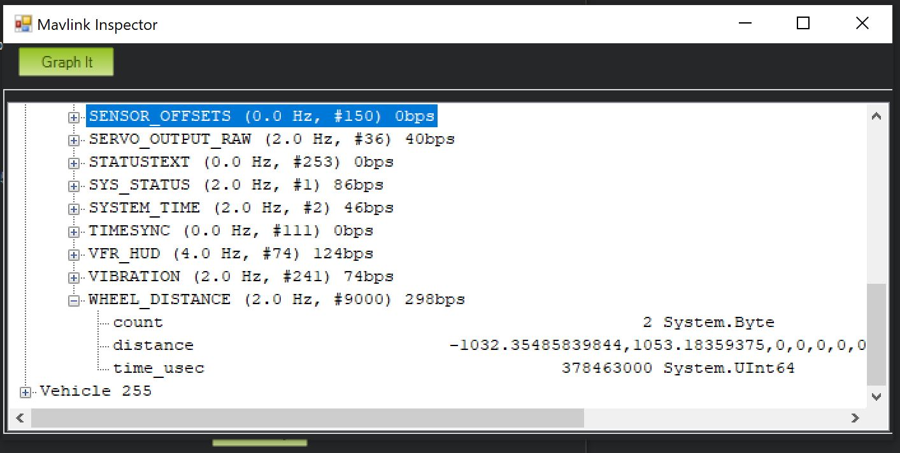

.. _wheel-encoder:

==============
Wheel Encoders
==============

Rover supports up to two "AB" wheel encoders like those in `this Pololu motor <https://www.pololu.com/product/1442>`__ which can be used to improve position estimation especially when no GPS is used.

..  youtube:: eaLBRx7LYD8
    :width: 100%

Connection and Setup
====================

.. image:: ../../../images/wheel-encoder-pixhawk.png
    :target: ../_images/wheel-encoder-pixhawk.png

- connect motor encoder's A and B outputs to the autopilot (i.e. Pixhawk's) AUX OUT 3,4,5 and 6 pins.  Normally 3,4 should be used for the left motor's encoder, 5,6 for the right's.
- set ``BRD_PWM_COUNT`` to 2 to allow AUX OUT 3 and 4 to be used as inputs

.. note:: in firmware versions 4.2 and later, the method for setting a PWM/SERVO/MOTOR output to be a GPIO function is changed. Instead of ``BRD_PWM_COUNT`` being used, the individual ``SERVOx_FUNCTION`` parameter is merely set to "-1". If set to "0", it remains a PWM output, unassigned to a function, and outputs that output's trim value when board safety is not active. If the servo function is being "mirrored" to a remote device, as in the case of a DroneCAN or KDECAN ESC, then in order to change the autopilot board's corresponding output pin to be a GPIO, but allow the ``SERVOx_FUNCTION`` to still be assigned to the remote device, the :ref:`SERVO_GPIO_MASK<SERVO_GPIO_MASK>` parameter can be used to assign the board pin to be a GPIO without affecting the ``SERVOx_FUNCTION`` assignment for the remote device.

- set :ref:`WENC_TYPE <WENC_TYPE>` and :ref:`WENC2_TYPE <WENC_TYPE>` to 1 to enable reading from two wheel encoders
- set :ref:`WENC_CPR <WENC_CPR>` and :ref:`WENC2_CPR <WENC2_CPR>` to the counts-per-revolution of the encoder.  This is the number of "pings" the encoder will produce for each full revolution of the wheel
- set :ref:`WENC_RADIUS <WENC_RADIUS>` and :ref:`WENC2_RADIUS <WENC2_RADIUS>` to the radius (in meters) of each wheel (i.e. 5cm radius would be 0.05)
- set :ref:`WENC_POS_X <WENC_POS_X>` and :ref:`WENC_POS_Y <WENC_POS_Y>` to define the first wheel's distance from the autopilot or COG (i.e. :ref:`WENC_POS_X <WENC_POS_X>` = 0.10, :ref:`WENC_POS_Y <WENC_POS_Y>` = -0.05 means the wheel is 10cm ahead and 5cm left of the autopilot) 
- set :ref:`WENC2_POS_X <WENC2_POS_X>` and :ref:`WENC2_POS_Y <WENC2_POS_Y>` to define the second wheel's distance from the autopilot or COG
- disable :ref:`relays <common-relay>` by setting :ref:`RELAY1_PIN <RELAY1_PIN>` and :ref:`RELAY2_PIN <RELAY2_PIN>` to -1

To enable position estimation using the wheel encoders the EKF3 must be used and configured as follows:

- set :ref:`AHRS_EKF_TYPE <AHRS_EKF_TYPE>` to 3 (means use EKF3)
- set :ref:`EK2_ENABLE <EK2_ENABLE>` to 0 (disable EKF2)
- set :ref:`EK3_ENABLE <EK3_ENABLE>` to 1 (enable EKF3)
- set :ref:`EK3_SRC1_VELXY <EK3_SRC1_VELXY>` to 7 ("WheelEncoder")
- (optionally) set :ref:`EK3_SRC1_POSXY <EK3_SRC1_POSXY>` to 0 ("None") to disable use of GPS for horizontal position
- (optionally) set :ref:`EK3_SRC1_VELZ <EK3_SRC1_VELZ>` to 0 ("None") to disable use of GPS for vertical velocity

After making the above changes the autopilot should be rebooted

Ground Testing
==============

The ``WHEEL_DISTANCE`` MAVLink message shows the total distance travelled by each wheel in real time.  Mission Planner's MAVLink Inspector can be used which can be opened by pressing Ctrl-F and then pushing the "MAVLink Inspector" button.

DataFlash logging
=================

The wheel encoder data including total distance travelled by each wheel appears in the WENC dataflash log messages.
