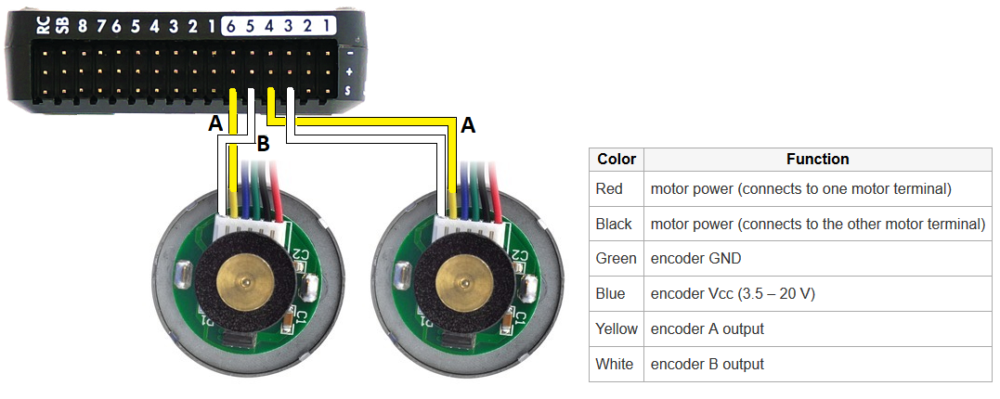

.. _wheel-encoder:

==============
Wheel Encoders
==============

Rover 3.2 includes support for up to two AB wheel encoders like those in `this Pololu motor <https://www.pololu.com/product/1442>`__ which can be used to improve position estimation especially when no GPS is used.

..  youtube:: eaLBRx7LYD8
    :width: 100%

Connection and Setup
====================

- connect motor encoder's A and B outputs to the flight controller (i.e. Pixhawk's) AUX OUT 3,4,5 and 6 pins.  Normally 3,4 should be used for the left motor's encoder, 5,6 for the right's.
- set :ref:`BRD_PWM_COUNT <BRD_PWM_COUNT>` to 2 to allow AUX OUT 3 and 4 to be used as inputs
- set :ref:`WENC_TYPE <WENC_TYPE>` and :ref:`WENC2_TYPE <WENC_TYPE>` to 1 to enable reading from two wheel encoders
- set :ref:`WENC_CPR <WENC_CPR>` and :ref:`WENC2_CPR <WENC2_CPR>` to the counts-per-revolution of the encoder.  This is the number of "pings" the encoder will produce for each full revolution of the wheel
- set :ref:`WENC_RADIUS <WENC_RADIUS>` and :ref:`WENC2_RADIUS <WENC2_RADIUS>` to the radius (in meters) of each wheel (i.e. 5cm radius would be 0.05)
- set :ref:`WENC_POS_X <WENC_POS_X>` and :ref:`WENC_POS_Y <WENC_POS_Y>` to define the first wheel's distance from the flight controller or COG (i.e. :ref:`WENC_POS_X <WENC_POS_X>` = 0.10, :ref:`WENC_POS_Y <WENC_POS_Y>` = -0.05 means the wheel is 10cm ahead and 5cm left of the flight controller) 
- set :ref:`WENC2_POS_X <WENC2_POS_X>` and :ref:`WENC2_POS_Y <WENC2_POS_Y>` to define the second wheel's distance from the flight controller or COG

To enable position estimation using the wheel encoders the EKF3 must be set as the main AHRS:

- set :ref:`AHRS_EKF_TYPE <AHRS_EKF_TYPE>` to 3 (means use EKF3)
- set :ref:`EK2_ENABLE <EK2_ENABLE>` to 0 (disable EKF2)
- set :ref:`EK3_ENABLE <EK3_ENABLE>` to 1 (enable EKF3)

After making the above changes the flight controller should be rebooted

Ground Testing
==============

The RPM of the two wheels can be seen as "rpm1" and "rpm2" in the ground station.

If using the Mission Planner these values can be seen in the Flight Data screen's Status tab.

DataFlash logging
=================

The wheel encoder data including total distance travelled by each wheel appears in the WENC dataflash log messages.
