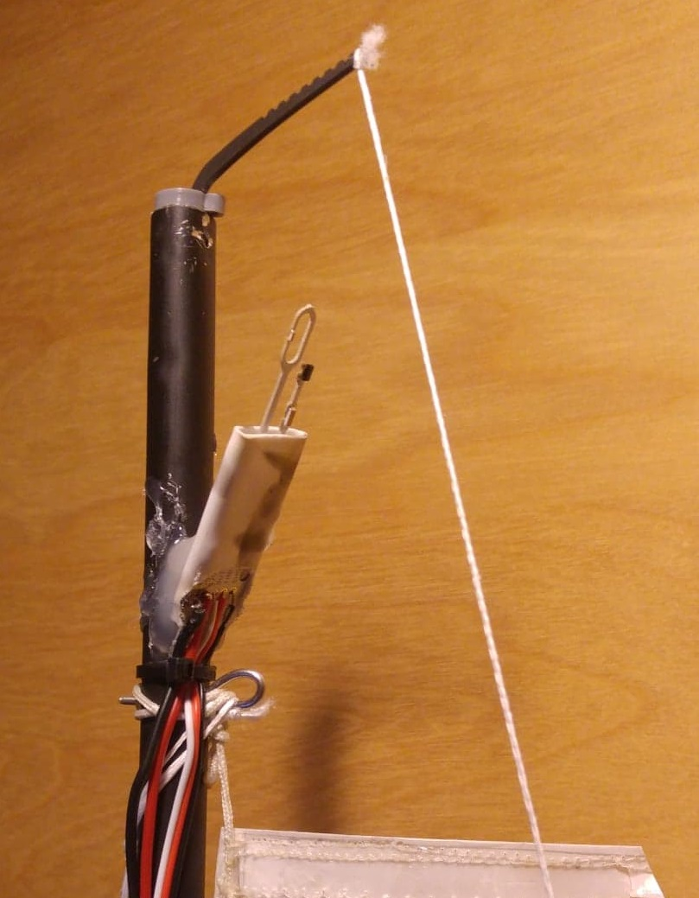

.. _wind-vane-MD-rev-p:

================================
Modern Devices Wind Speed Sensor
================================

A `Modern Devices wind sensor Rev. P <https://www.moderndevice.com/product/wind-sensor-rev-p>`__ hot wire anemometer can be used to sense the wind speed. This is selected by
setting :ref:`WNDVN_SPEED_TYPE <WNDVN_SPEED_TYPE>` to 2. 

This should be powered by between 10V and 12V and the OUT and TMP pins connected to two 3.3V ADC pins. The speed output pin labeled OUT should connected to 
the autopilot ADC pin defined by :ref:`WNDVN_SPEED_PIN <WNDVN_SPEED_PIN>`. The TMP pin of the sensor should be connected to the autopilot ADC
pin defined by :ref:`WNDVN_TEMP_PIN <WNDVN_TEMP_PIN>`. If only a single ADC pin is available the TMP output may be omitted, :ref:`WNDVN_TEMP_PIN <WNDVN_TEMP_PIN>`
should be set to -1 in this case. The code will then assume room temperature; this will slightly reduce the accuracy of the wind speed reading.

The :ref:`WNDVN_SPEED_OFS <WNDVN_SPEED_OFS>` should be set to the voltage reading in zero wind. This calibration can be triggered automatically by setting :ref:`WNDVN_CAL <WNDVN_CAL>`
to 2. The vehicle must be disarmed and the sensor sheltered from the wind. You will see a message in your GCS reporting the updated offset voltage.
