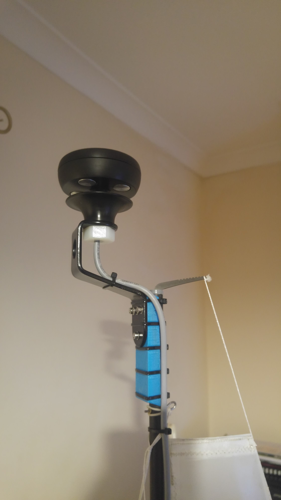
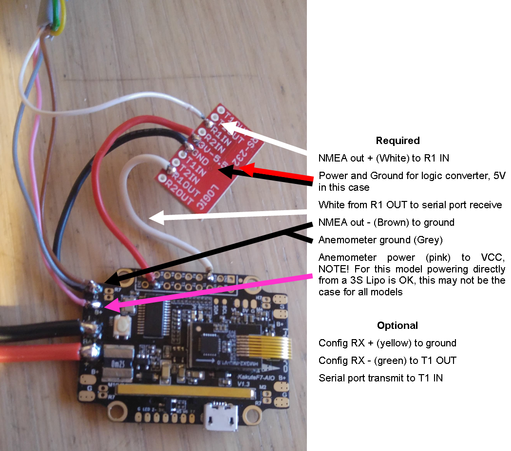

.. _wind-vane-NMEA:

=======================
NMEA 0183 Wind Vane
=======================

NMEA 0813 is a widely used maritime standard, this driver makes used of the `MWV message <https://gpsd.gitlab.io/gpsd/NMEA.html#_mwv_wind_speed_and_angle>`__ 
this is used by many wind sensors sold for use on full-size sailboats. This example shows a `Calypso Wired Standard anemometer <https://calypsoinstruments.com/shop/product/ultrasonic-wired-standard-81>`__ 
this is a ultrasonic anemometer that provides acuate wind speed and direction in a small package. Typically ultrasonic anemometers are more acuate than traditional wind vanes,
particularly in low wind speeds.

    
The NMEA driver can be selected by setting :ref:`WNDVN_TYPE <WNDVN_TYPE>` to 4 and/or :ref:`WNDVN_SPEED_TYPE <WNDVN_SPEED_TYPE>` to 4. The driver uses a serial port,
the selected :ref:`seral port's protocol<SERIAL2_PROTOCOL>` should set to type 21 for WindVane.  For use with a wind vane the :ref:`WNDVN_DIR_OFS <WNDVN_DIR_OFS>` parameter
can be set to account for any offset between the wind vanes' forward direction that of the vehicle. Electrical connection is slightly more complex as NMEA 0183 uses a RS-422 signal.
Commercial RS-422 to ttl logic level converters designed for use with NMEA will make this connection easy however, they can be costly. It is possible to use a RS-233 converter
with most NMEA devices, these are much more readily available. This example shows a MAX3232 based transceiver board from SparkFun, for use with a expensive device such as a wind vane it
is recommended to buy from a reputable supplier, clone MAX3232 are common. Note than the wire colors in the diagram may not match your device. 

.. tip:: Although not required for normal operation on some NMEA devices have receive inputs, these can be connected to the autopilot via the logic translator. This allows ArduPilot to act as a :ref:`NMEA to USB adapter <common-serial-passthrough>` for use with the manufacturers tools for updating the wind vanes' firmware or configuration.  
