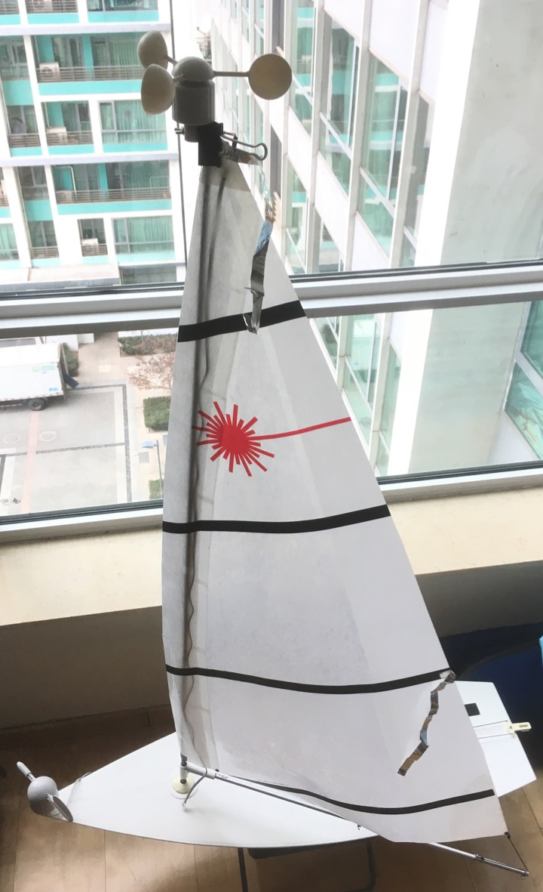

.. _wind-vane-rpm:

=======================
RPM wind speed sensor
=======================
 
A cups type anemometer can be used via the :ref:`RPM library <common-rpm>` (as of master feb 2019). This is selected by setting :ref:`WNDVN_SPEED_TYPE <WNDVN_SPEED_TYPE>`
to 3. The RPM library must be setup accordingly using the first :ref:`RPM sensor <RPM1_TYPE>`. The :ref:`RPM1_SCALING <RPM1_SCALING>` value must be calculated
such that wind speed in m/s is returned. 

