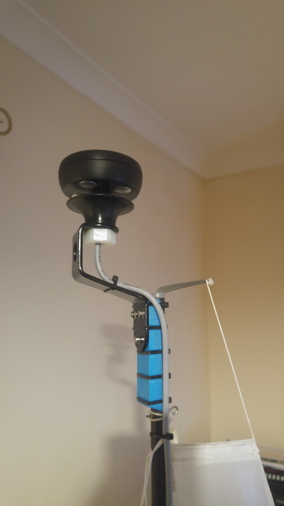

.. _wind-vane:

==============
Wind Vane
==============

A wind vane is used to sense both the speed and direction of the apparent wind; this can
then be used to calculate the true wind speed and direction. Wind vanes are only supported for Rover sailing vehicles. 
All wind vane parameters can be found by searching for the prefix :ref:`WNDVN <WNDVN_TYPE>`.

.. tip:: For best results wind sensors should be mounted as high as possible away from any part of the vehicle that may disturb the air flow around the vane

Some wind sensors can be used to sense both the wind speed and direction. In this case both :ref:`WNDVN_TYPE <WNDVN_TYPE>` and
:ref:`WNDVN_SPEED_TYPE <WNDVN_SPEED_TYPE>` should be set to the same value. If a sensor reports both speed and direction it is still
possible to use only the speed or direction by setting the :ref:`WNDVN_TYPE <WNDVN_TYPE>` or :ref:`WNDVN_SPEED_TYPE <WNDVN_SPEED_TYPE>` 
to a alternative sensor. Note that any change to the _TYPE parameters will require a re-boot to take effect

.. toctree::
    :maxdepth: 1
    
    NMEA 0183 <wind-vane-NMEA>

Wind Direction
----------------------
Wind direction can be directly sensed through the use of an analogue voltage input. However it is also possible to use a fixed wind direction,
this is not recommended for long term use, but will allow testing of sailboats without the need for specialist sensors. The wind vane type can be
selected with :ref:`WNDVN_TYPE <WNDVN_TYPE>`. The wind direction is filtered using a low pass filter, the frequency of this filter can be set 
using :ref:`WNDVN_DIR_FILT <WNDVN_DIR_FILT>`. If the wind direction is oscillating this frequency can be reduced. This will reduce the effect
of fast oscillating wind shifts but will also reduce the response time to a change in wind direction.

If a wind speed sensor is also fitted the :ref:`WNDVN_SPEED_MIN <WNDVN_SPEED_MIN>` speed can be set. At wind speeds less than this the direction reading will be ignored,
this allows the vane to be ignored when it may be stuck or inaccurate due to a temporary drop in wind. Keep in mind that if the wind is consistently less than this value
the vehicle will have no new information about wind direction.

.. toctree::
    :maxdepth: 1
    
    Analogue Wind Vane <wind-vane-analogue>
    Home Heading <wind-vane-home-heading>

Wind Speed
------------------

A wind speed sensor is not absolutely required to get a sailing vehicle to work well. If one is not fitted apparent wind effects are
ignored, for vehicles that move slowly in comparison to the wind speed this will have little effect however, if possible, it is always
better to have a wind speed sensor. The wind speed sensor type can be changed with :ref:`WNDVN_SPEED_TYPE <WNDVN_SPEED_TYPE>`. The wind
speed is filtered using a low pass filter, the frequency of this filter can be set using :ref:`WNDVN_SPEED_FILT <WNDVN_SPEED_FILT>`.

.. toctree::
    :maxdepth: 1
    
    Airspeed <wind-vane-airspeed>
    RPM <wind-vane-rpm>
    Modern Devices rev-p <wind-vane-MD-rev-p>

