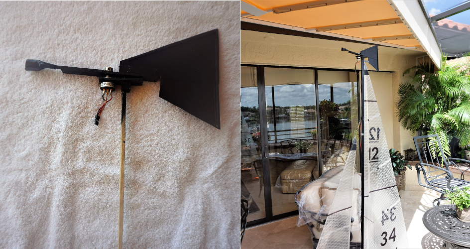
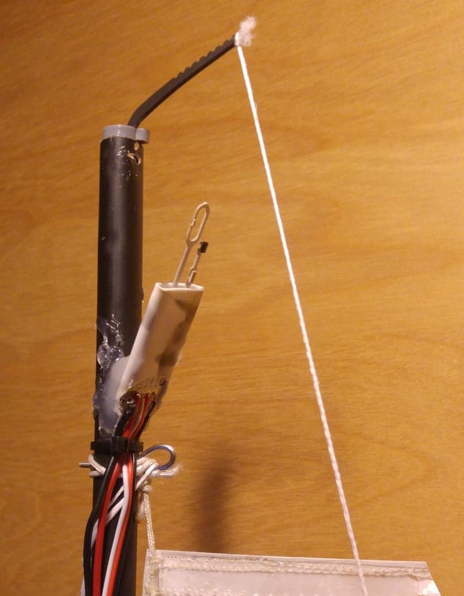

.. _wind-vane:

==============
Wind Vane
==============

A wind vane is used to sense both the wind speed and direction of the apparent wind; this can
then be used to calculate the true wind speed and direction. Wind vanes are only supported for Rover sailing vehicles.
All wind vane paramiters can be found by serching for the prefix :ref:`WNDVN <WNDVN_TYPE>`.

Sensing wind direction
----------------------
Wind direction can only be directly sensed through the use of an analogue voltage from a 360 degree
rotation potentiometer at this time. Two other methods can be used to give the code information about
the wind direction. The wind vane type can be selected with :ref:`WNDVN_TYPE <WNDVN_TYPE>`.

Home heading wind direction
+++++++++++++++++++++++++++
WNDVN_TYPE = 1, the wind vane library assumes the wind is coming from the direction the vehicle was pointing when armed.
This method is slightly improved upon by type 2 allowing this initial wind direction to be offset +- 45 degrees
by a RC input channel defined by :ref:`WNDVN_RC_IN_NO <WNDVN_RC_IN_NO>`. These methods do not directly sense the wind but just assume
it is coming from a constant direction so they shouldn't be used in shifty wind conditions or for longer missions.
They are however a good method to test sailing support before a proper wind vane can be fitted.

Potentiometer wind vane
+++++++++++++++++++++++

WNDVN_TYPE = 3, this wind vane relies on the reading voltage from a 360 degree rotation potentiometer. A Bourns `6630S0D-C28-A103 <https://www.bourns.com/docs/product-datasheets/6630.pdf>`__
has been used with success and is easy to get hold of. However it takes quite a large force to rotate. A more free-turning
one would provide better results. If you find a better one please `tell us <https://discuss.ardupilot.org/t/sailboat-support/32060>`__! The outer pins of the potentiometer should be
wired to a voltage less than the voltage rating of the ADC pin you plan on using. If using a 6.6V ADC the potentiometer can
be wired to 5V and ground. If using a 3.3V ADC the potentiometer can be wired to 3.3V if available or for a 10k potentiometer
a 5.6k resistor can be used to drop 5V down to less than 3.3V. As the potentiometer passes from maximum to minimum output voltage the
wiper pin is briefly floating, it is recommended to use a high value pull down resistor of around 100k. The outer pins of the potentiometer
should be connected in such a way that rotating the potentiometer clockwise will result in an increasing voltage.

The analogue pin the potentiometer is connected to is defined by :ref:`WNDVN_DIR_PIN <WNDVN_DIR_PIN>`. The maximum and minimum voltage should be
set. This can be done by manually setting :ref:`WNDVN_DIR_V_MIN <WNDVN_DIR_V_MIN>` and :ref:`WNDVN_DIR_V_MAX <WNDVN_DIR_V_MAX>` but it is recommended that a automatic calibration
is used. To trigger this the :ref:`WNDVN_CAL <WNDVN_CAL>` parameter should be set to one.  A message will appear saying "WindVane: Calibration started, rotate wind vane"
the vane should then be slowly rotated for 30 seconds until "WindVane: Calibration complete" is seen.
The vehicle should then the pointed north so that the yaw angle is zero. If the wind vane is set up correctly you
should see the wind direction value increase as you turn the vane clockwise, it should reach both zero and 359 degrees. If this is not
the case double check the potentiometer is wired such that a clockwise movement provides a increasing voltage and check the min and max
voltage parameters are sensible. Now the vane can be set such that it points to the front of the vehicle as if it was head to wind. The
negative of wind_dir value should then be set to the :ref:`WNDVN_DIR_OFS <WNDVN_DIR_OFS>` parameter. The wind_dir value should now be zero and read 90 degrees
when turned 90 degrees clockwise and read 270 degrees when turned 90 degrees anticlockwise.

.. note:: In testing so far it has been found that the potentiometer is not very accurate. An accuracy of +- 20 degrees around the a full rotation is acceptable. The potentiometer should however be repeatable. If your potentiometer has a large dead zone where it passes from maximum to minimum voltage some improvement may be gained by setting :ref:`WNDVN_DIR_DZ <WNDVN_DIR_DZ>` to a suitable angle, a dead zone value may be provided in the data sheet for your potentiometer.

If a wind speed sensor is also fitted the :ref:`WNDVN_SPEED_MIN <WNDVN_SPEED_MIN>` speed can be set. At wind speeds less than this the vane will be ignored,
this allows the vane to be ignored when it may be stuck due to a temporary drop in wind.
Keep in mind that if the wind is consistently less than this value the vehicle will have no new information about wind direction.

The wind speed is low pass filtered at a frequency defined by :ref:`WNDVN_DIR_FILT <WNDVN_DIR_FILT>`. If the wind direction is oscillating this frequency
can be reduced. This will reduce the effect of fast oscillating wind shifts but will also reduce the response time to a change in wind direction.

It is hoped that more accurate sensors for reading the angle of the wind vane will be supported in the future. 

Wind vane construction
++++++++++++++++++++++

A wind vane should be constructed to provide the maximum force to turn the potentiometer. A larger wind vane will be more effective
in lighter winds than a smaller one. It is recommended to mount the vane as high as possible so that it is in clear wind. The vane must be
balanced about the pivot point so that any heel angle of the craft does not change the reading. The weight of a well balanced vane has little
effect; it can be directly mounted to the shaft of the potentiometer.

Sensing wind speed
------------------

A wind speed sensor is not absolutely required to get a sailing vehicle to work well. If one is not fitted apparent wind effects are
ignored, for vehicles that move slowly in comparison to the wind speed this will have little effect however If possible it is always
better to have a wind speed sensor.

The wind speed can be sensed in two ways, the wind speed sensor type can be changed with :ref:`WNDVN_SPEED_TYPE <WNDVN_SPEED_TYPE>`.  The first is to read the
speed from the :ref:`airspeed library <airspeed>` . This allows any pitot tube type airspeed sensor to be used. It is important the :ref:`ARSPD_USE <ARSPD_USE>` and
:ref:`ARSPD_AUTOCAL <ARSPD_AUTOCAL>` parameters are left at zero, they enable features designed for aircraft that will not work with Rover.

It may also be desirable to disable start up calibration with :ref:`ARSPD_SKIP_CAL <ARSPD_SKIP_CAL>`. If left enabled the airspeed sensor will be zeroed at boot.
This recalibration requires the sensor is sheltered from the wind, this may be hard on a sailing craft. Pitot tube airspeed sensors must 
be pointed directly into the wind, in this case that would require mounting the sensor to the wind vane. Due to this mechanical complexity
other methods of sensing wind speed may be more convenient.

Hot Wire Anemometer
+++++++++++++++++++

A hot wire anemometer can be used to sense the wind speed from any direction so can be mounted directly to the vehicle. So far only the
`modern devices wind sensor Rev. P <https://moderndevice.com/product/wind-sensor-rev-p/>`__ is supported.
This should be wired to between 10V and 12V the OUT and TMP pins are then connected to two 3.3V ADC pins. As with the wind vane the
sensor should be mounted as high as possible.

The speed output pin labelled OUT should connected to the flight controller ADC pin defined by :ref:`WNDVN_SPEED_PIN <WNDVN_SPEED_PIN>`. The TMP pin of
the sensor should be connected to the flight controller ADC pin defined by :ref:`WNDVN_TEMP_PIN <WNDVN_TEMP_PIN>`. If only a single ADC pin is available
the TMP output can be omitted, :ref:`WNDVN_TEMP_PIN <WNDVN_TEMP_PIN>` should be set to -1 in this case. The code will then assume room temperature; this will
reduce the accuracy of the wind speed reading. The :ref:`WNDVN_SPEED_OFS <WNDVN_SPEED_OFS>` parameter should be increased until there is a small wind speed reading in
zero actual wind speed, it can then be reduced again until it just reaches zero.

The wind speed is filtered using a low pass filter, the frequency of this filter can be set using :ref:`WNDVN_SPEED_FILT <WNDVN_SPEED_FILT>`.
