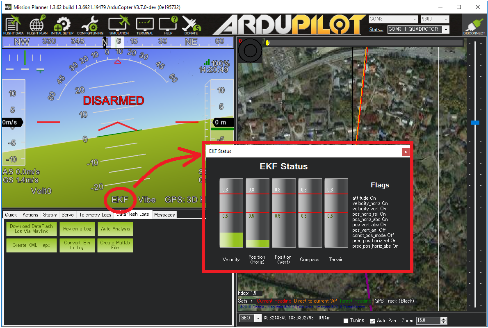

.. _ekf-inav-failsafe:

============
EKF Failsafe
============

The EKF failsafe monitors the health of EKF (the position and attitude estimation system) to catch problems with the vehicle's position estimate (caused by compass errors or velocity estimate errors) and prevent "swimaways".

When will it trigger?
=====================

The EKF failsafe will trigger when any two of the EKF "variances" for compass, position or velocity are higher than the :ref:`FS_EKF_THRESH <FS_EKF_THRESH>` parameter value for 1 second.

These "variances" come from the EKF itself and are numbers indicating the EKF's confidence in its estimates.  The values are between 0 and 1 with 0 meaning the estimate is very trustworthy and 1.0 is very untrustworthy.

The EKF calculates these "variances" by comparing the results from multiple sensors.  So for example, if the GPS position suddenly jumps but the accelerometers do not show a sudden acceleration, the EKF variance for position would climb (i.e become less trustworthy)

The variances can be viewed in real-time on the ground station.  If using Mission Planner click on the "EKF" label on the HUD.

What will happen when the failsafe triggers?
============================================

- The autopilot's `LED will flash red-yellow or blue-yellow and the tone-alarm will sound <https://www.youtube.com/watch?v=j-CMLrAwlco&feature=player_detailpage&t=60s>`__
- "EKF variance" will appear on the ground station's HUD if telemetry is connected
- In manual flight modes that do not require position (i.e. Stabilize, Acro, AltHold) nothing further will happen but the pilot will be unable to switch into autonomous flight modes (PosHold, Guided, Auto) until the failure clears
- In autonomous modes that require position (i.e. PosHold, Guided, Auto, etc) the :ref:`FS_EKF_ACTION <FS_EKF_ACTION>` controls the behaviour.  By default this is "0" meaning the sub will take no action. "1" will send a GCS warning message. "2" will Disarm the sub. 
- An EKF failsafe error will be written to the dataflash logs

After an EKF failsafe occurs, the pilot can re-take control (using the flight mode switch) in a manual flight mode such as :ref:`AltHold <altholdmode>` to bring the vehicle home.

Adjusting the Sensitivity of the failsafe
=========================================

The :ref:`FS_EKF_THRESH <FS_EKF_THRESH>` parameter can be adjusted to control the sensitivity of the failsafe

- Set :ref:`FS_EKF_THRESH <FS_EKF_THRESH>` = 0 to disable the EKF failsafe
- Increase :ref:`FS_EKF_THRESH <FS_EKF_THRESH>` to values between 0.8 and 1.0 to reduce the chance of an EKF failsafe.  The downside of increasing this parameter value is that during a flyaway caused by a bad compass or positioning glitch, the vehicle will swim further away before the failsafe is activated.
- Decrease :ref:`FS_EKF_THRESH <FS_EKF_THRESH>` to values as low as 0.6 to increase the chance of an EKF failsafe triggering quickly.  The downside of lowering this value is the EKF failsafe could trigger during aggressive maneuvers

