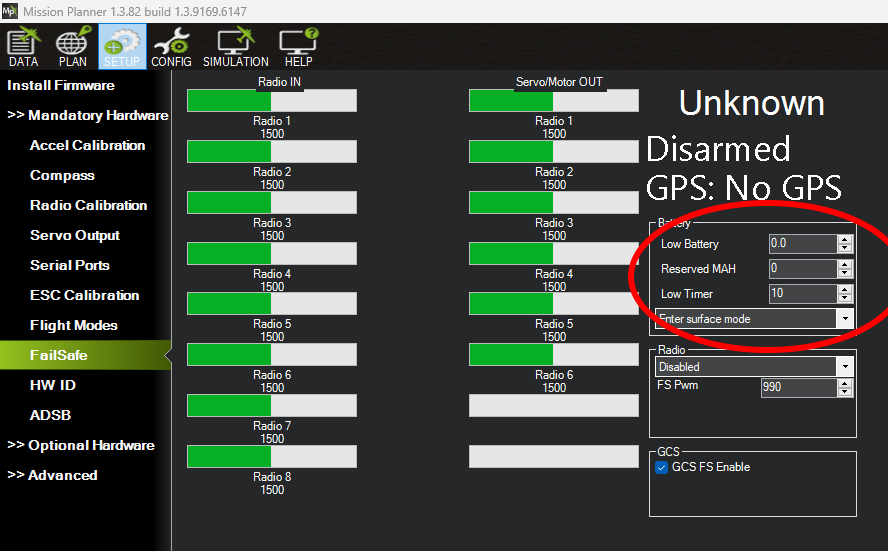

.. _failsafe-battery:

================
Battery Failsafe
================
The battery failsafe can be configured to automatically switch the vehicle into SURFACE mode or disarm if the vehicle battery voltage drops below a specified voltage for 10 seconds or the estimated remaining capacity has dropped below a configurable threshold.

.. note::

    This failsafe requires the vehicle have a working :ref:`Power Module <common-powermodule-landingpage>`.

.. note:: ArduPilot supports up to 9 batteries/power monitors. The discussion below applies to those optional batteries also. Each can trigger a failsafe and each can have different actions and setup values. In addition, a group of batteries can be treated as a single unit, see ``BATTx_MONITOR`` = 10.

When the failsafe will trigger
------------------------------
If enabled and set-up correctly the battery failsafe will trigger if the main battery's:

-  voltage drops below the voltage held in the :ref:`BATT_LOW_VOLT <BATT_LOW_VOLT>` parameter (or FS_BATT_VOLTAGE in older versions) for more than 10 seconds. The default voltage is 10.5 volts. If set to zero, the voltage based trigger will be disabled.
-  remaining capacity falls below the :ref:`BATT_LOW_MAH <BATT_LOW_MAH>` parameter (or FS_BATT_MAH in older versions) 20% of the battery's full capacity is a good choice (i.e. "1000" for a 5000mAh battery). If set to zero, the capacity based trigger will be disabled (i.e. only voltage will be used)

What will happen
----------------
When the failsafe is triggered:

-  Buzzer will play a loud low-battery alarm
-  LEDs will flash yellow
-  "Low Battery!" will be displayed on the ground station's HUD (if telemetry is connected)

Then one of the following will happen, depending on :ref:`BATT_FS_LOW_ACT<BATT_FS_LOW_ACT>`:

-  **Nothing**  (value 0)
-  **Disarm motors** (value 1)
-  **Enter SURFACE mode** (value 2)

As with all failsafes, the user can re-take control of the vehicle by changing the flight mode switch to another mode. The battery failsafe will not trigger again unless the two-layer failsafe is setup (see below)

.. note::

    Once a battery failsafe has triggered, it cannot be reset until the autopilot is rebooted.

Setting up using Mission Planner
--------------------------------
-  On the **INITIAL SETUP \| Mandatory Hardware \| Failsafe** page:

   - If the Battery section parameters are greyed out follow instructions to setup the :ref:`Power Module <common-powermodule-landingpage>`
   - Set the "Low Battery" threshold voltage (i.e. 10.5 volts)
   - Set the "Reserved MAH" or leave as "0" if the failsafe should never trigger based on estimated current consumed.
   - Select the desired behavior (Land, RTL, SmartRTL, etc) from the drop-down list

Two-Layer failsafe
------------------
ArduPilot includes a two-layer battery failsafe. This allows setting up a follow-up action if the battery voltage or remaining capacity falls below an even lower threshold.

- :ref:`BATT_CRT_VOLT <BATT_CRT_VOLT>` - holds the secondary (lower) voltage threshold. Set to zero to disable.
- :ref:`BATT_CRT_MAH <BATT_CRT_MAH>` - holds the secondary (lower) capacity threshold. Set to zero to disable.
- :ref:`BATT_FS_CRT_ACT <BATT_FS_CRT_ACT>` - holds the secondary action to take.

Advanced Settings
-----------------

- :ref:`BATT_FS_VOLTSRC <BATT_FS_VOLTSRC>` allows configuring whether the raw battery voltage or a sag corrected voltage is used
- :ref:`BATT_LOW_TIMER <BATT_LOW_TIMER>` can configure how long the voltage must be below the threshold for the failsafe to trigger
- ``BATTx_`` parameters can be setup to trigger the failsafe on other battery monitors.
