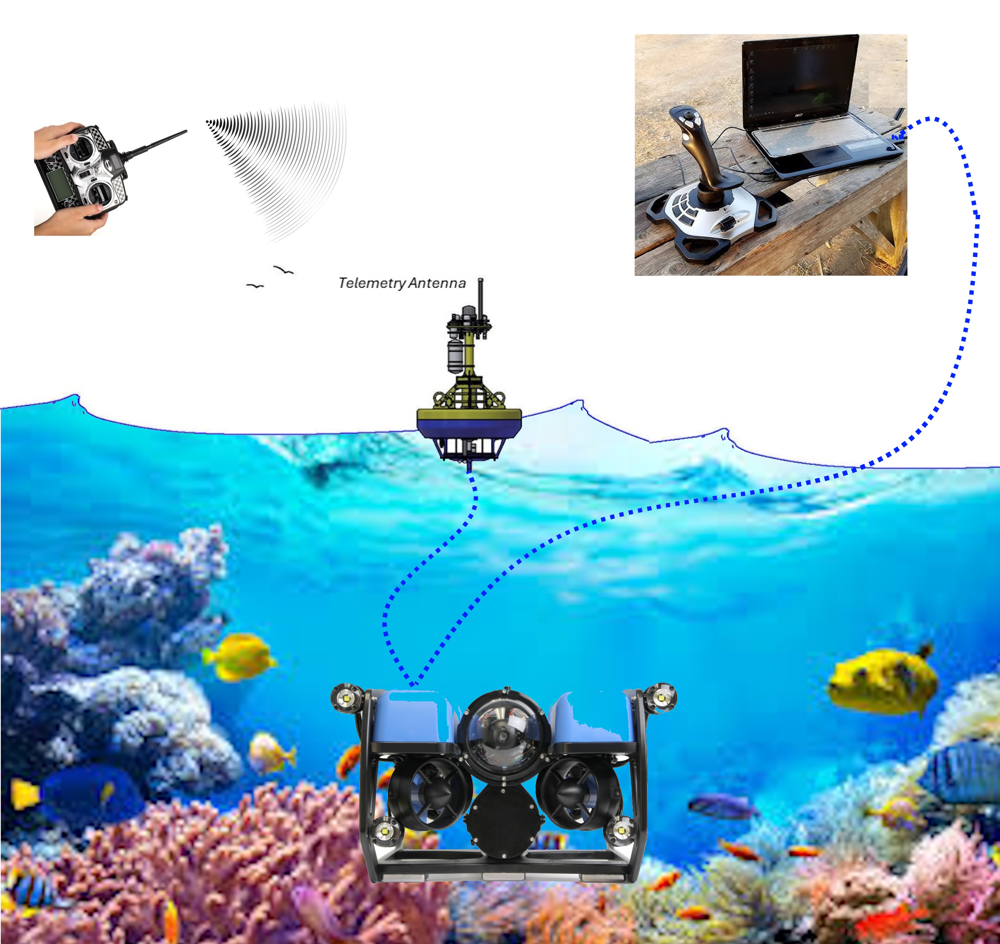

.. _introduction:

===================
Introduction to Sub
===================

Sub is an advanced open-source autopilot system for submersible ROVs (Remote Operated Vehicle) that supports multiple vehicle configurations. It offers a variety of operating modes from fully manual to fully autonomous.

Vehicle Configuration Options
=============================

* Sub supports both brushed and brushless, uni-directional or bi-directional propulsion motors/thrusters
* 3/4/5/6 or 8 thruster configurations controlling up to all 6 degrees of vehicular motion and axial rotation
* Pilot control and telemetry via cable tether to a Ground Control Station (GCS) using joystick, button, and/or keyboard commands, or
* Pilot control and telemetry via radio control to tethered surface buoy
* Position and Depth Control using optional depth sensor, GPS while surfaced, Sonars, or Shore/Support Vessel based acoustic beacon locators
* Leak, Temperature, and internal Pressure sensor options for vehicle safety
* Ethernet vehicle peripheral connectivity option for sophisticated sensors like Side Scan sonars
* 100's of ArduPilot compatible autopilots to choose from
* Optional Linux based companion computer interface to autopilot for image processing, beacon data processing, sonar displays in the GCS, custom applications, etc.
* Analog and Digital Video camera and OSD (On Screen Display) support
* Optional Buoyancy Control instead of vertical thrusters/neutral buoyancy
* Optional Grabber for object retrieval or manipulation

Swim Features
=============

* Automatic Attitude Stabilization, Depth Control, Position Control (assuming configuration and installed sensors allow it)
* Fully Autonomous Missions, see :ref:`common-mission-planning`
* Configurable Failsafes for system component failures, see :ref:`failsafe-landing-page`
* Subsurface Terrain Following and Surface Tracking, see :ref:`modes`
* Extensive GCS Button Action Support, see :ref:`buttons`

