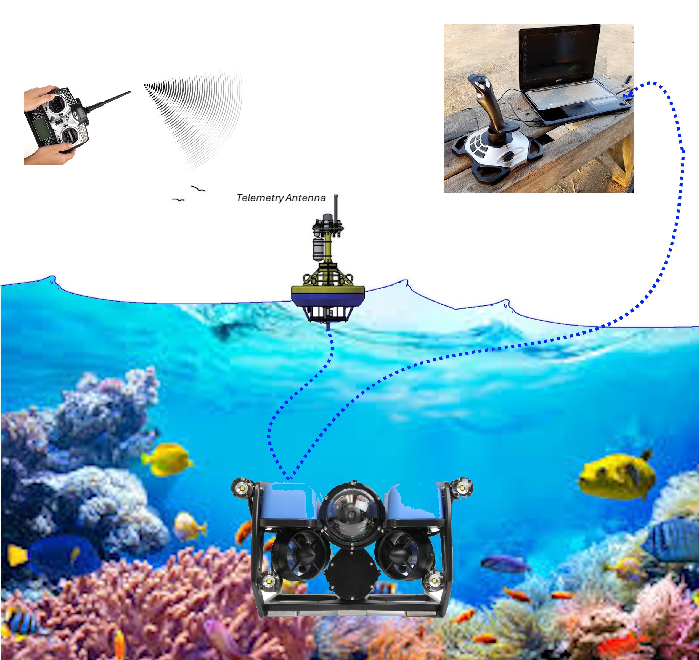

.. _introduction:

===================
Introduction to Sub
===================

.. toctree::
   :maxdepth: 1
   :hidden:

   common-use-cases-and-applications

Sub is an advanced open-source autopilot system for submersible ROVs (Remote Operated Vehicle) that supports multiple vehicle configurations. It offers a variety of operating modes from fully manual to fully autonomous, and is designed to be safe, feature-rich, open-ended, and easy to use even for novice users. 

Swim Features
=============

* A robust Attitude and Heading Reference System (AHRS), powered by sensor fusion and inertial navigation algorithms (:ref:`EKF <common-apm-navigation-extended-kalman-filter-overview>`)
* Automatic Attitude Stabilization, Depth Control, and Position Control (assuming configuration and installed sensors allow it)
* Fully Autonomous Missions, see :ref:`common-mission-planning`
* Configurable Failsafes for system component failures, see :ref:`failsafe-landing-page`
* Subsurface Terrain Following and Surface Tracking, see :ref:`modes`
* Extensive GCS Button Action Support, see :ref:`buttons`

As part of the broader :ref:`ArduPilot<ardupilot:home>` platform, utilities like :ref:`simulators <dev:simulation-2>`, :ref:`Ground Control Station (GCS) <common-GCS>` software, and :ref:`log analysis tools <common-logs>` are also available. These can aid in preparing for operations, executing them, and analysing their outcomes and data afterwards.

Vehicle Configuration Options
=============================

Sub provides access to many functionalities through its fine-grained :ref:`parameter set <parameters>`, including:

* Bi-directional propulsion motors/thrusters, with brushed or brushless construction
* Built-in :ref:`frame configurations <sub-frames>` for 3/4/5/6 or 8 thrusters, controlling up to all 6 degrees of vehicular motion and axial rotation

    * Custom configurations are possible too

* Pilot control and telemetry via cable tether to a Ground Control Station (GCS) using joystick, button, and/or keyboard commands

    * Radio control via a tethered surface buoy can also be enabled, via parameters

* Position and Depth Control using optional depth sensor, GPS while surfaced, Sonars, or Shore / Support Vessel based acoustic beacon locators
* :ref:`Camera gimbal <common-cameras-and-gimbals>` control and stabilization
* Lights brightness control, through a joystick or gamepad controller
* :ref:`Gripper <common-gripper-landingpage>` control, for object retrieval or manipulation
* Leak, Temperature, and internal Pressure sensor options for vehicle safety
* Ethernet vehicle peripheral connectivity option for sophisticated sensors like Side Scan sonars
* 100's of ArduPilot compatible autopilots to choose from
* Optional Linux based :ref:`companion computer<dev:companion-computers>` interface to autopilot for simplified configuration, and advanced functionality like image and beacon data processing, sonar displays in the GCS, custom applications, etc.

    * :ref:`BlueOS<dev:companion-computer-blueos>` is optimised for ROVs

* Analog and Digital Video camera and OSD (On Screen Display) support
* Optional Buoyancy Control instead of vertical thrusters/neutral buoyancy

**No programming is required** for standard operation, but highly detailed interfaces are available for programmatic control (including :ref:`MAVLink commands<dev:mavlink-commands>`), and the autopilot firmware can be freely modified and extended (including through dynamically loaded :ref:`common-lua-scripts`).

