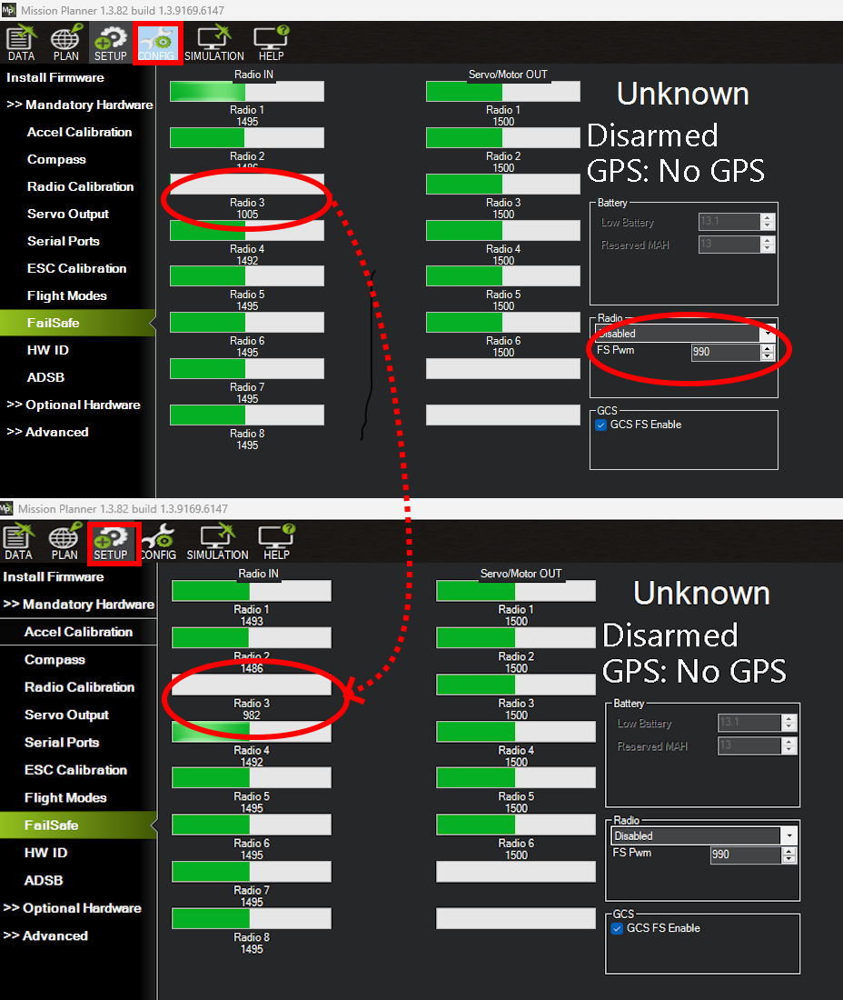

.. _radio-failsafe:

==============
Radio Failsafe
==============

.. note:: RC control is not enabled by default so items in this section would not be applicable. See :ref:`Sub Defaults<sub-defaults>` section to enable.

Sub supports several configurable failsafe options in cases where contact between the Pilot's RC transmitter and the autopilot's receiver is lost.  This page explains this failsafe's setup and testing.  Note the "Radio failsafe" was previously called "Throttle failsafe" because of the way in which some receivers use the throttle channel to signal the loss of contact.

.. note::

   Sub also supports other failsafes, see the :ref:`failsafe-landing-page`.

When the failsafe will trigger
==============================
If enabled and set-up correctly the radio failsafe will trigger if any of these conditions occur for more than :ref:`RC_FS_TIMEOUT<RC_FS_TIMEOUT>` seconds:

-  The pilot turns off the RC transmitter.
-  The vehicle travels outside of RC range and signal is lost.
-  The pilot forces the throttle channel below :ref:`FS_THR_VALUE<FS_THR_VALUE>` from the transmitter.
-  The receiver loses power (unlikely).
-  The wires connecting the receiver to the autopilot are broken
   (unlikely).

What will happen
================
When a radio failsafe is triggered, the vehicle can be configured via parameters to do nothing, warn the GCS, or switch mode to SURFACE.

If the rc failsafe clears (i.e. transmitter and receiver regain contact) the vehicle will remain in its failsafe mode. It will **not** automatically return to the flight mode that was active before the failsafe was triggered. If the pilot wished to re-take control he/she would need to change the RC flight mode switch to another position.

Receiver Configuration
======================
By default, most newly purchased receivers will simply not output pulses if contact with the transmitter is lost. However, some older low end receivers will be set-up to simply hold all channels at their last known position.  This is not good because the autopilot has no way to know that the Pilot has lost control of the vehicle.  Instead the receiver must be set-up to signal to the autopilot it has lost contact and there are two ways that it can do this (the method depends upon the receiver). Each brand of Transmitter/Receiver is slightly different so please refer to your transmitter's user manual to determine which method is available and how to set it up.

Receiver configuration for low-throttle method
----------------------------------------------
The **"Low-Throttle" method** pulls the throttle channel (normally channel 3) to a value below the bottom of its normal range (normally below 1000us).  This method is used by Futaba systems and many older systems.  Below is the setup method for a Futaba T7C Transmitter with R617FS or TFR4-B receiver which uses the "low throttle" method.

..  youtube:: qf8YinLKQww
    :width: 100%

Many receivers allow for the failsafe positions to be set either by simply pressing a button on the receiver, or directly from the transmitter. In this case, the transmitter is temporarily adjusted to output a throttle signal below the normal low idle position (for example,if low idle is 1000us, then 990uS would be sent) setting this as the failsafe value for the receiver, then adjusting low stick back to normal idle position. This below throttle idle value is then set for :ref:`FS_THR_VALUE<FS_THR_VALUE>`, as discussed below.

Receiver configuration for No-Signal method
-------------------------------------------
**"No Signal" method** - the receiver stops sending signals to the autopilot.  This is the preferred method and is how most modern receivers operate. Below is the setup method for a FlySky 9 channel transmitter with FrSky D4R-II receiver which uses the "No Signal" method.

..  youtube:: FhKREgqjCpM
    :width: 100%

Parameter Configuration
=======================
The :ref:`FS_THR_ENABLE<FS_THR_ENABLE>` parameter can be set in the Mission Planner full parameter list or full parameter tree, or can also be set using the Mission Planner *failsafe options* dropdown in the Initial Setup >> Mandatory Hardware >> Failsafe menu.

-  **Disabled** (Value 0) will disable the radio failsafe entirely.
-  **Warn only, prevent arming** (Value 1) Send a GCS message and prevent arming if unarmed.
-  **Surface** (Value 2) change mode to SURFACE.

The :ref:`FS_THR_VALUE<FS_THR_VALUE>`  parameter can be set in the Mission Planner full parameter list or full parameter tree, or can also be set using the Mission Planner *FS PWM* value in the Initial Setup >> Mandatory Hardware >> Failsafe menu. It should be set:

-  At least 10 us higher than your Throttle Input Channel (usually 3) PWM value when the throttle stick is fully down and the transmitter is **off**
-  At least 10 us lower than your Throttle Input Channel (usually 3) PWM value when the throttle stick is fully down and the transmitter is **on**
-  Above 910 PWM

Testing
=======
You can check your failsafe by performing the following tests with the
autopilot connected to the Mission Planner either via a USB cable or
telemetry link. You can complete these tests without plugging in your
LiPo battery but if you do connect a battery you should first be sure if the thrusters run, it will be safe.

**Test #1** : if using the "Low-Throttle" method, ensure the throttle channel drops with loss of radio contact

* Ensure your RC transmitter is on and connected with the throttle all
   the way down and flight mode set to MANUAL.
* The throttle (channel 3) PWM value should be approximately as in
   first illustration below.  Its value may be higher or lower but it
   should definitely be at least 10us higher than the value held in the FS
   PWM field
* Turn the transmitter off and the throttle PWM value should drop to be
   at least 10us below the FS PWM field value (as in the second
   illustration below) below

* A GCS message noting the failure will occur and the mode switch to SURFACE if that action has been selected with :ref:`FS_THR_ENABLE<FS_THR_ENABLE>`.

* If disarmed, a pre-arm message will be sent and arming prevented.

**Test #2** : retaking control after the failsafe has cleared

* Continuing on from test #1, turn your transmitter back on
* While the flight mode is still SURFACE, the pre-arm warnings should disappear(assuming nothing else is preventing arming) and a notice that RC has been reaquired sent to the GCS.
* You should be able to arm the vechicle now and change modes via the RC flight mode control channel.

**Test #3** (optional) : removing power from the receiver

-  Switch to STABLIZE mode, arm your motors and keep your throttle
   above zero.
-  Carefully disconnect the power wires connecting the receiver to the
   autopilot
-  The autopilot should failsafe as described in Test #1

.. warning:: Unplug the autopilot so that it is powered down before reattaching
   the receiver's power to assure the receiver is detected during autopilot initialization.

